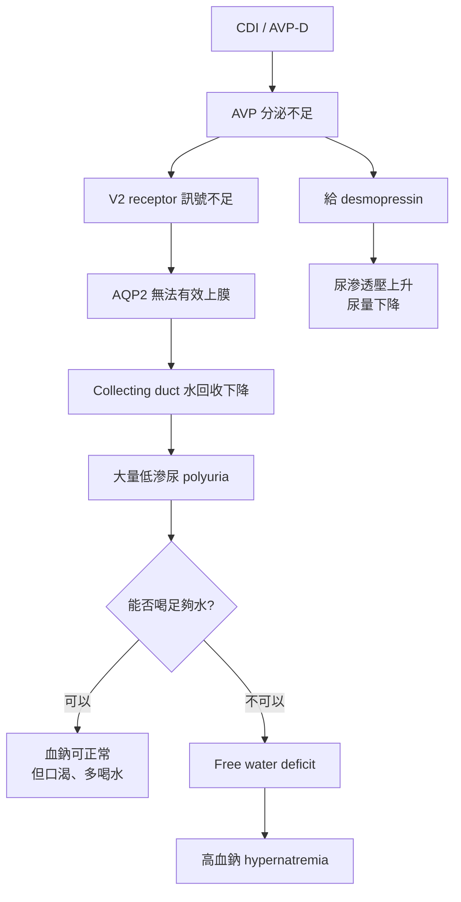

> **一句話**：CDI ＝ 中樞 AVP 不夠；病人**能喝水時血鈉可正常，不能喝水時很容易高血鈉**；DDAVP（desmopressin）通常有效。

*圖：中央性尿崩症（CDI）與腎性尿崩症（NDI）比較表（本站整理製圖）。*

---

## CDI（AVP-D）是什麼

CDI 現在常稱 **arginine vasopressin deficiency（AVP-D）**，以前叫 central diabetes insipidus。問題在中樞：**下視丘／後葉腦下垂體分泌 AVP 不足**，所以腎臟 collecting duct 收不到足夠的抗利尿訊號，導致無法濃縮尿液，出現**大量低滲尿、多尿、口渴**。

## 會不會高血鈉？取決於能不能喝水

會，但一樣取決於病人能不能喝水。

| 情境 | 血鈉表現 |
|---|---|
| 意識清楚、口渴正常、可自由喝水 | 血鈉常可正常或 high-normal |
| 不能喝水、NPO、術後、ICU、意識障礙、adipsic DI | 容易快速高血鈉 |
| CDI 合併發燒、感染、腹瀉、利尿、補水不足 | 更容易高血鈉 |

核心公式一樣是：

> **free water loss ＞ free water intake → serum Na⁺ ↑**

也就是**不是鈉變多，而是水少太多**。

## CDI 跟 NDI 最大差別

| 項目 | CDI／AVP-D | NDI／AVP resistance |
|---|---|---|
| **問題位置** | 中樞 AVP 分泌不足 | 腎臟對 AVP 反應差 |
| **AVP／copeptin** | 低或不適當地低 | 通常高（身體想補償）|
| **AQP2** | 沒有 AVP 訊號去啟動 | AQP2 表現、轉運或功能被破壞 |
| **Desmopressin 反應** | 通常有效 | 反應差或無效 |
| **高血鈉風險** | 補水不足時會 | 補水不足時也會 |

> NDI 的病因與 AQP2 分子機轉，見：[後天性腎因性尿崩症（Acquired NDI）：AQP2 loss 的共同機轉](/blog/acquired-ndi-aqp2-loss/)。

## 水禁試驗 ＋ desmopressin 怎麼區分

水禁試驗後給 desmopressin，可以幫助區分 CDI 與 NDI：**CDI 缺的是 AVP，所以補 desmopressin 後 urine osmolality 會上升；NDI 因腎臟抗 AVP，反應通常不明顯。**

Endotext 對 complete central DI 的描述是：baseline urine osmolality ＜ 300 mOsm/kg，給 desmopressin 後 urine osmolality 增加 ＞ 50%；complete nephrogenic DI 則 urine osmolality 仍無法有效上升。

## 臨床上最重要的警訊

CDI 病人如果出現：

- serum Na ＞ 145 mEq/L
- serum osmolality 高
- 但 urine osmolality 卻低（例如 ＜ 300 mOsm/kg）
- urine output 很大（例如成人 ＞ 3 L/day 或 ＞ 50 mL/kg/day）

就要高度懷疑 **water diuresis 型高血鈉**，包含 CDI 或 NDI。MSD Manual 也指出 AVP resistance／NDI 會有大量稀尿，並可出現 dehydration 與 hypernatremia。

## 實務提醒：給 DDAVP 之後要防「血鈉掉太快」

CDI 高血鈉給 desmopressin 後，尿量可能很快下降。這時要小心：**如果同時大量給 hypotonic fluid，血鈉可能下降太快，甚至後續變成 hyponatremia。**

所以治療時要同時追蹤：**serum Na⁺、尿量（UO）、尿滲透壓（Uosm）、I／O、意識狀態（mental status）。**

## 決策流程

---

延伸閱讀：[後天性腎因性尿崩症（Acquired NDI）：AQP2 loss 的共同機轉——lithium、阻塞、內毒素、低血鉀、高血鈣](/blog/acquired-ndi-aqp2-loss/)。

*參考來源：Endotext（Diabetes Insipidus）、MSD Manual（AVP Resistance／Nephrogenic Diabetes Insipidus）；圖為本站整理製作，供臨床教學參考。*
