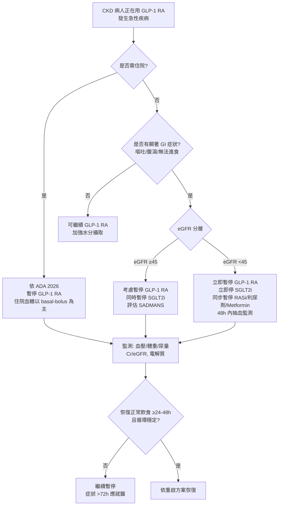
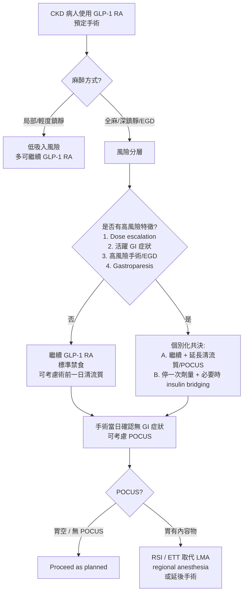

## Why This Matters

CKD 病人接受完整 guideline-directed therapy 時，會同時使用 GLP-1 RA、SGLT2i、RASi 與利尿劑。當急性疾病（感染、脫水、嚴重 GI 症狀）或擇期手術出現，臨床醫師必須決定哪些藥該停、哪些可續。此決策在 2023–2025 年間經歷快速演變：2023 年 ASA 採「一律停藥」的保守立場；2024 年多學會 guidance 將核心訊息改為「多數擇期手術患者可繼續使用」；2025 年 ANZCA/ADS/GESA/NACOS 與 SPAQI 進一步將重點移至風險分層；ADA 2026 則在住院章節首次寫入「急性住院病患應暫停 GLP-1 RA」。

CKD 族群的額外複雜性在於：AKI 風險因多重脫水相關藥物同時在線而被放大、腎儲備有限、sick-day 多藥停用的 cascade risk 難以評估、且沒有任何一份指引對 CKD 提供專屬協議。本筆記整合最新證據與風險分層邏輯，提供門診 sick-day、住院急性病、與擇期手術三個情境下的實務決策框架。

---

## Key Evidence

### 指引演變：從「一律停」到「風險分層」

| 時間 | 指引 | 核心立場 |
|------|------|---------|
| 2023 | ASA Consensus | Daily 手術當日停、weekly 術前 1 週停；不分適應症、劑量、手術類型。ASA 自承證據 sparse |
| 2024 | Multi-Society Guidance（ASA/AGA/ASMBS/ISPCOP/SAGES） | 「Most patients should CONTINUE」；risk-stratified shared decision-making |
| 2025 | ANZCA / ADS / GESA / NACOS | 強烈不建議常規停藥；未遵守飲食者以 POCUS / 極細胃鏡 / 延後手術處理 |
| 2025 | SPAQI + AACE | 不常規停用；延長禁食；批評 1-half-life hold 為「problematic」 |
| 2026 | ADA Standards of Care — Diabetes Care in the Hospital | 住院急性病病人應暫停 GLP-1 RA，住院血糖控制以 basal-bolus insulin 為主 |

2024 多學會 guidance 為目前圍手術期的主要框架，2023 ASA 已不再被視為唯一依據。高風險特徵包括：dose escalation phase、活躍 GI 症狀、高風險手術情境（特別是上消化道內視鏡、急診手術）、合併 gastroparesis 或嚴重自主神經病變。無上述風險因素的病人，建議繼續用藥搭配標準禁食；具高風險因素者則考慮延長清流質、day-of POCUS 評估或個別化共決停一次劑量。

### Evidence Paradox：RGV 增加，但一般手術 aspiration 未穩定增加

證據需以兩部分精確表述，不能簡化為「aspiration 不增加」。

**第一部分：RGV/RGC 在 GLP-1 RA 使用者一致增加。** POCUS 系列研究（JAMA Surgery 2024 等）顯示，即使遵守標準禁食，穩定劑量 GLP-1 RA 使用者的殘餘胃內容物顯著增加。機轉明確來自胃排空延遲，且以固體食物最為明顯。

**第二部分：在一般手術族群，aspiration 與 aspiration pneumonia 未穩定顯示增加。**

| 研究 | 規模 | Aspiration 風險 |
|------|------|-----------------|
| Alkabbani et al., BMJ 2024 | ~43,000 adults | RR 無顯著差異 |
| Chen et al., JAMA Network Open 2025 | 366,476 pts | OR 0.78 (0.57–1.06) |
| 2025 general surgery meta-analysis | multi-study | pooled OR ≈ 1.04 |
| Wu et al., BJA 2025 | 大型 PSM cohort | RR 降低（可能殘餘 confounding） |

**重要例外：endoscopy-specific 文獻訊號不一致。** 部分 EGD 與 colonoscopy 報告顯示 aspiration、procedural failure 或 aborted procedure 風險增加，不能把一般手術的 reassuring 結果直接外推到上消化道內視鏡。上消化道內視鏡仍屬高風險情境，應更嚴謹處置。

因此，v1.1 採更精確的表述：RGC/RGV 一致增加；在一般手術族群 aspiration 未穩定顯示增加；endoscopy 情境證據不一致，不得認為風險已被排除。個案報告仍然存在禁食 18–20 小時後發生明顯 aspiration 的案例，FDA 已更新所有 GLP-1 RA 仿單加入 aspiration 警語。

### OCULUS Trial：這是 RGV 試驗，不是 aspiration 試驗

OCULUS RCT（JAMA Internal Medicine 2026）是目前最重要的前瞻性隨機資料，但其性質與常被誤讀的方向需要明確澄清。

- **研究性質**：RGV（residual gastric volume）試驗，不是 aspiration 試驗。
- **Primary endpoint**：Clinically significant residual gastric volume，以 POCUS 與 endoscopic 定義，而非 aspiration 事件。
- **Primary result**：Continue group 25.0% 出現 clinically significant RGV；hold-one-dose group 3.1%。
- **EGD + colonoscopy 混合次群組**：若採前一日 clear liquid diet，hold-one-dose 組**無任何 clinically significant RGV**。
- **推論範圍**：OCULUS 支持「停一次劑量 ± 前一日清流質飲食可降低 RGV」，但**不支持**「停藥可降低 aspiration」這個更強的結論——後者需要以 aspiration 為 powered primary endpoint 的試驗，目前仍缺。

OCULUS 為風險分層停一次劑量策略提供了 mechanistic 依據，但把它當成「aspiration 試驗成功」是誤讀。藥動學上的現實進一步強化此警訊：semaglutide t½ 約 7 天，停 1 週後體內仍殘留約 50%；dulaglutide 與 tirzepatide 停 1 週後仍殘留約 30%。因此 OCULUS 停藥組 RGV 改善很可能是相對減輕，而非完全清除。

### ADA 2026 住院章節的新方向

ADA 2026 Standards of Care 在 Diabetes Care in the Hospital 章節明確指出，住院並處於急性疾病狀態的病人應暫停 GLP-1 RA，住院期間的血糖控制應以 basal-bolus insulin 為主。考量包括住院急性病情境下 GI 耐受性差、胃排空延遲影響進食、以及潛在 aspiration 風險。此為第一個真正寫入大型糖尿病指引的明確停藥方向，但針對的是「住院 inpatient setting」，不直接延伸至所有輕度門診疾病。門診 sick-day 層面，2023 AJKD Delphi consensus（Watson et al.）仍未能就 GLP-1 RA 常規停用達成共識，GLP-1 RA 在此層面仍屬 expert precaution 而非 guideline recommendation。

### CKD 特殊風險：AKI 機轉與 cascade

GLP-1 RA 的 AKI 風險以 prerenal 為主，機轉為 GI 副作用（噁心、嘔吐、腹瀉、食慾不振）導致的脫水。此外 GLP-1 RA 可能抑制渴覺（hypodipsia），在已有脫水情境下進一步加重風險。CVOT pooled analysis 顯示群體層級 AKI 風險未升高，但 FAERS 報告顯示 AKI 中位發生時間與 dose escalation 重疊，CKD 病人的腎儲備有限，使其成為特別需要留意的亞群。當 GLP-1 RA、SGLT2i、RASi、利尿劑同時使用時，急性疾病下的 cascade risk 更難評估，停藥優先順序必須依各藥共識等級與機轉差異處理。

---

## Clinical Decision

### 核心原則

決策應以「是否達住院急性病等級」與「是否有顯著脫水/GI 風險」為雙軸，並對擇期手術採風險分層而非一律停藥。CKD 病人需額外考量合併用藥與腎儲備，必要時降低停藥閾值。

### 情境一：門診 Sick-Day（急性輕症或中度 GI 症狀）

**建議做法**：

- 無 GI 症狀的輕度急性疾病（如輕度上呼吸道感染）：繼續 GLP-1 RA，加強水分攝取與血糖監測。
- 有顯著 GI 症狀（反覆嘔吐、腹瀉、無法進食）：暫停 GLP-1 RA；同時依各自共識處理 SGLT2i（立即停）、metformin、RASi、利尿劑、NSAIDs。
- CKD eGFR <45 合併任何 GI 症狀：傾向更早暫停，且 48 小時內追蹤 Cr/eGFR。
- 重啟條件：急性疾病完全緩解、恢復正常飲食 ≥24–48 小時、循環穩定、若曾發生 AKI 則 eGFR 穩定恢復。

**不建議做法**：

- 輕度上呼吸道感染無 GI 症狀即停藥——過度停藥帶來處方瀑布與血糖控制惡化。
- 未追蹤 Cr/eGFR 即返回原劑量——尤其是 CKD G4-5 病人。

### 情境二：住院急性病

**建議做法**：

- 依 ADA 2026 Standards of Care，暫停 GLP-1 RA。
- 住院期間血糖控制以 basal-bolus insulin 為主。
- 同步評估並依共識暫停 SGLT2i、RASi、利尿劑、metformin、NSAIDs。
- 出院前重新評估：確認 GI 功能恢復、口服飲食穩定、腎功能穩定後依重啟方案恢復 GLP-1 RA。

**不建議做法**：

- 因「過去穩定使用」而於住院期間繼續維持原劑量——已超出現行指引建議。
- 出院時未主動恢復 GLP-1 RA 或未記錄重啟計畫——會造成長期心腎保護的損失，屬處方瀑布。

### 情境三：擇期手術／內視鏡

**建議做法**：

依 2024 多學會 guidance + 2025 ANZCA/ADS/GESA/NACOS + 2025 SPAQI 的風險分層框架。

- **低風險**（穩定維持劑量 ≥12 週、無活躍 GI 症狀、非高風險手術、無 gastroparesis）：繼續 GLP-1 RA，搭配標準禁食。可考慮術前一日清流質飲食進一步降低 RGV。
- **高風險**（任一高風險特徵：dose escalation phase、活躍 GI 症狀、上消化道內視鏡或急診手術、合併 gastroparesis）：個別化共決。選項 A：繼續用藥 + 延長清流質 + day-of POCUS 評估 RGC。選項 B：停一次劑量（OCULUS 支持降低 RGV，但不保證降低 aspiration）+ 必要時 insulin bridging。
- **上消化道內視鏡**：因 endoscopy 證據不一致，建議採更嚴謹處置（術前一日清流質、考慮停一次劑量、或 POCUS）。不延遲 urgent/emergent endoscopy。
- **大腸鏡**：GLP-1 RA 使用者腸道準備失敗率升高，延長流質飲食並強化分劑量清腸。
- **局部麻醉 / 輕度鎮靜手術**（如 AV fistula、腎切片）：吸入風險低，多可繼續用藥。
- **緊急/急診手術**：一律依 full stomach precautions 處理。

**不建議做法**：

- 把 2023 ASA 的「一律停」視為唯一依據——已被 2024 多學會 guidance 取代為主要參考。
- 僅因 overweight/obese 而要求停藥、沒有其他高風險因素——multi-society guidance 指出這可能構成「overweight and obesity bias」。
- 把 OCULUS 詮釋為「停藥可降低 aspiration」——OCULUS 是 RGV 試驗。
- 以 1 個 half-life 作為停藥間隔——SPAQI 明確指此做法 problematic；weekly agents 停 1 週仍殘留約 30–50%。

### Sick-Day 決策流程（門診 vs 住院 vs AKI）

### 圍手術期決策流程（風險分層）

### Sick-Day 暫停藥物整合清單（CKD 病人急性疾病）

| 藥物 | 停藥觸發條件 | 停藥共識等級 | 重啟條件 |
|------|-------------|-------------|---------|
| SGLT2i | 嘔吐/腹瀉/無法進食/術前 3–4d | Society guideline (KDIGO) | 恢復進食 + eGFR 穩定 |
| Metformin | eGFR <30 / AKI / 脫水 | Society guideline | eGFR >30 且穩定 |
| ACEi/ARB | 脫水 / 低血壓 / AKI | Society guideline | 循環穩定 + eGFR 穩定 |
| 利尿劑 | 脫水 / 低血壓 | Society guideline | 循環穩定 |
| NSAIDs | 任何急性疾病 | Society guideline | 急性疾病完全恢復 |
| GLP-1 RA | 住院急性病（ADA 2026）；門診顯著 GI 症狀 | 住院: Society guideline；門診: Expert precaution | 正常飲食 ≥24–48h + eGFR 穩定 |
| SU | 進食不足（低血糖風險） | Expert consensus | 恢復正常進食 |

### Perioperative Checklist

- 確認病人是否使用 GLP-1 RA 或 dual GIP-GLP-1（tirzepatide）
- 使用狀態：穩定維持劑量 ≥12 週，或 dose escalation phase
- GI 症狀評估：噁心、嘔吐、腹脹、便秘、消化不良
- CKD 特殊風險：eGFR、合併用藥（RASi、利尿劑、SGLT2i）
- 是否合併 gastroparesis 或嚴重自主神經病變
- 麻醉方式：全麻 / 深鎮靜 / 區域 / 局部
- 手術是否為上消化道內視鏡或急診
- 術前一日清流質飲食是否可行
- Day-of POCUS 是否可行
- 術後重啟計畫（劑量與時間）
- 是否需要 insulin bridging（endocrinology consult）
- SGLT2i 是否需同步停藥（通常術前 3–4 天）

### Restart Protocol

重啟前須確認：急性疾病完全緩解或術後恢復口服飲食、正常飲食 ≥24–48 小時、循環穩定、若曾發生 AKI 則 eGFR 穩定恢復至基線或 >30 mL/min/1.73 m²、確認原使用藥物在目前 eGFR 仍可用（exenatide 於 eGFR <30 為禁忌）。

| 停藥時間 | 重啟劑量 | 理由 |
|----------|---------|------|
| <2 週 | 恢復原維持劑量 | 體內藥物濃度仍存在 |
| 2–4 週 | 降至少一個劑量階層，維持 4 週後再評估 | 耐受性部分喪失 |
| >4 週 | 從最低起始劑量重新開始，標準 4 週遞增 | 藥物已完全清除，等同新使用者 |

Daily agents（liraglutide）於恢復口服後 24–48 小時重啟；weekly agents 於下一個預定給藥日重啟。術後或重大急性病後**切勿跳過 re-titration**——個案報告顯示直接以高劑量重啟可導致嚴重 GI 事件與 bowel transit time 延長。CKD 額外注意：重啟後 3–7 天追蹤 Cr/eGFR 與 GI 症狀；必要時預防性開立 ondansetron（肝代謝為主，注意 QTc）；停藥期間若血糖控制惡化則考慮 insulin bridging。KDIGO 同時警告：急性疾病後未重啟 GLP-1 RA/SGLT2i/RASi 的長期心腎危害，可能超越短期停藥的理論益處——停藥必須記錄為暫時性病假處置，而非永久停用。

---

## Uncertainty

1. **門診 sick-day 是否真正預防 AKI**——KDIGO 2024/2026 draft 明確質疑其整體效益，並指出未及時重啟的長期心腎危害可能超越短期停藥的理論益處。
2. **GLP-1 RA 是否應正式納入 SADMANS 停藥清單**——Delphi 2023 未達共識；英國部分地方實務已納入但非全球標準。
3. **CKD-specific sick-day / perioperative protocol**——KDIGO、ADA、NKF 均未提供；CKD 分期特異性停藥間隔完全缺乏試驗依據。
4. **最佳術前停藥時間**——1 週對 weekly agents 不足以完全清除，但 5 週不切實際；OCULUS 僅驗證「停一次劑量」對 RGV 有效，未解最佳策略。
5. **手術與內視鏡 aspiration 風險是否不同**——一般手術大型研究一致 reassuring，但內視鏡研究結果分歧，臨床上應分開處理。
6. **降低 aspiration 的停藥策略是否真正有效**——目前沒有以 aspiration 為 primary endpoint 的 powered RCT；OCULUS 是 RGV 試驗。
7. **Tachyphylaxis 是否真正消除固體食物排空延遲**——不同測量方法間結果矛盾。
8. **SGLT2i + GLP-1 RA 合併 sick-day protocol**——不存在。
9. **Oral semaglutide 的正確停藥分類**——daily dosing vs t½ 7 天的矛盾未解。
10. **POCUS 在 GLP-1 RA 使用者的 validated accuracy**——未確立；肥胖患者窗品質差。

上述不確定性不阻礙臨床決策，但要求：處方前進行風險分層、對高風險情境（特別是 endoscopy 與住院急性病）採更嚴謹處置、並把監測與重啟閾值視為暫行標準，保留臨床判斷彈性。

---

## Metadata

- **Certainty Level**：
  - 高：GLP-1 RA 增加 RGC/RGV；一般手術 aspiration 未穩定顯示增加；指引轉向風險分層
  - 中：OCULUS 支持停一次劑量降低 RGV；ADA 2026 住院暫停建議；擇期手術多可繼續用藥
  - 低：門診 sick-day stop rules（Delphi 未達共識）；endoscopy aspiration 風險是否被排除；重啟劑量階梯細節
  - 極低：CKD-specific 停藥間隔與 combined SGLT2i + GLP-1 RA sick-day protocol
- **Evidence Sources**：Multi-Society Clinical Practice Guidance 2024（ASA/AGA/ASMBS/ISPCOP/SAGES）；ANZCA/ADS/GESA/NACOS 2025；SPAQI + AACE 2025；OCULUS RCT（JAMA Intern Med 2026）；POCUS RGC series（JAMA Surgery 2024）；Alkabbani BMJ 2024；Chen JAMA Netw Open 2025；Wu BJA 2025；2025 general-surgery meta-analysis；Watson AJKD 2023（Delphi）；ADA Standards of Care 2026（Diabetes Care in the Hospital）；KDIGO 2022/2024/2026 draft
- **Guideline Concordance**：2024 multi-society、2025 ANZCA/ADS/GESA/NACOS、2025 SPAQI、ADA 2026 inpatient
- **Next Review Date**：2026-10-10
- **Clinical Relevance**：CKD 病人使用 GLP-1 RA 時，門診 sick-day、住院急性病、與擇期手術情境下的停藥與重啟決策框架

---

## 相關筆記

- [Q04: eGFR <30 或透析的 GLP-1 RA 使用](/glp1ra/q04-low-egfr-use/)
- [Q06: GI 副作用與營養不良風險](/glp1ra/q06-gi-malnutrition-risk/)
- [Q07: 體重下降在 CKD 病人是好事還是壞事？](/glp1ra/q07-weight-loss-paradox/)
- [SGLT2i Q09: 手術前禁食期的停藥](/sglt2i/q09-surgery-fasting-hold/)
- [SGLT2i Q14: 急性疾病時的停藥決策](/sglt2i/q14-acute-illness-hold/)
