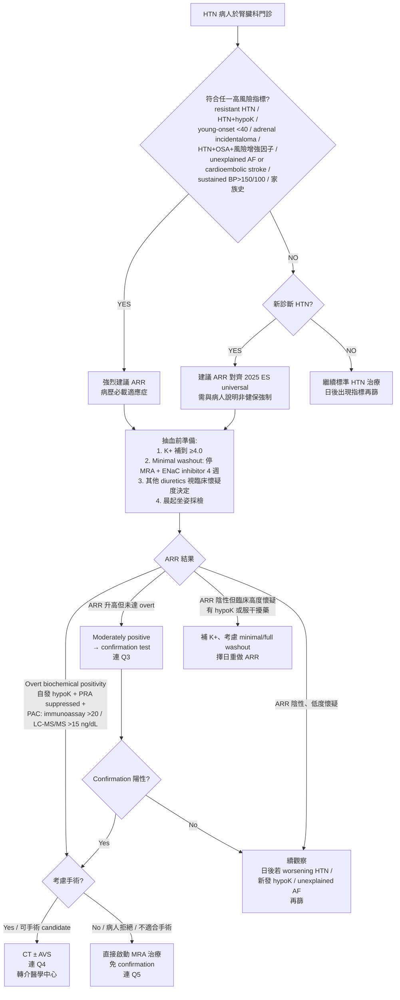

# Q1 — 何時該篩 PA：哪些 HTN 必須篩檢

> **💡 一句話結論**
> 目前所有 confirmed hypertension 都應被考慮至少一次 PA 篩檢。若資源無法 universal screening，**最低限度必篩**：resistant HTN、HTN + 自發/利尿劑誘發低血鉀、young-onset HTN <40 歲、adrenal incidentaloma + HTN、HTN + OSA 且有風險增強因子（hypoK / resistant / young / moderate-severe）、HTN + AF 或 cardioembolic stroke、sustained BP >150/100、PA / 早發 HTN/CVA 家族史。抽血前 K⁺ 補到 ≥4.0；2025 ES 採**三層 washout 策略**（no withdrawal / minimal withdrawal / ideal full withdrawal）；多數情境 minimal withdrawal 即可（停 MRA + ENaC inhibitor 4 週）。

> **📝 文件層級分辨**
> **指引建議（guideline recommendation）** ≠ **臨床實務（clinical practice）** ≠ **政策現況（NHI coverage）**。本文以 2025 Endocrine Society Clinical Practice Guideline (Adler GK et al., JCEM 2025, **PMID 40658480**) 為主軸；2024 ESC、2025 Taipei Positional Paper、2017/2024 TSA 共識為對照。截至本次查核可見（2026-05-08），台灣 NHI 對 PA 篩檢仍要求臨床懷疑佐證；universal screening 為國際指引建議，**未進入台灣健保政策**。

---

## 1. Bottom Line（300 字）

PA 篩檢已**不應再窄化為「低血鉀高血壓才需要驗 ARR」**。2025 Endocrine Society guideline (Adler 2025) 採 universal screening 立場（"In all individuals with hypertension, we suggest screening for PA"，**conditional recommendation, low certainty**）；2024 ESC HTN guideline 推薦 confirmed HTN systematic ARR screening（Class IIa, Level B）；2025 Taipei Positional Paper 主張台灣應跟進 [PMID 40658480、39210715、40991208]。

對台灣區域醫院腎臟科實務的雙軌策略：**第一軌**——下列 6 類絕對不能漏的「**必篩高風險族群**」；**第二軌**——新診斷且尚未複雜用藥的 HTN，可在資源允許下做 ARR + renin，朝 universal 靠齊。

抽血前必須先把 K⁺ 補到 ≥4.0 mEq/L（避免低 K⁺ 抑制 aldosterone 造成偽陰性）；2025 ES 不再要求所有病人一律完整 washout——可採 **no withdrawal**（不撤藥直接抽）或 **minimal withdrawal**（至少停 MRA + ENaC inhibitor 4 週）；其他 diuretics 多屬 **ideal full withdrawal** 範圍，依臨床懷疑度與安全性決定是否停藥重測。陽性結果分流：**overt biochemical positivity**（自發 hypoK + PRA 明顯 suppressed + PAC：immunoassay >20 ng/dL 或 LC-MS/MS >15 ng/dL）可免做 confirmatory test，後續依**手術意願**分流——考慮手術 → CT ± AVS（confirmatory test 與 AVS 詳見後續發表）；不考慮手術 / 不適合手術 → 直接啟動 MRA 治療；中度陽性做 confirmation；陰性但臨床高度懷疑 → 補 K⁺ + minimal/full withdrawal 後重做。

---

## 2. 篩檢適應症

### 2.1 2025 ES Universal HTN Screening（最新立場）

**Recommendation 1 原文**（PMID 40658480, Adler GK et al. JCEM 110:2453-2495）：

> *"In all individuals with hypertension, we suggest screening for primary aldosteronism (PA) (2 | ⊕⊕OO)."*

- **強度**：Conditional / weak recommendation（GRADE 2，**suggest** 而非 recommend）
- **證據等級**：⊕⊕OO = **Low certainty**
- **Technical remarks**：明寫「This is a **conditional recommendation**, with implementation depending on contextual factors such as available resources, local expertise, and healthcare system capacity」 → 留下資源受限地區的 prioritization 彈性
- ****篩檢工具**：serum/plasma aldosterone + plasma renin（PRA 或 DRC）+ 計算 ARR**
- **K⁺ 角色**：**不是篩檢工具本身**，而是用來校正 aldosterone 解讀

#### 2025 ES vs 2016 ES 對比

| 面向 | 2016 ES (Funder, **PMID 26934393**) | 2025 ES (Adler, **PMID 40658480**) |
|---|---|---|
| 篩檢對象 | 高風險族群（resistant、HTN+hypoK、incidentaloma、OSA、early-onset、家族史）| **所有 HTN** |
| 強度 | 高風險族群 strong recommendation | universal **conditional / weak** |
| Drug washout | 大多需停藥 | **三層策略**：no withdrawal / minimal（停 MRA + ENaC inhibitor 4 週）/ ideal full（再加停 other diuretics 4 週） |
| Confirmation | 幾乎所有陽性都要做 | Overt biochemical positivity 可免 confirmation；後續依**手術意願**分流（CT/AVS vs 直接 MRA） |
| K⁺ 矯正 | 強調 | 強調，且明文：先補 K⁺ 再重做 |
| OSA | 列入指標族群 | Table 3 未把 OSA 單獨列為 prevalence subgroup（evidence framing 改變，需依 enhancer 判讀）|
| HTN + AF | 未獨列 | Table 3 列出 prevalence；具體 cohort 結構詳見 A6 |

#### 與其他 2024-2025 國際指引的對齊

- **2024 ESC HTN guideline** (McEvoy et al., Eur Heart J, **PMID 39210715**)：在所有 confirmed hypertension（BP ≥140/90 mmHg）adults 中，PA 篩檢 *should be considered*（Class IIa, Level B）
- **2025 AHA/ACC HTN guideline**：在 resistant hypertension 情境下，PA screening 給到 COR 1 / LOE B-NR（regardless of K⁺）；**這不等於對所有 HTN 採 universal screening**
- **2025 Taipei Positional Paper** (Lin LY et al., J Clin Hypertens 2025, **PMID 40991208**)：主張台灣朝 universal PA screening 靠齊，引述 PA 約佔 all HTN 5-10%、resistant HTN 達 30%、實際篩檢率僅 1-2%

> **⚠️ 對台灣 NHI 政策含義**
> 截至本次查核可見（2026-05-08），台灣健保對 PA 篩檢仍要求臨床懷疑佐證；universal screening 是**國際指引建議**，**並非台灣健保政策**。Universal screening 在台灣的成本效益**尚未本土評估**。請務必區分「指引推薦」與「健保給付現況」。

### 2.2 高風險族群（已確認證據）

#### A. 最低限度「必須篩」族群（decision box）

##### A1. Resistant Hypertension

- **定義**：≥3 種降壓藥含利尿劑仍未達標（>140/90），或需要 ≥4 種藥物控制
- **PA prevalence**：2025 ES Table 3 列 **11.3-29.1%**；2025 Taipei Positional Paper 指可達 **約 30%** [PMID 40658480、40991208]
- **病歷必載**：目前使用的 3 種抗壓藥名稱與劑量、最近一次 BP、未控持續期間
- **2025 AHA/ACC 在 resistant HTN 情境下** PA screening 升為 COR 1 / LOE B-NR（限定範圍：resistant HTN，不是 universal HTN screening）

##### A2. HTN + Spontaneous 或 Diuretic-induced Hypokalemia

- **PA prevalence**：HTN + hypokalemia **28.1%**（Burrello 2020, **PMID 32114853**, n=5,100）
- **Spontaneous K <2.5 mmol/L**：PA 達 **88.5%**（Burrello 2020）⭐ **最強篩檢指標**
- **病歷必載**：K⁺ 數值（要寫具體數字）+ 是否服用利尿劑 + 何時抽
- **臨床路徑**：hypoK 為 ARR 的 **hard stop** — 先補 K⁺、再抽 ARR，不要長期只補 K⁺

##### A3. Young-onset HTN <40 歲

- **PA prevalence**：年輕高血壓 onset <40 歲者 **17.8%**（Alam 2021, **PMID 33393127**）
- **次族群更高**：grade 3 HTN **37.1%**；≥4 meds **50%**；K <3.5 mmol/L **85.7%**
- **2025 ES Table 3** 同樣列 18-40 歲 HTN PA **16.2%**
- **病歷必載**：HTN onset 年齡 + 嚴重度 + 用藥數
- **意義**：年輕患者若 lateralized PA 接受手術，治癒率最高 → 早篩 = 終身效益最大

##### A4. HTN + Adrenal Incidentaloma

- **PA prevalence**：4.4%（範圍 0.4-24.6%，2025 ES Table 3）
- **臨床路徑**：incidentaloma 不是只篩 PA，應進入 **triple screen**（PA + Cushing 1-mg DST + pheo metanephrine；詳見後續發表的 Q8 腎上腺意外瘤專題）
- **2025 ES Recommendation 8** 明文要求

##### A5. HTN + OSA + 風險增強因子

> **📝 OSA 是否普篩在近年證據具爭議**
> 2019 HYPNOS 顯示，若沒有其他適應症，OSA 人群的 PA prevalence 可降至約 1.5%；2025 ES Table 3 也未把 OSA 單獨列為 prevalence subgroup。Evidence framing 已從「OSA = 強指標」轉為「**需依 enhancer 情境判讀**」。

下列情境仍應優先篩：
- HTN + OSA **+ spontaneous/diuretic-induced hypokalemia** → PA 達 **50.0%**（Hu 2025, **PMID 40381611**）
- HTN + OSA **+ resistant HTN**
- HTN + OSA **+ young-onset / moderate-severe OSA**
- 男性 + HTN+OSA：13.8%（Heizhati 2023, **PMID 36882631**）；女性 / 輕度 OSA / OSA alone 4.8%（Hu 2025）
- OSA-PA 共病雙向 OR≈2，但異質性高（Zhang 2024, **PMID 38142557**）

→ **不寫成「所有 OSA+HTN 都要篩」**，而是「HTN + OSA + 風險增強因子應優先篩」

##### A6. HTN + AF / Cardioembolic Stroke / Stroke 後高血壓

兩個 cohort 對應兩種臨床情境：

- **PAPPHY Study**（Seccia 2020, **PMID 31834121**）：在合併**高血壓且找不到明確 AF 原因**（unexplained AF）的病人中，PA 約 **42%**，其中近半（48%）為可手術治療的 unilateral / APA 型態 [^1]
- **Nguyen 2022**（**PMID 35518929**）：較廣 cohort
  - HTN + AF（整體）：PA **30%**
  - HTN + **cardioembolic stroke**：PA **11%**
  - HTN + stroke 整體：4.0%

[^1]: PAPPHY 詳細 cohort 結構：411 AF+HTN 篩檢 → 73 unexplained AF+HTN eligible (~18%) → 31/73 PA 診斷 (~42%) → 15/31 APA / surgically curable (48%)。

**寫法紀律**：
- ❌ 不寫「AF 病人 PA prevalence 42%」（cohort 過於粗略）
- ✓ 寫：**「在合併高血壓且找不到明確 AF 原因（unexplained AF）的病人中，PAPPHY 顯示 PA 約 42%，其中近半屬可手術治療的 unilateral / APA 型態」**

**臨床路徑**：
- HTN + **unexplained AF**（無結構性心臟病、無甲亢、無其他可解釋原因）→ ARR 不該再拖
- HTN + AF early-onset / 反覆發作 / 合併 resistant HTN 或 hypoK → ARR 篩檢優先度更高
- HTN + **cardioembolic stroke**（PA 11%）→ 也應主動篩
- AF 詳細 management 詳見後續發表的 Q9 PA + AF 專題

##### A7. Sustained BP >150/100 mmHg

- **PA prevalence 隨 HTN severity 線性升高**：Stage 2 HTN 約 9.7-21.6%；Stage 3 HTN 約 11.9-19%（2025 ES Table 3）
- **病歷必載**：多次測量數值（≥3 occasions）+ 是否治療前 / 治療中 / 即使單藥控制中

##### A8. PA 家族史 / 一等親早發 HTN/CVA <40 歲

- 對家族性 PA（FH-I/II/III/IV）有臨床意義
- 強 actionability，雖然 prevalence 數據不如 resistant HTN 充足（詳見第 5 章）
- **病歷必載**：家族史細節（一等親 PA / 早發 HTN / 早發 stroke）

##### 適應症 quick table

| 族群 | PA prevalence | 證據強度 | 病歷關鍵字 |
|---|---|---|---|
| Resistant HTN | 11.3-29.1% | 強 | 3 藥含利尿劑名稱+劑量 |
| HTN + 自發/利尿劑誘發 hypoK | 28.1% / spontaneous K<2.5 達 88.5% | 強 | K⁺ 數值 |
| Young-onset HTN <40 | 17.8% | 強 | onset 年齡 |
| HTN + adrenal incidentaloma | 4.4% (0.4-24.6%) | 中強 | 影像描述 |
| HTN + OSA + 風險增強因子 | OSA+hypoK 達 50% | 中 | OSA + 增強因子 |
| HTN + unexplained AF / cardioembolic stroke | **PAPPHY: ~42%**（surgically curable 48%）；Nguyen 2022 廣 cohort: AF 30% / cardioembolic stroke 11% | 中強 | 排除結構性心臟病/甲亢/其他可解釋 AF cause |
| Sustained BP >150/100 | Stage 2 HTN 9.7-21.6%；Stage 3 11.9-19% | 強 | ≥3 次測量數值 |
| PA / 早發 HTN/CVA 家族史 | 顯著高於背景（無精確數字） | 中 | 家族史細節 |

#### B. 進階提醒族群（不是 guideline 第一線，但應留意）

##### B1. HTN + Osteoporosis / Hypercalciuria / Fragility Fracture

- Osteoporosis 門診中 PA prevalence：osteoporosis 組 5.2% vs 非 osteoporosis 0.9%（Salcuni 2017, **PMID 28794160**）
- **Osteoporosis + HTN + hypercalciuria 同時**：PA **26.1%**
- PA 與骨代謝：lower serum calcium、higher urinary calcium、higher PTH；治療後 calcium/PTH/urinary calcium 可改善（BMD 改善證據不穩定）（Wang 2022, **PMID 36387892**）
- **臨床語句**：「在 HTN 病人若合併 unexplained osteoporosis、fragility fracture 或 hypercalciuria，可把 PA 納入 secondary osteoporosis 鑑別」（詳見後續發表的 Q12 PA + osteoporosis 專題）

##### B2. 家族性線索

- 觸發點：HTN <20 歲、PA 家族史、一等親早發 HTN/CVA <40 歲、PA 但 PAC/ARR 偏低且對 dexamethasone 反應佳
- TAIPAI GRA case series (Cheng 2021, **PMID 34944634**)：GRA-positive PA 可能 PAC/ARR 較**低**，**不要因 ARR 不典型而排除** GRA
- 詳見第 5 章

##### B3. HTN + CKD / albuminuria（腎臟科主場）

- 不是獨立篩檢適應症，但 PA 在 CKD 病人易被忽略（high K 由 CKD 解釋掩蓋 PA 經典 hypoK 表現）
- **腎臟科觸發點**：HTN + low-renin phenotype、反覆低 K、resistant、albuminuria/eGFR decline 與糖尿病/血壓負荷不相稱

### 2.3 邊緣 / 爭議族群

#### OSA — HYPNOS 後的後續

- HYPNOS (Buffolo 2019, **PMID 31679423**)：HTN+OSA PA 8.9%；**單純 OSA（無其他指標）僅 1.5%** → 挑戰 2016 ES 將 OSA 列為強指標的立場
- 後續證據（已驗證 PMID）：
  - Heizhati 2023 (**PMID 36882631**)：HTN+OSA 13.2% vs HTN without OSA 10.0%
  - Hu 2025 (**PMID 40381611**)：HTN+OSA 13.0%、OSA alone 4.8%、**OSA + hypoK 50.0%**
  - Zhang 2023 meta (**PMID 38142557**)：OSA 病人 PA 27%、PA 病人 OSA 46%（雙向 OR≈2）
- **2025 ES 立場**：Table 3 已**未將 OSA 獨立列為強指標**，但 Recommendation 1 涵蓋所有 HTN
- **臨床結論**：若採 universal screening，OSA 爭論被涵蓋；若資源排序，**OSA alone 不宜排在 hypoK / resistant / severe HTN / incidentaloma 前面**

---

## 3. 篩檢前準備（K⁺ 矯正 + 藥物影響）

### 3.1 抽血條件

- 清晨、坐姿
- 抽血前數日**勿限鈉**
- 靜脈鬆綁帶後等 ≥5 秒再抽（避免假性高 K⁺）
- 30 分鐘內離心

### 3.2 K⁺ 必須先矯正

- 教科書建議：補到 **≥4.0 mEq/L** 再測
- 2025 ES 用語：至少回到 **laboratory reference range**
- **務實寫法**：至少補到正常範圍；若原本低 K⁺ 明顯，盡量靠 4.0
- **若初次 ARR 陰性但有 hypokalemia → 補 K⁺ 後必須擇日重做**（2025 ES 明文規定）

### 3.3 藥物影響（簡介；詳細 wash-out 策略詳見後續發表的 Q2 ARR cutoff / washout 專題）

| 影響層級 | 藥物 | 機轉 |
|---|---|---|
| **Minimal washout（停 4 週）** | MRA（spironolactone, eplerenone）、ENaC inhibitor（amiloride, triamterene） | 抬 renin → 偽陰性（最強影響） |
| **Ideal full washout（再加停 4 週）** | 其他 diuretics（thiazide、loop） | 抬 renin → 偽陰性（依臨床懷疑度與安全性決定是否停藥重測） |
| 偽陰性（建議停 2 週）| ACEi / ARB | 抬 renin |
| 偽陽性（建議停 2 週）| β-blocker、α-methyldopa、clonidine、NSAIDs | 壓 renin |
| 較少干擾（橋接首選）| α-blocker（doxazosin）、verapamil SR、hydralazine、moxonidine | — |

### 3.4 2025 ES Washout 三層策略

2025 ES 重要進步：**不再要求所有病人一律完整 washout**。明確分三層：

**Layer 1 — No withdrawal**（完全不撤藥就先抽）
- 適合：用藥複雜、高齡、難以安全停藥之病人
- 解讀紀律：
  - 陽性 + 服用 β-blocker / central α2-agonist → 小心偽陽性，必要時重做
  - 陰性 + 中高 pretest probability → 不能當已排除，補 K⁺ 後再依安全性考慮 minimal/full withdrawal 重測

**Layer 2 — Minimal withdrawal**（多數情境）
- **至少**停 MRA + ENaC inhibitor **4 週**
- 視情況再停 β-blocker / central α2-agonist 2 週

**Layer 3 — Ideal full withdrawal**（高 pretest probability + 初次邊緣陰性 + 安全可行時）
- Layer 2 + 加停其他 diuretics 4 週
- 一般初次篩檢**不需要**走到這層

**反向判讀**（重要紀律）：若服 ACEi/ARB 但 renin 仍 suppressed + PAC 高 → PA 診斷反而**更確立**，不必一定要停藥重測。

---

## 4. 篩檢決策樹



---

## 5. 家族性 / 兒童 PA 篩檢觸發點

> 段落控制 200-400 字（依 prompt）

**何時懷疑**：
1. HTN <20 歲
2. HTN + 一等親 PA
3. 一等親早發 HTN / CVA <40 歲
4. PA 但 PAC 偏低、ARR 偏低且對 dexamethasone 反應佳

**FH 四型概論**（不深入機轉）：
- **FH-I (GRA, glucocorticoid-remediable aldosteronism)**：CYP11B1/CYP11B2 chimeric gene；ACTH-dependent aldosterone；**dexamethasone trial 即可大幅改善**血壓與低 K⁺，是診斷與治療兼具
- **FH-II (CLCN2)**：氯離子通道突變，臨床表現似散發 PA
- **FH-III (KCNJ5)**：鉀離子通道 germline 突變，極端嚴重早發 + 雙側增生
- **FH-IV (CACNA1H)**：鈣離子通道突變，多 <10 歲發病
- **PASNA**：CACNA1D de novo + 神經異常（癲癇）

**TAIPAI GRA 在台灣的臨床意義**（**PMID 34944634**, Cheng 2021）：
193 PA 配對中 79 例 GRA-positive；**較低 PAC、較低 ARR** → 對於早發 / 家族史 / ARR 不典型者，**不應因 ARR 低而排除 GRA**

**轉介時機**：PA 確診且 <20 歲、強烈家族史、dexamethasone 反應佳、或 18-oxocortisol 升高 → 轉介醫學中心進行基因定序與遺傳諮詢。**地區醫院腎臟科無須自行做基因檢測**。

---

## 6. 台灣 underdiagnosis 政策含義

### 6.1 流行病學數量級（衛教溝通用，非精確流病）

- **台灣 HTN 母數**：18 歲以上 26.8%（國健署）≈ **529 萬人**（臨床溝通有時粗估為「近 600 萬」）
- **PA 預期盛行率**：5-10%（各 cohort 範圍）→ 潛在 **30-60 萬 PA**
- **已診斷數**：依 2025 medRxiv preprint (Tsai CH et al., 含 Lin YH; **PubMed PMID 41292622**, 仍為 preprint 尚未同儕審查) 估計約**萬餘人**
- **診斷率**：**<5%**（衛教用估算，不是單一原始研究的精確數字）

### 6.2 台灣篩檢率現況（NHIRD preprint）

依 medRxiv 2025 Tsai CH et al.（**PubMed PMID 41292622**，仍為 preprint 尚未同儕審查）：
- 全 HTN 族群整體篩檢率（2022）：~0.75%
- Resistant HTN：1.0%
- Early-onset HTN：3.0%
- HTN + hypokalemia：3.6%

> **⚠️ 數據口徑**
> 上述為 medRxiv preprint。**截至本次查核可見，已可由 PubMed 檢索到 preprint record（PMID 41292622），但仍不宜視為正式定稿證據**；待正式期刊發表後補入信心等級。

### 6.3 在地共識與基礎建設

- **TSA 2017 case detection consensus** (Wu VC et al., **PMID 28735660**)
- **TSA 2024 treatment guideline** (Tseng CS et al., **PMID 37328332**)
- **TAIPAI Study Group**：台灣 PA 國家級登錄與 AVS 轉介網絡；地區醫院腎臟科可透過此網絡轉介 AVS 與基因檢測

### 6.4 NHI 體系障礙

1. ARR 健保有給付但需臨床適應症支撐
2. AVS 集中於少數醫學中心
3. 區域醫院無法獨立完成 AVS、複雜遺傳檢測
4. 病人轉介意願受地域 + 自負費用影響

### 6.5 在地臨床現場觀察

> **📝 🩺 在地臨床現場觀察**
>
> 臨床上遇到多重藥物控制不下來的高血壓，尤其使用利尿劑、合併低血鉀或代謝鹼、腎功能正常者，PA 的警覺度會明顯上升。這類臨床圖像在地區醫院腎臟科門診並不少見。
>
> 但篩檢實務有兩個結構性挑戰：
>
> **(1) ARR 檢驗報告的時效（約一個月）與病人對單次就診達到血壓控制的期待之間，存在現實落差。** 對偏鄉腎臟科而言，這個落差有時被讀為「效率問題」，而非檢驗本質——理解這個落差才能在初診時提早做 expectation management：先說明「這次先抽血排除可治癒原因，下次回診依結果調整治療方向」。
>
> **(2) 依 nationwide NHIRD preprint 趨勢資料，resistant HTN 接受 PA 篩檢的比例仍偏低**（2022 年約 1.0%；Tsai CH et al. 2025 medRxiv, PubMed PMID 41292622, 仍為 preprint）。這不是個別醫師的問題，是篩檢量能、門診時間、轉介路徑的結構性不足；對應 2025 ES universal screening 的政策含義，正是要把這層 gap 補起來。

---

## 7. ARR 申報核刪預防（callout）

> **❗ 截至本次查核可見**
> 台灣 NHI 給付 aldosterone 與 renin 檢測，但需臨床適應症佐證。**實際申報前以最新版健保署支付標準查詢系統與貴院申報指引為準**。

### 7.1 高頻核刪情境

- 病歷未載適應症的 universal screening（即使 2025 ES 推薦，台灣 NHI 不依此給付）
- 短期內重複申報但未載「K⁺ 矯正後重做」/「停藥後重做」原因
- 同一病人多醫師重複開立而適應症重疊
- 若申報型態異常，實務上可能增加審查風險（**此點偏屬經驗法則，實際以最新版審查規範為準**）

### 7.2 病歷強化建議（每筆 ARR 應載明至少 1 項）

```
1. "Resistant HTN despite ≥3 antihypertensives including diuretic, BP _/_ mmHg"
2. "Spontaneous hypokalemia, K _ mEq/L on no diuretics"
   或 "Diuretic-induced hypokalemia <3.5"
3. "Adrenal incidentaloma _ cm, suspect functional"
4. "Early-onset HTN at age _ + family history of HTN/CVA <40"
5. "Newly-diagnosed HTN with unexplained AF, no structural heart disease, no thyrotoxicosis"
6. "K⁺ corrected to _ mEq/L and ARR repeated for accurate interpretation"
```

### 7.3 ICD-10 建議碼（搭配主診斷）

| Code | 用途 |
|---|---|
| I10 | Essential HTN（基礎） |
| I15.0 | Renovascular HTN |
| I15.2 | HTN secondary to endocrine disorders（懷疑次發性）|
| E26.0 | Primary hyperaldosteronism（已懷疑或診斷）|
| E26.9 | Hyperaldosteronism, unspecified |
| E27.8 | Other adrenal disorders |
| D35.0 | Benign neoplasm of adrenal（incidentaloma）|
| E87.6 | Hypokalemia |
| I48.91 | AF unspecified（合併診斷）|

---

## 8. Patient-friendly 對話框架（區域醫院腎臟科門診實境）

### Q：「我這樣的高血壓需要做進一步檢查嗎？」

> 您的血壓目前用了很多種藥物控制，我覺得應該可以再評估看看，有沒有其他引起血壓問題的原因。尤其像你有用到一些非典型、比較不常見的血壓藥，而且你的肝腎功能都正常，在需要用到多種血壓藥的情況下，其實應該要評估一下有沒有其他的原因。我覺得我們可以抽一些內分泌的抽血看看。有些繼發性的高血壓是有機會可以治療的，所以我覺得我們可以檢查看看。

### Q：「ARR 是什麼檢查？要花多少？」

> 我們先抽血檢驗腎上腺的數值，透過抽血檢查評估是否有可以治療的高血壓。**若符合目前申報條件，多數情況可依現行健保規範辦理**（仍以申報當下系統與院內申報規則為準）。抽血前需要先補鉀、不要自行停藥、必要時調整干擾藥。

### Q：「我才 25 歲就高血壓，會不會是 PA？」

> 年輕高血壓確實要看有沒有可對症處理的原因。若是單側、適合手術的 PA，**有機會大幅減藥，少數人甚至可停藥**——但不是每個人都一定能完全痊癒，要查清楚才知道。

### Q：「我抽血前要停哪些藥？」

> **最重要的是 spironolactone / eplerenone（鉀離子保留型）和 amiloride / triamterene 必須停 4 週**。其他血壓藥（ACEi/ARB、β-blocker、利尿劑）是否要調整，要看你目前的用藥組合與臨床懷疑度，由我評估後決定。**先把鉀離子補到 4.0 以上比停藥更重要**。**不要自己突然停降壓藥**。

---

## 9. Cross-Topic Linkages

| Q | 連結內容 |
|---|---|
| [Q11 PA 健保給付與自費價格](/pa/q11-taiwan-nhi-coverage/) | 健保申報核刪、給付條文、自費告知 |
| Q2 ARR cutoff / washout（後續發表）| ARR cutoff、washout 詳細策略、CKD 解讀調整 |
| Q3 confirmation test（後續發表）| confirmatory test（saline / captopril / FUDST）、何時免 confirmation |
| Q4 AVS / lateralization（後續發表）| AVS 適應症、subtyping |
| Q5 治療策略 Surgery vs MRA（即將發表）| 手術 vs MRA、PASO outcome、Finerenone off-label disclaimer |
| Q8 腎上腺意外瘤（後續發表）| triple screen（PA + Cushing + pheo）|
| Q9 PA + AF（後續發表）| AF 為新 re-screen trigger、MRA 對 NOAF 預防 |
| Q12 PA + osteoporosis（後續發表）| PA + osteoporosis workup、治療後 BMD 變化 |
| Q13 MACS-PA overlap（後續發表）| incidentaloma + PA 同步加 1-mg DST |

---

## 10. Uncertainty / 待補充事項

1. **過濾的引用錯誤**：早期 Gemini deep research 曾誤用兩個 PMID — PMID 8698750（誤標 GRA case series；正確為 PMID 34944634, Cheng 2021 TAIPAI）+ PMID 25340212（為 medRxiv ID 格式，不是 PubMed PMID；對應 Tsai CH et al. 2025 medRxiv preprint, 已有 PubMed PMID 41292622）。本文不引用前述兩筆假 PMID
2. **台灣 30-60 萬潛在 PA / 萬餘人已診斷 估算**：分子（治療登錄個案）來自 TAIPAI 與 NHIRD 推估（Tsai CH et al. 2025 medRxiv preprint, PMID 41292622），分母（PA 預期數）為盛行率乘積，**非單一原始研究的精確數字**，僅作衛教用算術
3. **Universal screening 在台灣的成本效益尚未本土評估**：目前僅日本、澳洲、中國的 cost-effectiveness 資料；不應將「ES 推薦 universal」直接等同「台灣應立即 universal」
4. **HTN + AF 兩個 cohort 的數字並列**：PAPPHY (PMID 31834121) **unexplained AF + HTN 中 PA ~42%**（嚴格 subset，high-yield phenotype）；Nguyen 2022 (PMID 35518929) 較廣 cohort **HTN + AF 30%、cardioembolic stroke 11%**。本文兩者並列以呈現不同 inclusion 對應的不同臨床情境
5. **截至 2026-05-09 本次查核**：未見取代 2025 ES 的新 PA-specific guideline；ES 自承每年覆閱

---

## 11. References

#### 指引

1. **Adler GK, Stowasser M, Correa RR, et al.** Primary Aldosteronism: An Endocrine Society Clinical Practice Guideline. *J Clin Endocrinol Metab* 2025;110(9):2453-2495. **PMID 40658480**2. **Funder JW, Carey RM, Mantero F, et al.** The Management of Primary Aldosteronism: An Endocrine Society Clinical Practice Guideline. *J Clin Endocrinol Metab* 2016;101:1889-1916. **PMID 26934393**3. **Wu VC, Hu YH, Er LK, et al.** Case detection and diagnosis of primary aldosteronism — The consensus of Taiwan Society of Aldosteronism. *J Formos Med Assoc* 2017;116:993-1005. **PMID 28735660**4. **Tseng CS, Chan CK, Lee HY, et al.** Treatment of primary aldosteronism: Clinical practice guidelines of the Taiwan Society of Aldosteronism. *J Formos Med Assoc* 2024;123 Suppl 2:S125-S134. **PMID 37328332**5. **McEvoy JW, McCarthy CP, Bruno RM, et al.** 2024 ESC Guidelines for the management of elevated blood pressure and hypertension. *Eur Heart J* 2024;45:3912-4018. **PMID 39210715**6. **Lin LY, Lin YH, Chueh SCJ, et al.** Universal Screening for Primary Aldosteronism in Hypertensive Patients: A 2025 Taipei Positional Paper. *J Clin Hypertens* 2025;27(9):e70102. **PMID 40991208**
#### 核心試驗 / Cohort

7. **Rossi GP, Bernini G, Caliumi C, et al.** A prospective study of the prevalence of primary aldosteronism in 1,125 hypertensive patients (PAPY). *J Am Coll Cardiol* 2006;48:2293-2300. **PMID 17161262**8. **Monticone S, Burrello J, Tizzani D, et al.** Prevalence and clinical manifestations of primary aldosteronism in primary care. *J Am Coll Cardiol* 2017;69:1811-1820. **PMID 28385310**9. **Brown JM, Siddiqui M, Calhoun DA, et al.** The unrecognized prevalence of primary aldosteronism. *Ann Intern Med* 2020;173:10-20. **PMID 32449886**10. **Kuo CC, Wu VC, Huang KH, et al.** Verification and evaluation of aldosteronism demographics in TAIPAI. *J Renin Angiotensin Aldosterone Syst* 2011;12:348-357. **PMID 21393359**11. **Buffolo F, Li Q, Monticone S, et al.** Primary Aldosteronism and Obstructive Sleep Apnea (HYPNOS). *Hypertension* 2019;74:1532-1540. **PMID 31679423**
#### 流行病學數字

12. **Burrello J, Monticone S, Losano I, et al.** Prevalence of Hypokalemia and Primary Aldosteronism in 5100 Patients Referred to a Tertiary Hypertension Unit. *Hypertension* 2020. **PMID 32114853**
13. **Alam S, Kandasamy D, Goyal A, et al.** High prevalence and a long delay in the diagnosis of primary aldosteronism among patients with young-onset hypertension. *Clin Endocrinol* 2021. **PMID 33393127**
14. **Cheng CY, Liao HW, Peng KY, et al.** Characteristics and Outcomes in PA Patients Harboring Glucocorticoid-Remediable Aldosteronism (TAIPAI). *Biomedicines* 2021;9:1816. **PMID 34944634**
15. **Heizhati M, Aierken X, Gan L, et al.** Prevalence of PA in patients with concomitant HTN and OSA. *Hypertens Res* 2023. **PMID 36882631**
16. **Hu Z, Chen X.** Primary aldosteronism in hypertensive patients with obstructive sleep apnea. *Blood Press* 2025;34:2507680. **PMID 40381611**
17. **Zhang R, Cai X, Lin C, et al.** Primary aldosteronism and obstructive sleep apnea: A meta-analysis. *Sleep Med* 2024;114:8-14. **PMID 38142557**
18. **Nguyen V, Tu T, Mamauag M, et al.** Primary Aldosteronism More Prevalent in Patients With Cardioembolic Stroke and Atrial Fibrillation. *Front Endocrinol* 2022. **PMID 35518929**

#### 骨代謝（Q12 連結）

19. **Salcuni AS, Carnevale V, Battista C, et al.** Primary aldosteronism as a cause of secondary osteoporosis. *Eur J Endocrinol* 2017. **PMID 28794160**
20. **Wang A, Wang Y, Liu H, et al.** Bone and mineral metabolism in patients with primary aldosteronism: a systematic review and meta-analysis. *Front Endocrinol* 2022. **PMID 36387892**

#### HTN + AF / Stroke

21. **Seccia TM, Letizia C, Muiesan ML, et al.** Atrial fibrillation as presenting sign of primary aldosteronism: results of the PAPPHY Study. *J Hypertens* 2020;38(2):332-339. DOI: 10.1097/HJH.0000000000002250. **PMID 31834121**

#### Preprint（尚未同儕審查）

22. **Tsai CH, Chang YC, Chen ZW, Parisien-La Salle S, Brown JM, Vaidya A, Wu VC, Lin YH.** Screening and Diagnosis Trends for Primary Aldosteronism: A Longitudinal Nationwide Cohort Study of 7.8 Million People. *medRxiv* 2025.11.13.25340212. **PubMed PMID 41292622**（preprint record；尚未同儕審查）
