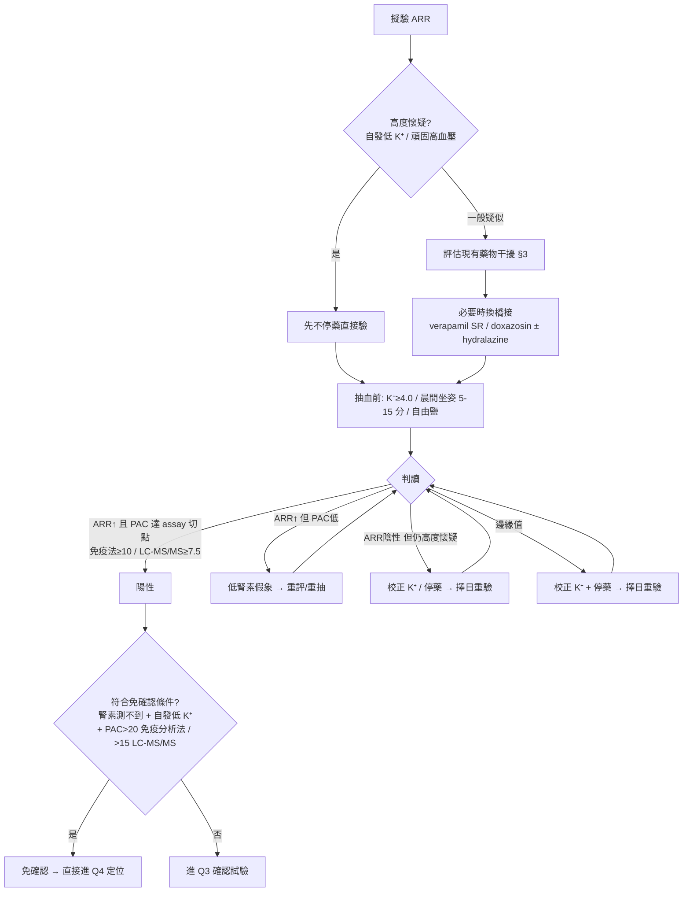

> **💡 一句話結論**
> 承接 [Q1（誰該篩 PA）](/pa/q01-screening-indication/)，本篇是「**怎麼驗 ARR 才不會驗錯**」的操作展開：切點怎麼看、哪些藥要停、抽血條件怎麼控。腎臟科門診案頭速查。

> **⚠️ 先講最重要的一層**
> **以 PRA（腎素活性）計算的 ARR 與以 DRC（直接腎素濃度）計算的 ARR 不可互換**，切點也不同；指引建議值 ≠ 各實驗室實際用值 ≠ 健保認定。下文所有切點一律**以你自己實驗室的檢驗方法與參考值為準**。

---

## 1. 重點結論

- **切點**：主力用 **以 PRA 計算的 ARR ≥30 (ng/dL)/(ng/mL·h)**（國際光譜 20–40；2025 Endocrine Society 以免疫分析法的起點為 >20）**且必須同時 PAC ≥10–15 ng/dL**。以 DRC 計算者另立切點，不可套 PRA 數字。**腎素壓到測不到 + 自發性低 K⁺ + PAC 明顯升高 = 直接強陽性**。
- **藥物洗脫**：MRA／ENaC 抑制劑／利尿劑停 **4 週**；β-blocker、ACEi/ARB、DHP-CCB、中樞 α2-agonist、SGLT2i 停 **2 週**。過渡橋接用 **verapamil SR、doxazosin、hydralazine**。2025 ES **允許**「先不停藥也可驗」以降低門檻（**非無條件免停藥**——陰性且中高風險仍須停藥重驗）；TAIPAI 本土實務採 **21 天**完整停藥（diltiazem／doxazosin 控壓）。
- **抽血條件**：**晨間**、**坐姿 5–15 分**、起床活動後 2 小時內；先把 **K⁺ 校正 ≥4.0**（低 K⁺ 壓抑醛固酮 → 偽陰）；**不限鹽**；避免溶血。

> **地區醫院腎臟科醫師視角**
> 在地區醫院，我不會急著一次到位。**抽完血我會隔約一個月再回診追數據**；這段期間先照標準高血壓控制流程給藥、配合飲食控制把血壓穩住，同時就先跟病人做 PA 的衛教與預後說明。等一個月後的數據出來再決定下一步——這樣病人血壓不會在等待期間失控，病人也透過衛教理解為什麼要這樣一步一步來。

---

## 2. ARR 切點完整解讀

ARR 是分數：分子 = PAC（醛固酮），分母 = 腎素。兩大陷阱都在分母——「用哪種腎素量法」與「腎素太低時 ARR 被灌爆」。

### 2.1 PRA-based 與 DRC-based 不可互換

- **PRA（腎素活性，ng/mL·h）**：國際多數指引、TAIPAI、Mulatero 2002 等經典切點（20／30／35–40）皆建立於此。
- **DRC（直接腎素濃度，mU/L 或 pg/mL）**：CLIA 自動化、快，台灣不少實驗室改用。但 **DRC 與 PRA 在低腎素區（PRA <1）相關性差**（2025 ES 明言此區相關性不佳）→ 不能用固定係數換算硬套 PRA 切點。
- **2025 ES 表 5 對照**：
  - PRA ≤1 ng/mL·h + 醛固酮 ≥10 ng/dL（免疫分析法）→ ARR 切點 **>20**
  - DRC ≤8.2 mU/L + 醛固酮 ≥10 ng/dL（免疫分析法）→ ARR 切點 **>70**（pmol/L/mU/L）
  - 醛固酮改用 LC-MS/MS → 陽性切點約再低 25%（免疫分析法會系統性高估醛固酮）
- **以 DRC 計算的 ARR 實證切點**（Li 2019, PMID 31354984）：同一 CLIA cohort 中 ADRR 最佳切點 **2.93** (ng/dL)/(mU/L)、以 PRA 計算的 ARR 最佳切點 **25.28**；Gao 2022 統合分析（PMID 35845504）支持 ADRR 作 PA 篩檢工具（pooled 敏感度 0.87／特異度 0.85）。**重點仍是「換檢驗方法就換參考值」**，非背數字。
- **台灣醛固酮學會（TSA）工作小組（J Formos Med Assoc 2024, PMID 37173226）**：優先用 PRA，僅 PRA 不可得才用 DRC；明言台灣各院量法不一、切點因實驗室而異。

> **操作結論**：報告單先確認腎素是 PRA 還是 DRC；ARR 數字一定對照**同一張報告單的參考值區間**，不要把投影片的「>30」直接套到 DRC 報告。

### 2.2 PAC 絕對值下限為什麼不能省

分母腎素壓到趨近 0 → ARR 數學上趨近無限大 → 即使醛固酮正常也會「ARR 陽性」。這是低腎素老人／CKD／β-blocker 使用者最常見的**偽陽性**來源。

- 2025 ES 陽性需「兩條件都滿足」：① 腎素低（PRA ≤1 或 DRC ≤8.2）**且** 醛固酮 ≥10 ng/dL（免疫分析法）／≥7.5（LC-MS/MS）；② ARR 超切點。
- 免確認試驗的高度陽性：腎素測不到 + PAC 更高（ES：>20 ng/dL 免疫分析法／>15 LC-MS/MS；TSA：>20 ng/dL）。

> **一句話**：腎素很低時，**先看醛固酮夠不夠高，再看 ARR**；ARR 高但 PAC 不高 = 低腎素假象，不是 PA。

### 2.3 單位換算與台灣實驗室慣例

| 項目 | 慣用單位 | 換算 |
|---|---|---|
| PAC | ng/dL ↔ pmol/L | **×27.7**（10 ng/dL ≈ 277 pmol/L；15 ≈ 416；20 ≈ 555）|
| PRA | ng/mL·h | 2025 ES：≤1 ng/mL·h ≈ ≤12.9 pmol/L·min |
| DRC | mU/L（亦見 ng/L、µIU/mL）| ≤8.2 mU/L ≈ ≤5.2 ng/L（各家試劑不同）|

> **不寫死換算係數**：DRC↔PRA 在低腎素區換算本就不可靠 → **以你院報告所附參考值與單位為準**，不確定時病歷註明檢驗方法種類。

> **我自己踩過的雷**
> 我們的腎素（PRA）與醛固酮是**外送檢驗**，報告回來時兩者單位不一樣（一個 pg、一個 ng）——我就曾經因為單位沒對齊而把 ARR 算錯。所以拿到報告務必先確認單位、用**同一張報告單的參考值**換算，不要憑記憶套數字。

### 2.4 PAC 日內變動與重抽原則

**Yozamp 2021（Hypertension 77:891-899, PMID 33280409）**：51 名確診 PA、137 次篩檢。**醛固酮個體內變異係數 31%、ARR 變異係數 45%**；**49% 至少一次 PAC <15 ng/dL、29% <10；57% 至少一次 ARR <30、24% <20**。→ 單次 ARR 陰性或 PAC 不高**不能排除 PA**。

> **兩篇 Yozamp 2021 勿混用**
> 本段引的是 **篩檢的日間變異**（Hypertension, PMID 33280409）。另有 Yozamp 2021 **Am J Hypertens（PMID 33179734）** 講的是 **AVS 數小時內的急性變異**，是不同篇、不同情境。

**重抽原則**：① 邊緣值 ARR、或高度懷疑但首篩陰性 → 改天重抽（先校正 K⁺、停干擾藥）。② 重抽固定變數：晨間、坐姿、K⁺ ≥4.0、自由鹽。③ 腎素壓抑 + PAC 5–10 ng/dL「邊緣偏低」也建議擇日重驗。

---

## 3. 藥物干擾分類表

整合 Mulatero 2002（PMID 12468576, *Hypertension* 40:897-902）+ 2025 ES 表 6/7。方向欄以對 ARR 淨效應為準。

### 3.1 造成偽陰性（漏診——最危險）

| 類別 | 代表藥 | 腎素 | PAC | ARR | 機轉 | 停藥 |
|---|---|---|---|---|---|---|
| **MRA** | spironolactone、eplerenone | ↑↑↑ | ↑(反射) | ↓↓↓ | 阻斷 MR → 反射性腎素大升，干擾最強 | **4–6 週** |
| **ENaC 抑制劑** | amiloride、triamterene | ↑↑ | ↑ | ↓ | 排鈉 → 腎素升 | **4 週** |
| **利尿劑** | thiazide／loop | ↑↑ | ↑* | ↓ | 容積耗竭 → 腎素升（*若致低 K⁺ 反壓醛固酮）| **4 週** |
| **ACEi／ARB** | ramipril、valsartan | ↑↑ | ↓ | ↓↓ | Ang II↓ → 腎素升、醛固酮降（irbesartan 偽陰 23.5%）| **2–4 週** |
| **DHP-CCB** | amlodipine、nifedipine | 輕↑ | ↓ | 輕↓ | amlodipine 使 ARR −17%、偽陰 1.8% | **2–4 週** |
| **SGLT2i** | dapagliflozin 等 | 短期輕↑ | ↔ | 短期輕↓ | 單篇 retrospective（n=40, Sawamura 2020, PMID 33256676）：用 >2 個月後對 ARR 影響極小、不增偽陰 | 2 週（ES 完整洗脫仍列 2 週；no-washout 下長期使用者多可先不停）|

### 3.2 造成偽陽性（誤診）

| 類別 | 代表藥 | 腎素 | PAC | ARR | 機轉 | 停藥 |
|---|---|---|---|---|---|---|
| **β-blocker** | bisoprolol、atenolol | ↓↓ | ↓ | ↑↑ | 抑制腎絲球旁細胞腎素分泌，降幅 > 醛固酮（atenolol 使 ARR **+62%**）| **2 週** |
| **中樞 α2-agonist** | clonidine、methyldopa | ↓ | ↓ | ↑ | 交感↓ → 腎素降 | **2 週** |
| **NSAIDs** | ibuprofen 等 | ↓ | — | ↑ | 抑制前列腺素 → 腎素降 | 篩檢前避免 |
| **直接腎素抑制劑** | aliskiren | **PRA↓／PRC↑** | ↓ | **視檢驗方法** | 以 PRA 計算偽陽、以 DRC 計算偽陰（方向相反）| 2 週 |

> **β-blocker 細則（ES）**：醛固酮落 10–15 ng/dL（免疫分析法）／7.5–10（LC-MS/MS）邊緣帶 → 疑 β-blocker 偽陽；但醛固酮高於此帶，即使在 β-blocker 下，PA 仍很可能成立。

### 3.3 可用於洗脫期間控壓（對 ARR 干擾最小）

| 藥 | 對 ARR | 備註 |
|---|---|---|
| **Verapamil SR／Diltiazem**（non-DHP CCB）| 中性 | ES/ESH 首選橋接；Diltiazem 為 TAIPAI 指定 |
| **α1-blocker**（doxazosin 等）| 近中性 | Mulatero：doxazosin 使 ARR 僅 −5%；TAIPAI 指定 |
| **Hydralazine** | 中性 | 常併 verapamil 抵銷反射性心搏過速 |

### 3.4 其他干擾因子

口服避孕藥（雌激素 → DRC↓ → 以 DRC 計算者偽陽，PRA 不明顯；Ahmed 2011 ethinylestradiol+drospirenone，PMID 21411552）／荷爾蒙補充療法 HRT（方向類似，以 2025 ES 表 7 為據）／甘草（壓腎素 + 低 K⁺）／姿勢／限鹽（→偽陰）／月經黃體期（僅 DRC）／老年低腎素（→偽陽）／**低 K⁺ 本身（壓抑醛固酮 → 偽陰）**。

---

## 4. 藥物洗脫（wash-out）流程

### 4.1 標準停藥三檔（2025 ES）

- **① 完全不停藥**（ES 允許、降門檻；非無條件免停）：不停藥先驗。陰性 + 中／高前測機率 → 擇日改最小／完整停藥重驗；陽性 + 在用 β-blocker／中樞 α2 → 停這兩類重驗。
- **② 最小停藥**：停 MRA+ENaC 抑制劑 **4 週** + β-blocker+中樞 α2 **2 週**；其餘以橋接藥過渡。
- **③ 完整停藥**：再加停 ACEi/ARB／DHP-CCB／利尿劑／SGLT2i **2 週**。

> **記憶法**：**會升腎素的停 4 週（MRA／利尿劑），會降腎素或降醛固酮的停 2 週（ACEi/ARB／β-blocker／DHP-CCB／SGLT2i）**；橋接一律 verapamil SR + doxazosin ± hydralazine。

### 4.2 TAIPAI 21 天洗脫流程（本土）

所有降壓藥停 ≥21 天，過渡用 **diltiazem 和／或 doxazosin**；研究級確診流程初始 ARR >35 才進確認。介於 ES 2 週／4 週的務實折衷、排程方便（約三週回診）。**已在用 MRA 者 21 天可能不足 → 個案延長至 4–6 週**。（注：**21 天與 ARR >35 為 TAIPAI 臨床實務流傳之操作參數，未見正式文獻明列**——屬臨床社群／實務經驗層級，非 2025 ES 或 TSA 共識門檻，列此供實務參考。）

> **我的門診做法**
> 我**預設不停藥驗**——血壓控制得好就不會為了篩檢停藥，而是把藥物下的數值當作「服藥下的追蹤值」來判讀（呼應前面「用藥下腎素仍被壓抑＝強陽性」的邏輯）。真的需要停藥過渡時，我會加上 CCB、doxazosin（Doxaben XL）或 hydralazine（Apresoline）把血壓頂住，再安排重驗。

### 4.3 2025 ES「不停藥／最小停藥」的精確用語

- **建議 3 技術註解**（藥物洗脫）：條件式建議（2 | ⊕⊕OO，低證據）。允許先不停藥驗，**非無條件免停藥**；陰性在中高風險者仍須停藥重驗。
- **「用藥下腎素仍被壓抑」可作 captopril 試驗的 proxy（表 8）**：ES 原文為「may serve as a proxy for the captopril challenge test」、且判讀屬機率式（probabilistic）。在 ACEi/ARB 下腎素仍壓 + PAC 高 = 與 captopril 陽性同方向的強支持訊號，但**不寫成「等同陽性」**。
- **建議 4 免確認試驗**（2 | ⊕OOO，極低證據）：頑固性高血壓或高血壓+低 K⁺ + PRA <0.2（或 DRC <2）+ PAC >20 ng/dL（免疫分析法）/>15（LC-MS/MS）→ 不建議再做抑制試驗。
- **整份指引 10 項全為條件式建議、證據低～極低** → 勿把「條件式 + 極低證據」講成「強烈建議免停藥」。

> **務實排序（降低病人停藥風險）**
> 1. 高度懷疑（自發低 K⁺）→ 先不停藥直接驗；腎素仍壓 = 強陽性，省去停藥。
> 2. 陰性但高度懷疑 / 陽性但在用 β-blocker · clonidine → 停干擾藥擇日重驗。
> 3. 一般疑似但干擾多 → 換 verapamil SR／doxazosin 橋接後驗。

**不停藥篩檢的 2024–26 證據**：**Liu 2024（J Clin Endocrinol Metab, PMID 38381080）** 不停藥 ARR 篩檢表現佳（切點 0.7 時敏感度 96.3%、NPV 0.99）；**Wang 2026（J Clin Hypertens, PMID 41491647）** 在 RAS 抑制劑用藥下 pre-washout ARR 切點 2.69、敏感度 83.3%／特異度 87.2%／NPV 88.1%（n=412）；**Hua & He 2024（Blood Press, PMID 38824645）** 不調藥敏感度 94.7%／特異度 94.5% → 支持「先不停藥篩、陰性再停藥重驗」。但皆單中心、檢驗方法各異，**切點不可外推**，臨床適用性宜保守解讀。

---

## 5. 抽血前準備（護理站檢核表）

- ☐ **時機**：晨間抽（起床活動 ≥2 小時，建議 08:00–10:00）
- ☐ **姿勢**：坐姿安靜 5–15 分（非臥、非站）
- ☐ **血鉀**：先驗 K⁺，**低 K⁺ 補到 ≥4.0 再抽**；抽 K⁺ 慢抽、止血帶放鬆 ≥5 秒、勿握拳、30 分內分離血漿（防假性高 K⁺）
- ☐ **鈉／鹽**（反直覺：要吃鹽）：抽血前數日自由／高鹽、不限鈉（限鈉升腎素 → 偽陰）
- ☐ **其他**：避免久禁食／咖啡因／劇烈運動／溶血；記錄腎素檢驗方法種類 + 用藥清單；女性記錄口服避孕藥／荷爾蒙補充與月經週期

---

## 6. 偽陰／偽陽判讀除錯

| 情境 | 判斷 | 下一步 |
|---|---|---|
| ARR 陰性但高度懷疑（自發低 K⁺／頑固高血壓）| 多偽陰：K⁺ 未校正 或 用了升腎素／降醛固酮的藥 | 校正 K⁺ ≥4.0、停干擾藥（MRA 4 週／ACEi-ARB 2 週）擇日重驗；或用不停藥邏輯（腎素仍壓 = 強陽性）|
| ARR 陽性但 PAC 不高 | 低腎素分母假象（老人／CKD／β-blocker）| 看 PAC 絕對值是否 ≥10–15；未達 = 不算陽性，重評／重驗，勿逕送確認試驗 |
| 邊緣值 ARR | Yozamp 變異係數 45%，單次不可靠 | 固定條件後改天重抽；必要時停藥重驗 |
| 腎素「測不到」（偵測下限效應）| PRA／DRC 偵測下限不同 | 重點放「腎素是否被壓 + PAC 是否夠高」，對照該檢驗方法的偵測下限 |
| 在用 β-blocker／clonidine + ARR 陽性 | 可能偽陽 | 醛固酮 >15 ng/dL（免疫分析法）仍可信；10–15 則停藥 2 週重驗 |

---

## 7. 特殊族群（腎臟科主場）

**CKD**
- 停 ACEi/ARB 的兩難：停 → 失去蛋白尿保護 + 停藥期血壓難控；不停 → 腎素被拉高造成偽陰。**實務傾向先不停藥篩檢**——在 ACEi/ARB 下腎素仍壓 + PAC 高 = 強陽性，免去停藥風險（連 [Q6 — PA + CKD 三段式治療](/pa/q06-ckd-pa-treatment/)）。
- CKD 本身低腎素 → 整體偏偽陽 → 判讀務必看 PAC 絕對值；生理鹽水確認試驗在進階 CKD 相對禁忌，captopril 試驗較安全。

> **我的門診做法**
> 地區醫院的 CKD 疑似 PA 病人，常常已經是 **ARB＋spironolactone、多重用藥（>3 種、尤其合併利尿劑）**——這正是干擾最重、最難乾淨停藥的組合。我傾向**不停藥直接驗**，把藥物下的數值當服藥追蹤值判讀，避免停掉 ARB 失去蛋白尿保護又讓血壓在停藥期間失控。

**老年／低腎素高血壓**：腎素生理偏低 → 偽陽率↑。守住 PAC 絕對下限；年齡分層切點屬研究級、不直接外推門診。

**已在用 MRA**：頑固性高血壓常見已加 spironolactone。停 ≥4–6 週、橋接 verapamil SR／doxazosin；停藥風險高時觀察「用 MRA 下腎素是否仍壓」（仍壓 = 高度可能）。

**孕婦**：ARR 孕期不可靠（RAAS 生理活化 + progesterone 抗礦物皮質素）→ 偽陰；診斷靠「壓抑的腎素 + 高醛固酮」，生理鹽水／fludrocortisone 確認試驗孕期禁用。**孕期 PA 應轉介**。

**糖尿病／用 SGLT2i／finerenone**：SGLT2i 用 >2 個月對 ARR 影響極小、no-washout 下多可不停（Sawamura 2020, PMID 33256676；ES 完整洗脫仍列 2 週）。**finerenone：已有 pilot RCT（Hu 2025, PMID 39804908）與 real-world switch study（Uslar 2025, PMID 40378185）短期資料，但無 ARR 篩檢判讀研究、亦無 PA hard-outcome 證據 → 篩檢情境保守視同 MRA 處理**（對齊 [Q9 — PA + 心房顫動](/pa/q09-pa-af/)／[Q11 — Taiwan NHI Coverage](/pa/q11-taiwan-nhi-coverage/) 已驗結論）。

---

## 8. ARR 判讀與後續決策樹

---

## 9. 台灣健保／申報實務

> 以本次查核可見為準；申報前以健保署最新版支付標準與審查注意事項查詢系統為準。

- ARR 篩檢 = **PAC（醛固酮）+ 腎素（PRA 或 DRC）** 兩項生化檢驗；給付通常需明確臨床指徵 + 病歷佐證。
- **病歷指徵記載建議**（提高過件 + 臨床正當性）：頑固性高血壓（≥3 種足量降壓藥含利尿劑仍未達標）／高血壓 + 自發或利尿劑相關低 K⁺／腎上腺意外瘤／早發或家族性高血壓。
- **重複檢驗／停藥後重驗**：因 ARR 再現性差（Yozamp）屬臨床合理，但是否給付依審查；病歷需寫明重驗理由（K⁺ 已校正／藥物已洗脫／首次與臨床不符）。
- 本篇**不寫死任何健保代碼／點數**；確切給付條件、頻次限制以申報當下系統最新版本為準（連 [Q11 — PA 健保給付與自費價格](/pa/q11-taiwan-nhi-coverage/)）。

> **在地申報經驗**
> 就我目前的申報經驗，ARR（醛固酮＋腎素）尚未遇到核刪；但仍建議照上面把適應症寫清楚，作為臨床正當性與日後查核的依據。

---

## 10. 病人衛教對話框架

> **「要驗醛固酮為什麼先停我的血壓藥？」**
> 某些血壓藥會動到要量的兩個荷爾蒙 → 假高／假低 = 白驗；會換不影響檢驗的藥頂著。**這個檢查不是自己停藥去抽**——尤其 spironolactone 這類常要停至少 4 週，停不停一定由醫師安排。

> **「停藥血壓飆高怎麼辦？」**
> 換 verapamil／doxazosin 過渡、回診盯著調、太高隨時回來。

> **「為什麼早上抽、坐著抽？」**
> 荷爾蒙晨間最高、姿勢影響數值 → 統一標準才準；抽前先確認 K⁺ 補夠。

> **「一次沒準還要再抽？」**
> 荷爾蒙一天內波動，單次抽到低點不代表沒事 → 條件固定後改天再驗，避免漏診誤診。**一次陰性也不能完全排除 PA**，尤其在低血鉀或藥物干擾下，更要看情況重驗。

---

## 11. Uncertainty／待補充事項

- **2025 ES 表 5/6/8 與建議 3／4 的逐字 wording**：本文以指引內容與跨來源一致為據；正式引用前建議再核 ES 原文 PDF。
- **finerenone 在 PA**：已有 pilot RCT（Hu 2025）與 real-world 短期資料（Uslar 2025），但無 ARR 篩檢判讀／hard-outcome 證據 → 保守視同 MRA，勿超寫。
- **TAIPAI 21 天／初始 ARR >35**：屬臨床實務流傳，未見正式文獻明列；列此供實務參考。
- **DRC↔PRA 換算係數、台灣各實驗室單位**：刻意不寫死，一律以個別檢驗報告參考值為準。
- **健保代碼／點數**：保守不寫；與 [Q11](/pa/q11-taiwan-nhi-coverage/) cross-check 後再定。

---

## 12. References（含 PMID）

1. Adler GK, Stowasser M, Correa RR, et al. Primary Aldosteronism: An Endocrine Society Clinical Practice Guideline. *J Clin Endocrinol Metab* 2025;110(9):2453-2495. **PMID 40658480**.
2. Mulatero P, Rabbia F, Milan A, et al. Drug effects on aldosterone/plasma renin activity ratio in primary aldosteronism. *Hypertension* 2002;40(6):897-902. **PMID 12468576**.
3. Yozamp N, Hundemer GL, Moussa M, et al. Intraindividual Variability of Aldosterone Concentrations in Primary Aldosteronism: Implications for Case Detection. *Hypertension* 2021;77(3):891-899. **PMID 33280409**.
4. Williams B, MacDonald TM, Morant S, et al. Spironolactone versus placebo, bisoprolol, and doxazosin to determine the optimal treatment for drug-resistant hypertension (PATHWAY-2). *Lancet* 2015;386(10008):2059-2068. **PMID 26414968**.
5. Williams B, MacDonald TM, Morant SV, et al. Endocrine and haemodynamic changes in resistant hypertension (PATHWAY-2 mechanisms substudies). *Lancet Diabetes Endocrinol* 2018;6(6):464-475. **PMID 29655877**.
6. Sawamura T, Karashima S, Nagase S, et al. Effect of sodium-glucose cotransporter-2 inhibitors on aldosterone-to-renin ratio in diabetic patients with hypertension: a retrospective observational study. *BMC Endocr Disord* 2020;20(1):177. **PMID 33256676**.
7. Ahmed AH, Gordon RD, Taylor PJ, et al. Effect of contraceptives on aldosterone/renin ratio may vary according to the components of contraceptive, renin assay method, and possibly route of administration. *J Clin Endocrinol Metab* 2011;96(6):1797-1804. **PMID 21411552**.
8. Lin CH, Lin CH, Chung MC, et al. Aldosterone-to-renin ratio (ARR) as a screening tool for primary aldosteronism (PA). *J Formos Med Assoc* 2024;123 Suppl 2:S98-S103. **PMID 37173226**.
9. Chang CC, Chen YY, Lai TS, et al. Taiwan mini-frontier of primary aldosteronism: Updating detection and diagnosis. *J Formos Med Assoc* 2021;120(1 Pt 1):121-129. **PMID 32855034**.
10. Li T, Ma Y, Zhang Y, et al. Feasibility of Screening Primary Aldosteronism by Aldosterone-to-Direct Renin Concentration Ratio Derived from Chemiluminescent Immunoassay Measurement. *Int J Hypertens* 2019;2019:2195796. **PMID 31354984**.
11. Gao H, Luo R, Li J, Tian H. Aldosterone/direct renin concentration ratio as a screening test for primary aldosteronism: a systematic review and meta-analysis. *Ann Transl Med* 2022;10(12):679. **PMID 35845504**.
12. Liu X, Hao S, Bian J, et al. Performance of Aldosterone-to-renin Ratio Before Washout of Antihypertensive Drugs in Screening of Primary Aldosteronism. *J Clin Endocrinol Metab* 2024;109(12):e2302-e2308. **PMID 38381080**.
13. Yozamp N, Hundemer GL, Moussa M, et al. Variability of Aldosterone Measurements During Adrenal Venous Sampling for Primary Aldosteronism. *Am J Hypertens* 2021;34(1):34-45. **PMID 33179734**.
14. Wang Q, Dong H, Li HW, Zou YB, Jiang XJ. Screening and Diagnosis of Primary Aldosteronism in Patients Using Renin-Angiotensin System Inhibitors. *J Clin Hypertens* 2026;28(1):e70197. **PMID 41491647**.
15. Hua Y, He Q. Comparison between screening for primary aldosteronism with and without drug adjustment. *Blood Press* 2024;33(1):2350981. **PMID 38824645**.
16. Hu J, Zhou Q, Sun Y, et al. Efficacy and Safety of Finerenone in Patients With Primary Aldosteronism: A Pilot Randomized Controlled Trial. *Circulation* 2025;151(2):196-198. **PMID 39804908**.
17. Uslar T, Sanfuentes B, Muñoz I, Vaidya A, Baudrand R. Real-world outcomes of finerenone in primary aldosteronism. *Eur J Endocrinol* 2025;192(5):K50-K53. **PMID 40378185**.

---

## 相關問答

依臨床情境分流：

- 想看**誰該篩 PA** → [Q1 — PA 篩檢適應症](/pa/q01-screening-indication/)
- 想看 **ARR 陽性的下一步** → [Q3 — 確認試驗選擇](/pa/q03-confirmation-test/)（符合免確認條件可跳過直接進定位）
- 想看 **PA + CKD 共病處置** → [Q6 — PA + CKD 三段式治療](/pa/q06-ckd-pa-treatment/)（停 ACEi/ARB 的洗脫兩難 + 高血鉀風險平衡）
- 想看 **PA + AF 共病** → [Q9 — PA + 心房顫動](/pa/q09-pa-af/)（AF 病人 wash-out 的心律安全紀律）
- 想看**健保給付與自費** → [Q11 — Taiwan NHI Coverage](/pa/q11-taiwan-nhi-coverage/)

---

## 跨 cluster 深化

- [Finerenone Q08 — 監測頻率](/finerenone/q08-monitoring-frequency/) — MR antagonist 家族監測原則
- [SGLT2i Q01 — CKD 啟用時機](/sglt2i/q01-ckd-start-timing/) — 心腎代謝交界用藥
- [偏鄉腎臟科醫師到底在做什麼？](/rural-nephrology/01-rural-nephrology-role/) — 在地腎臟科 PA 篩檢與轉介視角

---

> **重點重申**：以 PRA 計算與以 DRC 計算的 ARR 不可互換、切點也不同；ARR 高但 PAC 不高是低腎素假象、不是 PA。藥物洗脫「升腎素的停 4 週、降腎素／降醛固酮的停 2 週」，2025 ES 允許先不停藥也可驗（非無條件免停）。抽血前 K⁺ 補到 ≥4.0、晨間坐姿、不限鹽。本文為臨床決策參考，個別病人處置仍須回到主治醫師面對面評估。
