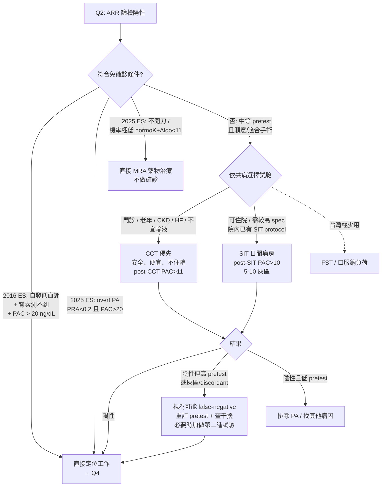

> **💡 一句話結論**
> 承接 [Q1（誰該篩 PA）](/pa/q01-screening-indication/) → [Q2（ARR 怎麼驗）](/pa/q02-arr-cutoff-washout/)，本篇是診斷流程第三站：**ARR 陽性後，哪種確認試驗、什麼時候可以不做**。下一站 [Q4（定位／AVS）](/pa/q04-lateralization-avs/)。

> **⚠️ 先講最重要的一層**
> **四種確認試驗無單一 gold standard、cutoff 各自獨立、不可互通**。下文所有切點**一律以你自己實驗室的檢驗方法（免疫分析法 vs LC-MS/MS）與 protocol 參考值為準**；單中心數字不可寫成普世標準。

---

## 1. 重點結論

- **先判斷能否「跳過確診」**：ARR 陽性後，若同時符合 **自發性低血鉀 + 腎素測不到/受抑制 + PAC >20 ng/dL**（2016 ES 三聯徵），可直接進入定位（[Q4](/pa/q04-lateralization-avs/)），不必做確認試驗。2025 ES 進一步**兩端都可省略**——高 pretest 直接分型、低 pretest／不開刀直接 MRA。
- **需確診者，門診／老年／CKD／HF 首選 CCT**（captopril 試驗）：安全、便宜、純門診、無容量負荷；與 SIT 診斷效能相當（AUC 0.88 vs 0.87，Liu 2021）。
- **SIT 用於可住院、需較高 specificity、院內已有固定 protocol／cutoff 者**；**FST、口服鈉負荷在台灣極少用**。
- **CKD／HF 病人因 SIT 容量負荷風險 → 明確優先 CCT**（腎臟科核心差異化）。
- **「陽性確認、陰性不能排除」**：borderline／discordant 時回頭評 pretest probability、必要時換不同機制的第二種試驗。

> **地區醫院腎臟科醫師視角**
> 我這邊的疑似 PA 病人，典型來自兩個入口。一個是因為**低血鉀**被轉來 survey，我一量發現血壓也偏高、血液氣體呈**代謝性鹼中毒**——年輕人尤其常見。另一個是**吃了好幾種降壓藥加利尿劑還是壓不下來**、病人不滿意，來尋求第二意見的難控型高血壓。
>
> 這兩種我通常**直接驗 ARR + serum K⁺ + 血液氣體**；只要 **ARR > 30** 我就準備轉介、或先用 aldactone（spironolactone）。我**不會再另外排 saline infusion test**，理由很實際：SIT 在我這裡得收一次**診斷型住院**才做得成，但驗完往往還是要轉介醫學中心評估手術。在護理與檢驗人力都吃緊的區域醫院，為了一個確診試驗多收一次住院，既不太合適、也不容易跟病人解釋。**ARR 本身已經高，診斷的確定性就夠了**——直接治療、或轉院評估開刀，對病人、對我們的資源都更省時。
>
> 還有一層是病人端的現實。在我這個社區，不少人對「先把病因查清楚」這種診斷導向的做法並不買單——來門診就是要拿降壓藥，你要是沒開、或開得跟原本一樣，病人會覺得你「不會治、沒在治療」。就算 ARR 高、照理該轉出去評估開刀，很多人也嫌遠、嫌麻煩，對疾病的認識又不夠，寧可留在原地吃藥；何況在南部，真正在做 PA 手術評估的中心本來就不多。所以這條路**很常最後又回到藥物控制**。
>
> 我把這個收尾講白：在這樣的條件下，**「驗出 ARR 高 → 一線 MRA 把血壓和荷爾蒙一起壓住」並不是退而求其次的妥協**——它既是病人當下要的「降壓藥」，本身也正好是 PA 站得住腳的治療方向。能轉、願意轉的，我幫他轉去確診評估開刀；轉不動的，藥物控制一樣是有依據的一條路。

---

## 2. 四種確認試驗比較

指引列出四種確認試驗，任選其一即可。整合 2016／2025 ES、Leung 2022 meta-analysis（PMID 35652330）、Song 2018（PMID 29158354）、Liu 2021（PMID 33779561）與 TAIPAI 資料。**四者 cutoff 各自獨立、不可互通，務必以各 lab／protocol 參考值為準**。

| 項目 | SIT | CCT | FST | 口服鈉負荷 |
|---|---|---|---|---|
| **流程** | 臥位或坐位；2 L 0.9% NaCl 於 4 小時滴注；臥位版先平躺 1 小時；0／4 小時測 PAC／renin／K⁺／cortisol | 口服 captopril 25–50 mg；0／60(／90)／120 min 測 PAC、PRA、ARR；門診坐位即可 | fludrocortisone 0.1 mg q6h × 4 天 + NaCl + KCl 補充；第 4 天測 PAC／renin（含 cortisol 排除 ACTH 干擾）| 高鈉飲食（NaCl ~6 g／天，目標尿 Na >200 mEq／天）× 3 天；第 3 天起收 24 小時尿 aldosterone |
| **陽性 cutoff**（不可互換）| 臥位 post-SIT PAC **>10 ng/dL 陽性、<5 排除、5–10 灰區**（國際慣用）；LC-MS/MS cutoff 較低（~5.8 ng/dL／162 pmol/L）；坐位 SIT 診斷亦沿用 >10 | post-CCT **PAC 不被抑制（傳統 <30%）或 ARR 仍高**；**建議改用 post-CCT PAC 絕對值 >11 ng/dL**（避免 denominator effect）| 第 4 天 10:00 PAC **>6 ng/dL**（且 PRA 低、10:00 cortisol < 07:00 cortisol）| 24 小時尿 aldosterone **>12 μg/24h 確診、<10 μg 不太可能**（須尿 Na >200 mEq／天才算 adequate）|
| **診斷效能** | post-SIT PAC>8：sens **85%**／spec **92%**（Song 2018）；坐位 SIT AUC 0.87（Liu 2021）| post-CCT PAC>11：sens **90%**／spec **90%**（Song 2018）；AUC 0.88（Liu 2021）| meta 僅 7 studies／386 人，certainty 很低；歷史視為 reference-like、sens 高（量小）| meta 僅 2 studies／99 人；spec 高、sens 偏低（量小）|
| **AUC（head-to-head）** | Liu 2021 SSST **0.87**（95%CI 0.82–0.91）| Liu 2021 CCT **0.88**（0.83–0.95），**與 SSST P=.646（無顯著差異）** | 缺現代前瞻直接比較 | 缺現代前瞻直接比較 |
| **費用／場域** | 中；日間病房（4 小時）| **低；純門診** | 高；傳統需住院 4–5 天 | 中；門診但 3 天高鈉 + 24h 尿依從性差 |
| **安全／禁忌** | 容量負荷 → **嚴重／未控制高血壓、HF、嚴重 CKD、心律不整禁忌**；可惡化低血鉀 | 安全、副作用極小；**可用於嚴重高血壓／HF／老年／CKD**；嚴重腎不全留意低血壓 | 低血鉀風險高、須密集監測；藥物取得不易 | 低血鉀惡化、須補鉀；嚴重高血壓／HF 慎用 |
| **台灣可行性** | **主流之一（日間病房）**；2017 TSA 共識標準 SIT 為臥位（recumbent），坐位 SIT（SSST）為近年發展方向 | **主流之一（門診）；最適區域醫院腎臟科** | **極少用**（資源密集、fludrocortisone 取得難）| **極少用**（24h 尿收集與依從性問題）|

**整體判讀**（Leung 2022 meta, PMID 35652330）：確認試驗在高 pretest 病人加值有限——陽性只證明已知的事、陰性有高 false-negative；**偏倚使過去研究高估準確度 5–7 倍**（case-control 7×、partial verification 5×），多數情境確認試驗反而**漏掉 PA case**；整體證據品質 GRADE **very low**，routine use 應重新檢討。在固定 specificity 95% 下，meta 估計各試驗 sensitivity 落差極大：臥位 SIT 84.5%、**坐位 SIT 僅 60.7%**、CCT 82.5%、FST 91.4%（皆 95% 廣 CI、證據品質 very low）。

> **⚠️ TAIPAI cutoff 三層，別混用**
> 以下三個數字用途不同、不可混為一談（2017 TSA 共識 PMID 28735660 + Wu CH 2019 PMID 31216359）：
> - **診斷切點**：post-SIT PAC **>10 ng/dL**（2017 TSA 共識正式印刷值、國際慣用；Song CONPASS 另用 >8、post-CCT >11，皆非 TAIPAI 專屬）。
> - **「>16 ng/dL」**：2017 TSA 共識中**引述 TAIPAI study group 未發表資料**、列為 highest positive predictive value 的附帶敘述（出現在坐位 SIT 討論脈絡）——**屬未發表來源、非正式診斷切點**，勿當成 TAIPAI 標準診斷或手術 cutoff 沿用。
> - **術後療效預測**：post-SIT PAC **>25 ng/dL → 腎上腺切除術後良好療效 PPV 86%**（Wu CH 2019, PMID 31216359；該研究中 post-SIT PAC、非 post-CCT PAC 才獨立預測 clinical success）——這是**「預測手術療效」非「診斷」**。

> **比較表的兩個判讀盲區**
> 1. **SIT 姿勢**：臥位消除重力對交感的刺激 → 對 Ang II 仍有殘餘敏感度的 APA 可能假性抑制（漏診）；故坐位 SIT（SSST）近年取代臥位為主流。
> 2. **CCT 抑制率 vs 絕對值**：基期 PAC 不高時，「下降 <30%」的百分比判讀易因分母小而誤判（denominator effect）→ **強烈建議改用 post-CCT PAC 絕對值 >11 ng/dL**（Song 2018 證實 sens／spec 0.90／0.90，且 AUC 從用抑制% 的 0.71 拉回 0.96）。

---

## 3. 何時可跳過確認試驗（2016 + 2025 ES 原文）

> **📖 2016 Endocrine Society 指引（Funder et al., JCEM 2016;101:1889-1916, PMID 26934393）逐字**
> "Instead of proceeding directly to subtype classification, we recommend that patients with a positive ARR undergo one or more confirmatory tests to definitively confirm or exclude the diagnosis (1∣⊕⊕○○). **However, in the setting of spontaneous hypokalemia, undetectable renin, and PAC >20 ng/dL (550 pmol/L), we suggest that there may be no need for further confirmatory testing (2∣⊕○○○).**"

→ 三條件**同時成立**：自發性低血鉀 + 腎素測不到 + PAC >20 ng/dL。屬 **conditional (2) + 極低證據（⊕○○○）**。

> **📖 2025 Endocrine Society 指引（Adler et al., JCEM 2025;110(9):2453-2495, PMID 40658480）Recommendation 4 逐字**
> "In individuals who screen positive for primary aldosteronism (PA), we suggest aldosterone suppression testing in situations when screening results suggest an **intermediate probability for lateralizing PA** and individualized decision making confirms a desire to pursue eligibility for surgical therapy. (2∣⊕○○○)"

確認試驗**可省略**的情境（2025 ES；低機率閾值原文帶 ∼ 近似符號）：

1. **高 pretest／overt PA**：resistant HTN 或 HTN+低血鉀，且有 renin-independent aldosterone 生成的明確生化證據（**PRA <0.2 ng/mL/h 或 DRC <2 mU/L，且 PAC >20 ng/dL [免疫分析法]／>15 [LC-MS/MS]**）→ 不建議再做確診。
2. **不願／不能接受 AVS 與腎上腺切除者** → 直接 MRA。
3. **家族性醛固酮增多症（germline mutation）家族成員**。
4. **低 pretest／lateralizing 機率極低**：normokalemia + aldosterone <∼11 ng/dL（免疫分析法）／<∼8（LC-MS/MS）→ 直接 MRA。

**外部驗證**（SCIPA／Ong Lopez 2024, PMID 38978003）：PAC **>20 ng/dL + PRA <0.6 ng/mL/hr + 自發性低血鉀** =「overt PA confirmed」可免動態確認試驗（spec 94.6%、PPV 93.6%；若 PAC>25 則 spec／PPV 達 100%）。

### 關鍵差異與實務意涵

- **2016**：僅「極端高表型」省略；**2025**：**兩端都可省略**——高 pretest 直接分型、低 pretest 直接 MRA，中間段才做 suppression test（且須病人想開刀）。
- 兩版皆 **conditional（2 級）、低／極低證據**——屬「臨床判斷 + 共享決策」。
- 真正「免確診」族群：典型三聯徵；不開刀直接 MRA 者；機率極低不打算追到底者。

---

## 4. 無單一 Gold Standard 與 Discordant 結果處理

### 無單一 gold standard（Mulatero 2006, PMID 16670162）

以 FST 為對照，SIT 漏掉 10.4% PA、把 16.1% EH 判陽性（一致率 88%）；SIT 為 FST 合理替代，但**無真正 gold standard**。Leung 2022 meta（PMID 35652330）進一步指出 spectrum／verification bias 使過去研究高估準確度 5–7 倍，「無法分辨單一最佳試驗、無法產生可信 pooled sens／spec」。

### 為什麼不同試驗會 discordant（機轉）

- **AT1 受體殘餘敏感度**：部分 IHA 增生細胞保留對 Ang II 的敏感度 → CCT 阻斷 Ang II 時 PAC 部分下降 → CCT 偽陰。
- **離子通道自主突變**（KCNJ5 等）：典型 APA 醛固酮分泌脫離容積負反饋 → SIT 呈鮮明陽性不抑制。
- **群體 vs 個體落差**：Liu 2021 證實 SSST 與 CCT 群體效能相當（AUC 0.87 vs 0.88），但個體層面同一病人可在 CCT 陽性、SIT 陰性。**cutoff 生物學上不可互換**。

### Discordant／borderline 處置

1. **回頭評 pretest probability**（自發低血鉀、難控高血壓、PAC／ARR、腎上腺結節）。高 pretest 而確診陰性 → 視為可能 false-negative，勿輕排除 PA。
2. **查干擾因子**：K⁺ 是否已矯正（低 K⁺ → 偽陰）、是否低鹽、干擾藥物（β-blocker 偽陽；ACEi／ARB／CCB 偽陰）、姿勢與採血時點、assay（免疫分析法 vs LC-MS/MS）。
3. **灰區（post-SIT 5–10 ng/dL）加做 CCT**：可提升 AUC **0.87→0.91（P=.041）**、sens 0.83→0.91（Lin 2020, PMID 31774187）。
4. **Liu 2021 含義**：SSST 與 CCT 效能相當，原作者明言 **CCT「preferred over SSST」**（較簡單、便宜）；鈉攝取不足會降 SSST 效能、不影響 CCT → 區域醫院門診優先 CCT 的證據基礎。
5. **身體不適合再做第二種試驗** → 回歸 2025 ES 精神，直接啟動 MRA 治療試驗（低劑量 spironolactone 後血壓／血鉀戲劇性改善，臨床意義大於一紙陰性報告）。

---

## 5. 確認試驗還需不需要：2025 爭議

### 反方：SSST 充滿偽陰性（Leung AA 2025, Ann Intern Med 178(7):948-956, PMID 40324193）

單中心（Calgary）、156 名 ARR 陽性成人做盲性坐位 SSST，以**治療反應**（降壓、減藥、生化正常化）為 reference standard（避開過去 verification bias）。結果：responder 與 non-responder 的 post-SSST PAC 大幅重疊（329 vs 255 pmol/L），**AUC 僅 62.1%（95%CI 45.1–79.1）**，140–300 pmol/L 各 cutoff 概似比模稜兩可。結論：**SSST false-negative 率高，依賴它會錯失治療機會**。隨刊評論 Cohen JB〈Rethinking Confirmatory Testing in PA〉（PMID 40324184, pp.1044-1045）呼應。

**同 cohort 後續**（Leung AA 2026, Hypertension 83(5):e26008, PMID 41582811, NCT04422756）：160 例皆做 SSST + AVS（lateralizing 98 例／61.3%），SSST 對 **AVS lateralization 準確度僅 64.4%（≥5.0 ng/dL）／67.5%（≥10.1 ng/dL）**，陽性概似比 1.1–1.9。結論「**aldosterone suppression testing 對預測 AVS 結果不可靠、可能誤導診療決策**」→ **陰性或低值 SIT／SSST 不能保證沒有單側病灶**。

### 正方：reference standard 選擇謬誤（Stowasser M 2026, Hypertension 83(5):e26302, PMID 41984985）

主導 2025 ES 修訂的 Stowasser 等發表〈Setting the Record Straight Under New Guidelines〉強力反駁：

- **對 MRA 有治療反應 ≠ 確診 PA**：MRA 對廣大 low-renin essential hypertension 同樣有效 → 以治療反應為 reference 必然把海量 low-renin EH 誤標 PA，壓低 SSST 表觀 sensitivity。
- **確認試驗的設計目的是「確認生化層次疾病存在（PA vs EH）」，非「預測廣效藥物的治療反應」** → 要求 SSST 回答它設計上無法回答的問題。
- **限縮於 AVS／手術證實的單側 PA 時，SSST 的表觀 sensitivity 會明顯提高**——呼應上述：用對的 reference standard，確認試驗的偽陰率自然下降。

### 實務含義收斂

學界頂層辯論激烈，但對第一線醫師指導意義清晰：**確認試驗的價值未消失、被重新定位**——

- **支持省略**：高 pretest 陽性錦上添花、陰性常 false-negative；SIT 有容量負荷風險；確診是冗長路徑的障礙。
- **確診仍有價值**：(1) Leung 2025 為單中心、reference standard 有爭議、外推性有限；(2) 中等 pretest 要決定 AVS／手術者，陽性 suppression test 仍助過濾假陽性、避免不必要的侵入性 AVS。
- **務實立場**：overt PA 與不開刀者免做；**只對「需過濾的中等機率手術候選人」做**；切記**陰性不能排除 PA、也不能排除單側病灶**。

---

## 6. 試驗選擇決策樹

---

## 7. 特殊族群（CKD／HF／老年）

- **CKD／HF**：SIT 的 2 L 容量負荷（≈308 mEq Na ≈ 18 g NaCl）可誘發肺水腫、HF 惡化、腎功能惡化與電解質紊亂——**嚴重 CKD／HF／未控制高血壓為 SIT 禁忌**。**改選 CCT**：不增加容量、可安全用於有心血管併發症者。**注意**：嚴重腎不全用 captopril 須留意低血壓；嚴重 CKD 因腎素系統與電解質基礎異常，post-test 判讀須臨床整合；CKD 常併大劑量 loop diuretic 致基期腎素不夠 suppressed → 試驗前安全範圍內暫停利尿劑。
- **老年／低腎素**：基期腎素本就受抑制 → CCT 依「百分比抑制」判讀易**偽陽**；**>65 歲建議改用絕對值（post-CCT PAC >11）**。PAC 由 8→6 ng/dL（降幅 <30% 但絕對值低）不可輕率確診。
- **已自發低血鉀 + 典型表現者**：**不要只為流程做 SIT**——符合三聯徵即依 2016／2025 ES 省略確診，避免低血鉀病人再承受鈉／容量負荷誘發心律不整。

> **腎臟科主場思維**
> 老實說，下放偏鄉之後，這類診斷型動態試驗（SIT／CCT）我這裡就**沒再排過**——技術上對我們的檢驗人員有難度。所以碰到灰區或共病病人，我的路線通常是**直接走 MRA trial**：用 MRA 一邊控血壓、一邊看反應；對手上同時有 HF 的病人，MRA 本來就有額外好處，又能**省掉一次不必要的 salt loading**，讓治療效果替我回答診斷問題。

---

## 8. 台灣健保／實務

> **截至本次查核可見；確切代碼與點數以健保署「醫療服務給付項目及支付標準」現行版本為準。**

- **SIT 與 CCT 為台灣兩大主流確認試驗**（2017 TSA 共識 Wu VC et al., J Formos Med Assoc 2017;116(12):993-1005, PMID 28735660）。CCT 純門診；SIT 多在日間病房／住院。
- **FST、口服鈉負荷在台灣極少使用**：FST 因 fludrocortisone 取得困難、須多日監測；口服鈉負荷因 24 小時尿收集與依從性問題。本文對此二者係依公開文獻與醫學中心常規，非作者個人例行操作。
- **健保給付**：PAC、PRA／DRC、aldosterone 等檢驗及生理食鹽水、captopril 屬常規可及項目；**SIT 多採拆項申報**（食鹽水藥費 + 點滴輸注處置 + 多次 PAC／renin 檢驗），CCT 為門診抽血檢驗 + 低廉 captopril 藥費。**本文不列具體支付代碼**——詳見 [Q11（健保給付）](/pa/q11-taiwan-nhi-coverage/)。

> **申報排程實務**
> 講白一點，確認試驗的申報與排程細節不是我的主場——SIT 我不收住院做、CCT 我也不熟。我的角色比較前端：**ARR 一旦高度懷疑，我就轉介**，把確診試驗、AVS、手術評估留給後送的醫學中心。所以這篇我不會憑空寫 SIT／CCT 怎麼拆項申報、怎麼喬床；操作層面的給付資訊，請以 [Q11（健保給付）](/pa/q11-taiwan-nhi-coverage/) 與健保署現行支付標準為準。

---

## 9. 病人衛教對話框架

> **「ARR 已經高了，為什麼還要再做一個試驗才確診？」**
> 「ARR 高只是『懷疑』的第一步，就像紅燈亮了要再確認。確診試驗是給身體一點鹽水或一顆藥，看您的醛固酮會不會像正常人一樣被『壓下去』；壓不下去才能確定。不過如果您本來血鉀就低、腎素也測不到、醛固酮又很高，這三點都符合時，其實已經很確定，可以不用再做試驗，直接安排下一步檢查。」

> **「saline 那個要打點滴住院嗎？captopril 是不是門診就能做？」**
> 「是的。生理食鹽水試驗（SIT）要打 4 小時點滴、通常安排在日間病房；captopril 試驗（CCT）只要在門診吃一顆藥、抽幾次血就好，比較方便。您有心臟或腎臟負擔的話，我們會優先選 captopril，因為它不會額外灌水進身體，比較安全。」

> **「醫師說我可以不用做確診直接做下一步，這樣會不會診斷不準？」**
> 「不會。您的表現非常典型，國際指引（2016、2025 年）都同意這種情況可以省略確診試驗、直接進入下一步，反而少打一次點滴、少跑一趟。這是有依據的做法，不是偷工省事。」

> **我門診實際的講法**
> 老實說，我的門診量很大，能花在單一病人身上的時間有限。所以遇到 ARR 高度懷疑 PA 的病人，我通常**不會在診間細談要打 saline 還是吃 captopril、要不要住院**——這些確診試驗我會**轉介到醫學中心**做。我跟病人的講法很簡單：「您這次抽血高度懷疑是一種會讓血壓高、血鉀低的荷爾蒙問題；我幫您轉到大醫院做進一步確認和後續評估，那邊的設備、人力比較齊全。」把病人**準時送到對的地方**，往往比在小診間硬做完一整套確診更實在。

---

## 10. Uncertainty／待補充事項

- **確認試驗的 cutoff 與 sens／spec 精確值**因檢驗方法（免疫分析法 vs LC-MS/MS）與各 lab protocol 而異，一律以個別實驗室參考值為準，勿把單中心數字當普世標準。
- **Stowasser 反方 commentary 的單側 PA 之 SSST sensitivity 精確數值**：本文僅引用其論點（以治療反應為 reference standard 會壓低 SSST 表觀 sensitivity），未引用未經一手核實的精確數字。
- **「post-SIT PAC >16 ng/dL」**屬 2017 TSA 共識引述之 TAIPAI 未發表資料（highest PPV），非正式診斷切點；診斷用 >10、術後療效預測用已發表的 >25。
- **SSST 是否仍需要**：最新爭議（Leung 2025／Stowasser 2026）顯示學界對 routine confirmation 的必要性尚未定論；SSST 與 CCT 在個體層面可 discordant，群體效能相當不代表可互換。
- **健保代碼／點數**：保守不寫，與 [Q11](/pa/q11-taiwan-nhi-coverage/) cross-check、申報前以最新系統版本為準。

---

## 11. References（含 PMID）

1. Funder JW, et al. The Management of Primary Aldosteronism: An Endocrine Society Clinical Practice Guideline. *JCEM* 2016;101(5):1889-1916. **PMID 26934393**.
2. Adler GK, Stowasser M, et al. Primary Aldosteronism: An Endocrine Society Clinical Practice Guideline. *JCEM* 2025;110(9):2453-2495. **PMID 40658480**.
3. Mulatero P, et al. Comparison of confirmatory tests for the diagnosis of primary aldosteronism. *JCEM* 2006;91(7):2618-2623. **PMID 16670162**.
4. Song Y, et al. (CONPASS). Confirmatory Tests for the Diagnosis of Primary Aldosteronism: A Prospective Diagnostic Accuracy Study. *Hypertension* 2018;71(1):118-124. **PMID 29158354**.
5. Liu B, et al. (CONPASS). Seated Saline Suppression Test Is Comparable With Captopril Challenge Test for the Diagnosis of Primary Aldosteronism. *Endocr Pract* 2021;27(4):326-333. **PMID 33779561**.
6. Lin C, et al. (CONPASS). A combination of captopril challenge test after saline infusion test improves diagnostic accuracy for primary aldosteronism. *Clin Endocrinol (Oxf)* 2020;92(2):131-137. **PMID 31774187**.
7. Wu CH, et al. (TAIPAI). Plasma Aldosterone After Seated Saline Infusion Test Outperforms Captopril Test at Predicting Clinical Outcomes After Adrenalectomy for Primary Aldosteronism. *Am J Hypertens* 2019;32(11):1066-1074. **PMID 31216359**.
8. Wu VC, et al. (TAIPAI). Primary aldosteronism: diagnostic accuracy of the losartan and captopril tests. *Am J Hypertens* 2009;22(8):821-827. **PMID 19444221**.
9. Wu VC, Hu YH, Er LK, et al. Case detection and diagnosis of primary aldosteronism — The consensus of Taiwan Society of Aldosteronism. *J Formos Med Assoc* 2017;116(12):993-1005. **PMID 28735660**.
10. Leung AA, et al. Performance of Confirmatory Tests for Diagnosing Primary Aldosteronism: a Systematic Review and Meta-Analysis. *Hypertension* 2022;79(8):1835-1844. **PMID 35652330**.
11. Leung AA, et al. Confirmatory Testing for Primary Aldosteronism: A Study of Diagnostic Test Accuracy. *Ann Intern Med* 2025;178(7):948-956. **PMID 40324193**.
12. Cohen JB. Rethinking Confirmatory Testing in Primary Aldosteronism (editorial). *Ann Intern Med* 2025;178(7):1044-1045. **PMID 40324184**.
13. Leung AA, et al. Seated Saline Suppression Test for Lateralizing Primary Aldosteronism. *Hypertension* 2026;83(5):e26008. **PMID 41582811**.
14. Stowasser M, Eisenhofer G, Pamporaki C, Yang J, Young WF. Confirmatory Testing for Primary Aldosteronism: Setting the Record Straight Under New Guidelines (commentary). *Hypertension* 2026;83(5):e26302. **PMID 41984985**.
15. Ong Lopez AMC, et al. Sparing confirmatory testing in primary aldosteronism (SCIPA): a multicenter retrospective diagnostic accuracy study. *BMC Endocr Disord* 2024;24(1):105. **PMID 38978003**.
16. Carasel A, et al. Ambulatory fludrocortisone suppression test in the diagnosis of primary aldosteronism: Safety, accuracy and cost-effectiveness. *Clin Endocrinol (Oxf)* 2022;97(6):730-739. **PMID 35762021**.
17. Tsai CH, et al. Discordance and shortcomings of aldosterone suppression tests in primary aldosteronism. *Eur J Endocrinol* 2025;193(3):348-358. **PMID 40796325**.
18. Shen H, et al. (CONPASS). Comparison of four confirmatory tests for the diagnosis of primary aldosteronism: Bayesian analysis in the absence of a gold standard. *Endocrine* 2024;85(3):1417-1424. **PMID 39009922**.
19. Wang K, et al. Development and Validation of Criteria for Sparing Confirmatory Tests in Diagnosing Primary Aldosteronism. *JCEM* 2020;105(7):e2449-e2456. **PMID 32449927**.
20. Daneshpour H, et al. Impact of confirmatory test results on subtype classification and biochemical outcome following unilateral adrenalectomy in patients with primary aldosteronism. *Front Endocrinol (Lausanne)* 2024;15:1495959. **PMID 39678193**.
21. Huang CW, et al. The role of confirmatory tests in the diagnosis of primary aldosteronism. *J Formos Med Assoc* 2024;123(Suppl 2):S104-S113. **PMID 37173227**.

---

## 相關問答

依臨床情境分流：

- 想看**誰該篩 PA** → [Q1 — PA 篩檢適應症](/pa/q01-screening-indication/)
- 想看 **ARR 怎麼驗才不會驗錯** → [Q2 — ARR 切點與藥物洗脫](/pa/q02-arr-cutoff-washout/)
- 想看**確診陽性後的定位** → [Q4 — 定位／AVS](/pa/q04-lateralization-avs/)（免確診或確診陽性者，下一步即 CT + AVS）
- 想看 **PA + CKD 共病處置** → [Q6 — PA + CKD 三段式治療](/pa/q06-ckd-pa-treatment/)（CKD／HF 選 CCT 而非 SIT 的理由與判讀 caveat）
- 想看**手術 vs 藥物治療** → [Q5 — 手術 vs MRA 治療](/pa/q05-surgery-vs-mra-treatment/)
- 想看**健保給付與自費** → [Q11 — Taiwan NHI Coverage](/pa/q11-taiwan-nhi-coverage/)

---

## 跨 cluster 深化

- [偏鄉腎臟科醫師到底在做什麼？](/rural-nephrology/01-rural-nephrology-role/) — 在地腎臟科 PA 篩檢、轉介與藥物優先的現實視角

---

> **重點重申**：四種確認試驗無單一 gold standard、cutoff 各自獨立不可互通，一律以你自己實驗室方法與參考值為準。符合三聯徵（自發低血鉀 + 腎素測不到 + PAC >20）可免確診直接定位；2025 ES 兩端都可省略，中間段才做、且須病人想開刀。需確診者門診／CKD／HF／老年首選 captopril 試驗；SIT 的 2 L 容量負荷在嚴重 CKD／HF／未控制高血壓為禁忌。**陽性可確認、陰性不能排除 PA，也不能排除單側病灶**。本文為臨床決策參考，個別病人處置仍須回到主治醫師面對面評估。
