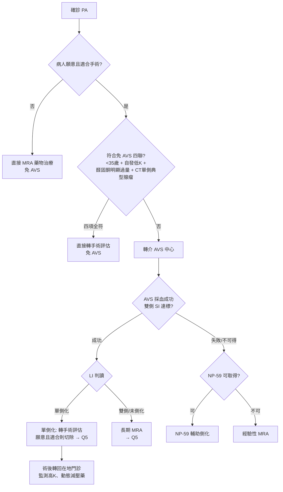

> **💡 一句話結論**
> 承接 [Q3（確認試驗）](/pa/q03-confirmation-test/)，本篇是診斷流程的終站：**lateralization（定位左右）**。定位結果直接決定 [Q5（治療）](/pa/q05-surgery-vs-mra-treatment/)——單側 → 手術；雙側 → MRA。

> **⚠️ 先講最重要的一層：執業範圍**
> **AVS 導管、腎上腺手術、影像判讀不是地區醫院腎臟科的主場——作者會把病人外轉到 AVS 中心。** 本篇全程以「共照腎臟科醫師視角」撰寫：AVS 技術內容一律以公開資料與醫學中心常規為依據；不替轉介中心做財務承諾、不解釋超出公開資料的手術／導管執行風險。作者的強項在「何時該轉、轉去哪、術前準備、術後在地長期追蹤的銜接」。

---

## 1. 重點結論

- **確診 PA、且病人願意並適合手術者，原則上都應做 AVS 分側**；AVS 與 CT **並用**，不是用 CT 取代 AVS。2025 Endocrine Society 維持此立場，但等級為**弱建議、低品質證據**——反映證據基礎本身有限，並非臨床立場鬆動。
- **在「病人願意且適合手術、且治療決策需判斷單側或雙側」的前提下**，唯一被指引明列可免 AVS 的窄門 = 四項同時成立：年齡 <35 歲 ＋ 自發性低血鉀 ＋ 醛固酮明顯過量 ＋ CT 單側 >1.0 cm 典型腺瘤（對側正常）。**未同時符合者，就不應只靠 CT 直接定側手術——通常應轉介評估 AVS**；若病人不願或不適合手術，AVS 邊際效益下降，可直接走長期 MRA。放寬到 45–60 歲的做法散見於回溯性／選擇性世代與中心經驗，證據強度不足、尚非指引標準免 AVS 條件。
- **為什麼 CT 不夠**：CT 看形態、不看功能。CT／MRI 單獨判斷與 AVS 約 **37.8% 不一致**（Kempers 2009），可能切錯邊、把無功能結節當兇手、或漏掉影像看不見的微小腺瘤。
- **共照腎臟科醫師的具體任務**：判斷轉介時機、術前矯正低血鉀與調整 MRA、影像與生化備齊、術後不論開刀與否都接回在地長期追蹤（血壓、血鉀、renin de-suppression）。AVS 技術成敗與手術風險屬轉介中心。
- **台灣特色**：AVS 不可得／失敗時，台灣醛固酮症學會（TSA）共識認可 **NP-59 核醫掃描**作為中心層級的二線分側工具——國際少見的明確認可。

---

## 2. AVS 適應症與「免做」條件（2016＋2025 ES）

### 核心邏輯

分側決定治療路徑：**單側 → 腎上腺切除（可能治癒）；雙側／無法分側 → 終生 MRA**。CT 只看解剖，AVS 看功能。不一致的兩個來源：① 年齡增長後無功能結節（incidentaloma）盛行率上升 → 誤指；② 真正高分泌的微小腺瘤／APCC 常 <3–5 mm、低於 CT 解析度 → 漏看。

### 2016 ES（強建議、中等證據）

「可手術且想手術者，應由有經驗的放射科醫師以 AVS 區分單側 vs 雙側」屬**強建議**。免 AVS 的例外（原文，弱建議、極低證據）：年齡 <35 歲、自發性低血鉀、醛固酮明顯過量，且 CT 上為對側正常的單側典型腺瘤者，**可能**不需先做 AVS 即進入單側腎上腺切除（Funder 2016, PMID 26934393）。重點在於**「免做是窄門，不是常規捷徑」**。

### 2025 ES（弱建議、低證據）

2025 ES 建議：考慮手術的 PA 病人，在決定治療方式前以 **CT 加 AVS** 進行分側（Adler 2025, PMID 40658480）。technical remark 維持 <35 歲例外；**CT 並未被升格為 AVS 的替代品**，延續「CT＋AVS」決策模型。

### 年齡 cutoff 爭議

放寬至 ≤45–60 歲的主張，主要來自回溯性／選擇性世代、中心經驗或預測模型；雖有支持資料，但證據強度不足、**尚未成為 Endocrine Society 的標準免 AVS 條件**。2024–2026 並無足以推翻 <35 窄門的新高品質證據：Htut 2025（PMID 40827954）顯示 ≤35 歲影像與 AVS 一致率 86%（25/29），排除不符 marked PA 條件者後升至 96%，但仍有極低誤判；BMJ Open 2020 meta（PMID 33384386，25 研究／4669 人）顯示即使 ≤40 歲，單靠影像仍有 **21% 不當切除**。本文採 guideline-concordant 的 **<35 歲窄門**，不把 imaging-only 策略外推到較高齡族群。

> **地區醫院腎臟科醫師視角：為什麼 >35 歲、就算 CT 漂亮也先做 AVS**
> 在偏鄉或地區醫院，PA 的困難常常不是沒有人想處理，而是大家不一定會第一時間想到：這是一個**功能性疾病**，不是單純看 CT 找腫瘤。病人看到報告寫 adrenal tumor，會自然以為「腫瘤拿掉就好」；轉診醫師可能也會想直接送外科；放射科報告則多半忠實描述形態，未必會替我們完成分側判斷。這時候，在地共照醫師的角色不是和任何科別對立，而是把問題拉回來：**這顆瘤是不是兇手？對側有沒有功能性分泌？病人是不是符合那極少數可免 AVS 的條件？**
>
> 所以對 >35 歲的病人，即使 CT 看起來很像單側腺瘤，我仍會傾向先轉 AVS，而不是只靠影像決定開刀方向。這不是延誤治療，而是避免把資源不足造成的「看得到」誤認為「判得準」。在地醫師的價值，正是在資訊不完整、專科資源不均的地方，幫病人守住那個關鍵問題：不要只是把腫瘤切掉，而是要切對真正造成醛固酮過量的那一側。
>
> 在地照護的價值，不是讓病人最快開刀，而是讓病人不要因為「CT 看得到一顆瘤」就開錯刀。

---

## 3. AVS 判讀參數（SI／LI／cosyntropin）

> 以下以「轉介中心如何判讀」的框架呈現，非教讀者自行操作。

兩個參數都以「皮質醇校正後的醛固酮比值（A／C ratio）」計算，校正採血稀釋：

- **SI（Selectivity Index，選擇指數）**：腎上腺靜脈 cortisol ÷ 下腔靜脈 cortisol → 確認導管是否真的進到腎上腺靜脈（採血成功與否）。
- **LI（Lateralization Index，側化指數）**：優勢側 A／C ÷ 非優勢側 A／C → 判斷是否單側化。

| 參數 | 有 cosyntropin | 無 cosyntropin |
|---|---:|---:|
| **SI** | ≥3 | ≥2 |
| **LI** | >4 | >2 |

（核心參考：Rossi 2014 AVS 專家共識, PMID 24218436）

> 上表為常見判讀框架；實際 SI／LI 切點應依轉介中心 protocol、是否使用 cosyntropin、以及是否納入 contralateral suppression index 綜合判讀。

- **LI 2–4 為灰區**，各中心切點不一；2014 共識並未固定單一 LI 值。
- **cosyntropin／ACTH 的作用**：穩定 cortisol gradient、提高 selectivity 與採血成功判定。是否使用及給法依中心 protocol（一種常見用法為 250 μg bolus ＋ 50 μg/h 輸注，非唯一標準）。代價：可能降低 LI、使部分單側被低估為雙側 → 同一中心的 protocol 與 cutoff 必須前後一致。
- **過嚴 cutoff 的代價**：AVIS-2 SI／LI 次研究（Rossitto 2020, PMID 31536622）顯示，SI／LI cutoff 越嚴，雙側採血成功率越低、被判為單側 PA（進而手術）的比例可低於 25%——近三分之一的 AVS 反被判「不成功」，降低臨床效益。

---

## 4. AVS 證據基礎（為何仍是 gold standard）

### AVIS-1（安全性）

Rossi 2012（JCEM, PMID 22399502）：20 個國際中心、2604 次 AVS，**腎上腺靜脈破裂率整體約 0.61%**。該登錄資料中破裂率與中心收案量、個別放射科醫師經驗呈現不同方向的關聯，**不宜簡化為「高量中心更危險」**——臨床上仍應轉介有經驗的 AVS team，由中心評估風險與可行性。

### AVIS-2（治癒率提升）

Rossi 2019（Hypertension, PMID 31476901）：1625 例、19 中心；AVS 成功率 80.1%、確認單側 PA 45.5%、接受切除 41.8%；在此**國際多中心 registry（observational，非 RCT）**中，**AVS 導引的腎上腺切除與較高的高血壓治癒率相關（40.0% vs 非 AVS 導引 30.5%，p=0.027）**——屬關聯而非隨機因果。

### SPARTACUS（爭議，未推翻 AVS）

Dekkers 2016（Lancet Diabetes Endocrinol, PMID 27325147）：唯一的 RCT（200 例／184 完成）。CT 導引 vs AVS 導引，1 年中位每日用藥量 3.0 vs 3.0、達標血壓 42% vs 45%，無顯著差異。**但未推翻 AVS**：① underpowered（手術 subgroup 檢力不足）；② selection bias（florid PA、女性極少、CT 本就準）；③ endpoint 用每日用藥量而非生化治癒（PA 的終極目標是消除醛固酮的心腎毒性）；④ 外推性受限（Rossi & Funder 2017 critique, PMID 28137983）。

### PASO（重塑「治癒」定義）

Williams 2017（Lancet Diabetes Endocrinol, PMID 28576687）：705 例單側切除，**生化完全治癒 94%、臨床完全治癒僅 37%**（partial 47%）。年輕、女性、術前用藥少者血壓治癒機會較高。**生化治癒 ≠ 血壓痊癒** → 術前期待管理很重要（見 [Q5](/pa/q05-surgery-vs-mra-treatment/)）。

---

## 5. AVS 不可得時的替代（NP-59 台灣特色）

- **TSA 共識認可**：AVS 不可得／失敗時，**NP-59（¹³¹I-iodomethyl-19-norcholesterol）腎上腺皮質掃描**作為中心層級的二線分側工具——全球少數明確認可（Huang 2019 治療共識, PMID 29506889；另見 Wu 2017 case detection 共識 PMID 28735660、Tseng 2024 治療指引 PMID 37328332）。
- **機轉**：NP-59 是膽固醇類似物，經 dexamethasone 抑制後觀察仍具自主活性的腎上腺皮質攝取／類固醇生成活性；它**並非 aldosterone-specific 或 CYP11B2-specific** tracer（反映皮質類固醇生成、非醛固酮專一）。需甲狀腺阻斷；hot spot＝自主分泌病灶（CT 看不到功能）。
- **效能**：對 PA 分側的診斷效能僅中等（Araujo-Castro 2023, PMID 37509573：AUC 0.812 單獨／0.869 與 CT／MRI 併用，14 家西班牙醫學中心 86 例）；解析度限制 → 微小腺瘤易偽陰性。
- **定位**：second-line／rescue，非全面取代 AVS。

> **地區醫院腎臟科醫師視角：NP-59 對偏鄉的真正意義**
> 對偏鄉小醫院來說，NP-59 不應被寫成「AVS 不可得時的在地替代方案」。現實是，多數地區醫院不只沒有這項檢查，第一線醫師甚至未必知道 PA 分側還有核醫路徑可以討論。這不是單純量能不足，而是**資訊、資源與轉介網絡都集中在少數中心**的問題。
>
> 因此，在地醫師的任務不是自己判讀 NP-59，也不是把它當成可以直接安排的檢查，而是在 AVS 不可得、AVS 失敗，或病人因距離與身體條件難以完成 AVS 時，**知道不要退回「那就看 CT 開刀」的簡化決策**，而是主動和有經驗的中心討論：這個病人是否還有 NP-59 或其他分側策略可用。
>
> 換句話說，NP-59 對偏鄉現場的意義，不是「我這裡做得到」，而是「**我知道這件事存在，也知道該把問題問給誰**」。在資源不對等的地方，知道何時不要硬做、何時不要只靠 CT、何時把病人送到對的中心，本身就是共照醫師的價值。
>
> NP-59 不是偏鄉小醫院的替代方案；它是提醒我們，當 AVS 走不通時，不要把病人直接推回只看 CT 就開刀。

---

## 6. 共照轉介 workflow（作者主場）

### 何時轉介（三條件同時）

① PA 已確診（[Q3](/pa/q03-confirmation-test/) 完成）；② 病人有手術意願且為手術候選者；③ 不符合免 AVS 四聯。

### 轉介前在地備齊

- **血鉀矯正**：補至正常（3.5–4.0 mmol/L 以上）；低血鉀會抑制基礎醛固酮分泌、可致 LI 偽低估。
- **MRA 處理**：傳統建議 AVS 前停 spironolactone／eplerenone 約 4–6 週（避免停藥後 renin 回升、經 angiotensin II 促非優勢側分泌而遮蔽側化）；橋接用對 RAAS 干擾最小的藥（doxazosin／amlodipine／verapamil）。**但** Pintus 2024（PMID 38525605）顯示：在能控制血壓與血鉀的劑量下，續用 MRA 並未顯著破壞 LI（AVS registry，MRA 治療組 61 例 vs 對照 779 例，LI 之 AUC 無顯著差異，含 renin 受抑制 subgroup）→ 對停藥會嚴重失控者，可與中心討論「不完全停藥」的彈性。**是否停藥屬轉介中心決定，作者負責在地橋接與安全**。亦見 [Q2（ARR 與藥物洗脫）](/pa/q02-arr-cutoff-washout/)。
- **影像／生化備齊**：近期薄切（2–3 mm）腎上腺 CT 光碟、PAC／renin／血鉀，避免到院重複。

### 術後／不開刀接回在地

- **單側切除術後**：對側暫時性機能低下 → 首要監測、預防**高血鉀**；停補鉀與 MRA、必要時暫減 ACEI／ARB；血壓 1–6 個月漸降、動態減藥。
- **雙側／不開刀**：長期 MRA。追蹤除 BP／K／eGFR 外，可把**解除 renin suppression（腎素自治療前 baseline 回升）**作為劑量是否足夠的參考之一；但**目前無普遍接受的固定 renin target**，CKD、hyperkalemia 風險或血壓已控制者需依耐受性與臨床目標個別化，不應硬追固定數值。
- **誠實界線**：AVS 技術成敗、手術風險由轉介中心負責。

> **地區醫院腎臟科醫師視角：沒有這把刀，但要當對的轉介窗口**
> 對偏鄉小醫院來說，最現實的問題不是「我院要不要做 AVS 或開刀」，而是**我們根本沒有這條完整治療鏈**。能做 AVS 的中心有限，熟悉 PA 分側後腎上腺切除決策的外科經驗也集中在少數醫學中心；即使在南台灣，病人也常常需要再往更有經驗的團隊轉出去。這時在地醫師的角色，不是硬把所有事情留在本地做，而是**先把診斷、低血鉀、MRA、影像與病人期待整理好**，然後透過熟悉 PA 流程的合作管道，把病人送到真正能完成分側與手術評估的中心。
>
> 但**轉出去不代表責任結束**。地方門診常見的落差是：病人被送到醫學中心後，可能只聽到「可以開刀」或「不適合開刀」，卻沒有真的理解手術能解決什麼、不能保證什麼、風險是什麼、術後還要追蹤什麼。最後病人又回到原本的門診，帶著不完整的理解來問「醫師，我到底該不該開？」所以在地共照醫師的價值，是在**轉介前先做期待管理，轉介後再把中心的建議翻譯成病人聽得懂、做得了決定的語言**。
>
> 換句話說，小醫院沒有這把刀，但不能因此只把病人丟出去。真正的在地窗口，是幫病人確認：是不是該轉、該轉到有哪種能力的中心、轉出去前要準備什麼、回來後誰繼續顧血壓、血鉀、renin 和長期心腎風險。
>
> 偏鄉醫師的角色不是開這台刀，而是不要讓病人在沒有完整說明、沒有完整分側、沒有後續照護的情況下被推進手術。

---

## 7. AVS 適應症決策樹

---

## 8. CKD 病人 AVS 特殊考量（腎臟科差異化）

### 顯影劑風險的破除

- AVS 對比劑量**低**（中位數約 25 mL）。CKD III–V 期世代（N=25）：急性腎損傷僅 8%（2/25）、皆未需透析、診斷成功率 96%（25/26）（Burshteyn 2013, PMID 23541280）。
- **風險分層**（Aus／NZ AVS 工作小組共識 2024/2025, PMID 39360599）：一般而言 eGFR 較保留者顯影劑風險可忽略；**eGFR 偏低者建議靜脈水化**並優先轉量大的中心（縮短時間、減顯影劑）。具體 eGFR 分層門檻見該共識全文。

### 已側化但手術高風險的抉擇

- 關鍵問句：**若 AVS 證實單側，這位 CKD 病人真的會去手術嗎？** 若 frailty／麻醉風險高、或拒絕手術 → AVS 的邊際效益下降，直接 MRA 往往更合理（2025 ES technical remark 認可：mild PA／多重共病／非手術候選者可繞過 AVS 走 medical）。
- **術後 eGFR 斷崖（unmasking of CKD）**：PA 造成 glomerular hyperfiltration，活躍期 Cr 假性低估；切除、血壓驟降後過濾壓消失 → eGFR 可能斷崖式下降，露出原本被遮蔽的 CKD。風險因子包含**較高齡、術前已偏低的腎功能、長期 PA 造成的既存腎損傷**；高風險者術前應先與病人說明此可能（避免術後誤以為手術「傷腎」）。
- CKD 使用 MRA 注意高血鉀，密切監測血鉀／eGFR。見 [Q6（PA＋CKD 治療）](/pa/q06-ckd-pa-treatment/)。

> **地區醫院腎臟科醫師視角：做不到所有檢查，但守得住長期追蹤**
> 在偏鄉小醫院，PA 的限制很清楚：AVS 不在這裡做，腎上腺手術不在這裡做，甚至能熟悉處理這類病人的中心也不多。但這不代表在地醫師沒有角色。相反地，**病人真正長期停留的地方，往往不是醫學中心，而是原本看高血壓、低血鉀、CKD 的地方門診。**
>
> 所以腎臟科共照的重點，不是把自己寫成能完成所有檢查和治療的中心，而是承認限制後，**把「持續追蹤」講成主場**：術前把血鉀、血壓、腎功能、用藥和病人期待整理好；轉出後協助理解中心建議；術後或不開刀時，接回來追蹤血鉀、creatinine／eGFR、albuminuria、血壓、renin 是否解除抑制，並持續調整 MRA、ACEI／ARB、利尿劑和補鉀。
>
> 對偏鄉病人來說，能不能在地做 AVS 或手術，常常不是我們能決定的事；但有沒有人長期看著他的血壓、血鉀和腎功能，提醒他**不要失聯、不要自行停藥、不要把一次轉診當成治療結束**，這就是在地醫師最重要的價值。
>
> 偏鄉做不到所有檢查和治療，但可以做到最重要的一件事：不要讓病人失去長期追蹤。

---

## 9. 台灣健保／自費實務

> **截至本次查核可見；確切代碼與點數以健保署「醫療服務給付項目及支付標準」現行版本為準。**

- **AVS 給付**：公開資料中，各主要中心對 AVS 的收費與申報方式不一（部分自費、部分基本技術費走健保、微導管耗材自費）；本文未查得健保署明列 AVS 為 PA 分側常規給付之專屬代碼。
- **NP-59 給付**：來源不一，本文未查得權威說明。
- **處理原則**：以各院公告與健保署最新支付標準為準，不寫絕對給付碼；細節見 [Q11（台灣健保給付）](/pa/q11-taiwan-nhi-coverage/)。AVS 中心的列舉僅依公開資料，命名由臨床現場最終定奪。

---

## 10. 病人衛教對話框架

> **「都確診了，為什麼還要做這個從血管採血的檢查？CT 照到一顆瘤不就好了？」**
> 「CT 看的是『形狀』，不一定是『真正在作怪的那顆』。研究顯示只看 CT，整體大約三到四成的人分側會判斷錯——可能把不會作怪的良性結節當兇手切掉、也可能漏掉看不到的小病灶、甚至開錯邊。AVS 直接從兩側腎上腺抽血比較，告訴我們是單邊還是兩邊。單邊開刀有機會根治；兩邊則用藥控制。為了不讓您白挨一刀，這一步很值得。」

> **「這檢查要去大醫院做，我在這裡的醫師還能幫我什麼？」**
> 「能幫的很多。去之前我幫您把血鉀補好、把會干擾檢查的藥調整好、CT 和抽血資料準備齊全，讓大醫院不用重做、檢查更準。檢查和手術在大醫院做，但做完之後——不論有沒有開刀——血壓、血鉀、腎功能的長期追蹤都回到我這裡。我是您整段路的『在地窗口』。」

> **「我年紀輕、CT 又看到一顆，可以直接開刀嗎？」**
> 「有可能，但要『同時』符合幾個條件：年齡小於 35 歲、自己就會低血鉀、醛固酮明顯偏高、CT 上是單邊一顆典型腺瘤、對側正常。四項全中，才考慮跳過 AVS。少一項還是建議先做 AVS，免得開錯或白開。網路上有人主張放寬到 50、60 歲，那是少數專家看法、證據還不夠，我們仍以四條件為準。」

---

## 11. Uncertainty／待補充事項

- **免 AVS 年齡 35 vs 45–60**：指引守 <35 歲；放寬僅單一中心專家意見，2024–2026 無高品質新證據。
- **分子影像**（¹¹C-metomidate／¹⁸F-CETO PET）：Goodchild 2025（Ann Intern Med, PMID 40030172；174 例 within-patient）顯示 post-dexamethasone [¹¹C]MTO PET 對單側 PA **術後結果預測對 AVS 達 non-inferiority**（生化成功預測準確度 71.3% vs AVS 62.8%）；但兩者對「誰是單側」的判定僅 25.4% 同時一致，且需 cyclotron／特製 tracer 與標準化流程。**台灣非常規、屬研究／少數中心階段，非目前可替代 AVS 的常規工具。**
- **MRA 洗脫必要性受挑戰**：Pintus 2024（renin 仍受抑制時續用 MRA 不破壞 LI）vs 傳統停 4 週鐵律；待前瞻 RCT 確認。
- **CKD 術後 eGFR unmasking 的精確預測因子**：現象明確、但可預測誰會發生的精確 cutoff 仍待更穩固的前瞻資料；本文僅列一般風險因子（高齡、術前低腎功能、既存腎損傷），不寫單一中心的具體切點。
- **2025 ES 之後無推翻「考慮手術者仍 CT＋AVS」的新主要指引**（查至 2026-06）。

---

## 12. References（含 PMID）

1. Funder JW, et al. The Management of Primary Aldosteronism: An Endocrine Society Clinical Practice Guideline. *JCEM* 2016;101(5):1889-1916. **PMID 26934393**.
2. Adler GK, Stowasser M, et al. Primary Aldosteronism: An Endocrine Society Clinical Practice Guideline. *JCEM* 2025;110(9):2453-2495. **PMID 40658480**.
3. Rossi GP, et al. An Expert Consensus Statement on Use of Adrenal Vein Sampling for the Subtyping of Primary Aldosteronism. *Hypertension* 2014;63(1):151-160. **PMID 24218436**.
4. Rossi GP, et al. The Adrenal Vein Sampling International Study (AVIS) for Identifying the Major Subtypes of Primary Aldosteronism. *JCEM* 2012;97(5):1606-1614. **PMID 22399502** (AVIS-1).
5. Rossi GP, et al. Clinical Outcomes of 1625 Patients With Primary Aldosteronism Subtyped With Adrenal Vein Sampling. *Hypertension* 2019;74(4):800-808. **PMID 31476901** (AVIS-2).
6. Dekkers T, et al. Adrenal vein sampling versus CT scan to determine treatment in primary aldosteronism (SPARTACUS). *Lancet Diabetes Endocrinol* 2016;4(9):739-746. **PMID 27325147**.
7. Rossi GP, Funder JW. Adrenal Venous Sampling Versus Computed Tomographic Scan to Determine Treatment in Primary Aldosteronism (SPARTACUS): A Critique. *Hypertension* 2017;69(3):396-397. **PMID 28137983**.
8. Williams TA, et al. Outcomes after adrenalectomy for unilateral primary aldosteronism (PASO). *Lancet Diabetes Endocrinol* 2017;5(9):689-699. **PMID 28576687**.
9. Kempers MJE, et al. Systematic review: diagnostic procedures to differentiate unilateral from bilateral adrenal abnormality in primary aldosteronism. *Ann Intern Med* 2009;151(5):329-337. **PMID 19721021** (CT／AVS 不一致 37.8%).
10. Lim V, et al. Accuracy of adrenal imaging and adrenal venous sampling in predicting surgical cure of primary aldosteronism. *JCEM* 2014;99(8):2712-2719. **PMID 24796926**.
11. Zhou Y, et al. Diagnostic accuracy of adrenal imaging for subtype diagnosis in primary aldosteronism: systematic review and meta-analysis. *BMJ Open* 2020;10(12):e038489. **PMID 33384386**.
12. Rossitto G, et al. Subtyping of Primary Aldosteronism in the AVIS-2 Study: Assessment of Selectivity and Lateralization. *JCEM* 2020;105(6):dgz017. **PMID 31536622**.
13. Pintus G, et al. Subtype Identification of Surgically Curable Primary Aldosteronism During Treatment With Mineralocorticoid Receptor Blockade. *Hypertension* 2024;81(6):1391-1399. **PMID 38525605**.
14. Burshteyn M, et al. Adrenal venous sampling for primary hyperaldosteronism in patients with concurrent chronic kidney disease. *J Vasc Interv Radiol* 2013;24(5):726-733. **PMID 23541280**.
15. Yang J, et al. Adrenal Vein Sampling for Primary Aldosteronism: Recommendations From the Australian and New Zealand Working Group. *Clin Endocrinol (Oxf)* 2024/2025;102(1):31-43. **PMID 39360599**.
16. Araujo-Castro M, et al. Diagnostic Accuracy of Adrenal Iodine-131 6-Beta-Iodomethyl-19-Norcholesterol Scintigraphy for the Subtyping of Primary Aldosteronism. *Biomedicines* 2023;11(7):1934. **PMID 37509573**.
17. Huang KH, et al. Targeted treatment of primary aldosteronism — The consensus of Taiwan Society of Aldosteronism. *J Formos Med Assoc* 2019;118(1 Pt 1):72-82. **PMID 29506889**.
18. Wu VC, et al. Case detection and diagnosis of primary aldosteronism — The consensus of Taiwan Society of Aldosteronism. *J Formos Med Assoc* 2017;116(12):993-1005. **PMID 28735660**.
19. Tseng CS, et al. Treatment of primary aldosteronism: Clinical practice guidelines of the Taiwan Society of Aldosteronism. *J Formos Med Assoc* 2024;123(Suppl 2). **PMID 37328332**.
20. Goodchild E, et al. Molecular Imaging Versus Adrenal Vein Sampling for the Detection of Surgically Curable Primary Aldosteronism: A Prospective Within-Patient Trial. *Ann Intern Med* 2025;178(3):336-347. **PMID 40030172**.
21. Htut Z, et al. Case selection of adrenal vein sampling in young patients with primary aldosteronism: a retrospective analysis of imaging and AVS concordance, and histopathological outcomes. *Endocr Connect* 2025;14(9):e250326. **PMID 40827954**.

---

## 相關問答

依臨床情境分流：

- 想看 **ARR 篩檢陽性後怎麼確診** → [Q3 — 確認試驗選擇](/pa/q03-confirmation-test/)
- 想看 **定位後手術 vs 藥物怎麼選** → [Q5 — 手術 vs MRA 治療](/pa/q05-surgery-vs-mra-treatment/)（單側→手術；雙側→MRA）
- 想看 **PA＋CKD 共病處置** → [Q6 — PA＋CKD 三段式治療](/pa/q06-ckd-pa-treatment/)
- 想看 **ARR 怎麼驗才不會驗錯** → [Q2 — ARR 切點與藥物洗脫](/pa/q02-arr-cutoff-washout/)
- 想看 **健保給付與自費** → [Q11 — Taiwan NHI Coverage](/pa/q11-taiwan-nhi-coverage/)

---

## 跨 cluster 深化

- [偏鄉腎臟科醫師到底在做什麼？](/rural-nephrology/01-rural-nephrology-role/) — 在地腎臟科在 PA 分側轉介與長期追蹤的現實視角
- MR 拮抗機轉與高血鉀管理：[Finerenone Q3 — Hyperkalemia Management](/finerenone/q03-hyperkalemia-management/)

---

> **重點重申**：確診 PA 且考慮手術者，原則上都應做 AVS 分側；CT 看形態、AVS 看功能，兩者並用。唯一可免 AVS 的窄門需四項同時成立（<35 歲＋自發低血鉀＋醛固酮明顯過量＋CT 單側典型腺瘤），缺一即做。單側→手術可能治癒、雙側→終生 MRA。台灣特色為 AVS 不可得時的 NP-59。共照腎臟科醫師的主場不是導管或手術，而是轉介時機、術前準備與術後在地長期追蹤。本文為臨床決策參考，個別病人處置仍須回到主治醫師面對面評估。
