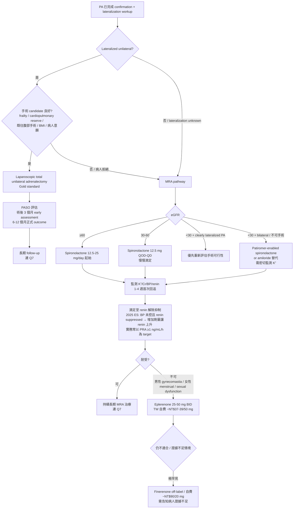

# Q5 — PA 治療策略：Surgery vs MRA 怎麼選

> **💡 一句話結論**
> **原發性醛固酮（Primary aldosteronism, PA）** 治療策略的核心：Lateralized unilateral PA + 可手術 candidate → **腹腔鏡單側腎上腺切除為 gold standard**（biochemical complete success ~94%，但 clinical complete success 僅 ~37%）。Bilateral / 不可手術 / 拒手術 → **spironolactone first-line**（12.5-25 mg/day 起始，依 K⁺/Cr/BP/renin 滴定；不耐受 → eplerenone 25-50 mg BID 自費）。**Severe CKD（eGFR <30）+ lateralized PA 反而常讓手術更值得認真考慮**（chronic MRA 有 hyperkalemia + dose limitation 問題）。**Finerenone 在 PA 為 off-label**：機轉外推合理，但 hard endpoint 不存在；TW 不在 PA 給付，自費。**沒有 spironolactone vs adrenalectomy head-to-head RCT**；長期 outcome 優勢來自 observational TAIPAI cohort。

> **📝 文件層級分辨**
> **指引建議** ≠ **臨床實務** ≠ **政策現況（NHI coverage）**。本文以 2025 Endocrine Society Clinical Practice Guideline (Adler GK et al., **PMID 40658480**) 為主軸；2024 TSA treatment guideline (Tseng CS et al., **PMID 37328332**) 為在地實作對照。截至本次查核可見（2026-05-09），TW NHI 對 eplerenone 的給付限 post-MI HF / NYHA II 以上 + LVEF ≤30%；finerenone 在 PA 未確認有正式生效之給付條文。

---

## 1. Bottom Line（300 字）

**原發性醛固酮（PA）** 治療決策核心其實不複雜：**能確認 unilateral / lateralized disease 且病人是可手術候選者** → 腹腔鏡單側腎上腺切除為 gold standard；**bilateral、不可手術、或拒絕手術** → spironolactone first-line 為主的 MRA 治療。這在 2016 與 2025 ES、TSA 2024 三個 guideline 一致 [PMID 40658480、26934393、37328332]。

但**手術的價值在於「修正病因」，不是保證完全停藥**：PASO (n=705) 顯示 complete biochemical success **94%**、partial clinical success **47%**、**complete clinical success 僅 37%** [PMID 28576687]。這是門診衛教最容易誤解的地方——多數人「醛固酮生化異常」會明顯改善，但只有約三分之一能完全停掉降壓藥。

**手術相較於 MRA 的長期 outcome 優勢，主要來自 observational hard endpoint**（**沒有 head-to-head RCT**）：TAIPAI 系列在不同 outcome 採不同 comparator——**ESRD（Chen 2019, sHR 0.38, P=0.007 [PMID 31086833]）為 adrenalectomy-treated PA vs matched EH controls**，MRA-treated PA 未顯示相同 benefit，因此這是**間接支持 surgery 優於 medical therapy 的 observational signal**；只有 **Wu 2021** 是 adrenalectomy vs MRA direct comparison（IPTW + time-varying：**ACM HR 0.57 / MACE HR 0.67 / CHF HR 0.49 [PMID 34851859]**）。AF（PMID 32070205）與 stroke（PMID 31676114）以 EH 為 comparator，呈現偏向 surgery 的 observational signal，**非 head-to-head RCT 結果**。

**Severe CKD + lateralized PA**：別預設一定只能吃藥；手術反而常更值得認真考慮（chronic MRA 會遇到 hyperkalemia + dose limitation），但術前必須講清楚 **adrenalectomy 後 16.6% 病人 eGFR dip >30%**（與 incident MAKE 風險上升相關，HR 2.18）[PMID 38051943]。

**Finerenone 在原發性醛固酮（PA）**：機轉外推合理但**hard endpoint 證據不存在**；TW NHI 在 PA 屬 off-label 自費（公開自費 ~NT$90/20 mg/顆）；除非 spironolactone/eplerenone 都無法接受 + 病人充分理解證據不足，否則不該作為 routine。

---

## 2. 治療選擇 Framework（mermaid flowchart）

**flowchart 反映 2025 ES + TSA 2024 共同精神**：手術與否先看 **lateralization**，再看 **surgical candidacy**；不能手術才走 lifelong medical therapy。eGFR <30 列為「不要常規 spironolactone」是實務安全思維，**不代表 amiloride 或其他藥就一定更安全**——amiloride 同樣可能造成高血鉀。

---

## 3. Surgical Option：Laparoscopic Adrenalectomy

### 3.1 PASO outcome 與長期 hard endpoint

**PASO criteria**（Williams 2017, **PMID 28576687**, n=705 unilateral PA adrenalectomy）：

| Outcome category | 定義 | % |
|---|---|---|
| **Complete clinical success** | 術後血壓正常 + 不需 antihypertensive drugs | **37%** |
| **Partial clinical success** | BP 較術前改善但仍需用藥；或 BP 相同但藥量減少 | **47%** |
| **Absent clinical success** | BP 未改善 / 更差 + 用藥未減少 | ~16% |
| **Complete biochemical success** | 低血鉀矯正（如術前存在）+ ARR 正常化 | **94%** |
| **Partial biochemical success** | K⁺ 校正 + ARR 仍高，但 aldosterone 較術前 ↓≥50% 或 confirmatory test 改善 | — |
| **Absent biochemical success** | 低血鉀和/或 ARR 持續異常 + confirmatory test 仍無法抑制 aldosterone | — |

**Assessment 時程**：
- **早期評估**：術後 3 個月內
- **正式 outcome assessment**：6-12 個月
- 之後年度追蹤

**衛教紀律**：手術主要優勢是「修正病因」**不是保證完全停藥**。Complete clinical cure 只有 ~1/3 病人。

### 3.2 Adrenalectomy 對 ESRD / Mortality / MACE / AF 的 outcome

> **⚠️ 證據層級嚴格區分**
> 下列為 **hard endpoint** 但證據層級為 **observational**（沒有 spironolactone vs adrenalectomy head-to-head RCT）。寫法應為「**觀察性研究一致顯示手術較優**」，不是「RCT 證實」。

| Outcome                 | Comparator                                                                        | Effect size                    | 來源                                                        |
| ----------------------- | --------------------------------------------------------------------------------- | ------------------------------ | --------------------------------------------------------- |
| **ESRD**                | adrenalectomy-treated PA **vs matched EH controls**（MRA-treated PA 未顯示相同 benefit） | **sHR 0.38, P=0.007**          | Chen YY 2019 TAIPAI NHIRD (n=2,699 PA), **PMID 31086833** |
| **All-cause mortality** | **adrenalectomy vs MRA direct**（IPTW + time-varying）                              | **HR 0.57**                    | Wu VC 2021 TAIPAI, **PMID 34851859**                      |
| **MACE**                | 同上                                                                                | **HR 0.67**                    | 同上                                                        |
| **CHF**                 | 同上                                                                                | **HR 0.49**                    | 同上                                                        |
| **New-onset AF**        | adrenalectomy-treated PA vs EH（observational signal）                              | adrenalectomy 較低 incidence     | Pan CT 2020 TAIPAI, **PMID 32070205**                     |
| **Long-term stroke**    | adrenalectomy-treated PA vs EH（observational signal）                              | adrenalectomy 降低 incident risk | Chang YH 2020, **PMID 31676114**                          |

**Hundemer GL 2018**（**PMID 29129576** cardiometabolic / **PMID 29987110** renal）：medically treated PA 若 renin 持續 suppressed → CV/renal outcome 較差。

**訊息**：如果真是 unilateral disease + 病人能承受手術，**長期 hard outcome 通常偏向 surgery**。

### 3.3 Adrenalectomy 對 surrogate endpoint 的影響

surrogate endpoint **不能**等同 hard endpoint，但決定病人「感不感覺有變好」：

| Surrogate | adrenalectomy 對比 MRA |
|---|---|
| BP 改善 | adrenalectomy 較乾淨 |
| K⁺ 校正 | adrenalectomy 較完整 |
| ARR / PRA 正常化 | adrenalectomy 較直接 |
| arterial stiffness | adrenalectomy 改善 |
| LV remodeling | 兩者都改善；unilateral PA studies 中 adrenalectomy LVMI 降幅通常更大（**近期 systematic review / meta-analysis 方向上支持此敘述；本 note 未列具體 citation，建議讀者另查**） |
| QoL | comparative studies 多數傾向 adrenalectomy 改善較快、幅度較大；6 個月 meta-analysis 未達顯著差異（**citation 待補**） |
| BMD / PTH | 兩者都可能改善 calcium / PTH / urinary calcium；direct comparative BMD data 不足；**fracture-hard-endpoint RCT 不存在** |

### 3.4 手術 acute eGFR dip 與術前 counsel

> **⚠️ 必告知 risk**
> **Adrenalectomy 後 16.6% 病人 eGFR dip >30%** [Chen JY 2024, **PMID 38051943**]

- **Risk profile**：年長 + 術前 eGFR 較高 + BP/aldosterone 較高 + 低血鉀
- **臨床意義**：dip >30% 與 incident **MAKE 風險上升**相關（**HR 2.18, 95% CI 1.04-4.57**）
- **CV composite outcome 無顯著差異**
- **機轉**：很大一部分是揭露 aldosterone-driven hyperfiltration 校正後的真實腎功能（不是手術直接傷腎）；常在數月後趨平穩
- **counsel 紀律**：術前必須講「Cr 可能上升、eGFR 可能掉」**不能等術後才告知**；（這個部分我覺得要這樣講）有些患者在開完刀後會出現真實的腎功能，下降的eGFR有點像是被開完刀之後校正回歸的狀態，這個才是實際上真實的腎功能。（不過我覺得這個應該由轉介竹後的醫師去解釋比較恰當）。

### 3.5 Long-term recurrence

**Tetti M 2024**（**PMID 38318706**, unilateral PA adrenalectomy long-term）：
- 短期 biochemically cured 病人於 **median 89 個月** 追蹤後，**~23% 出現 recurrence**
- **Nonclassical histopathology** 的 recurrence 風險明顯較高（~**60% vs 14%**）

**意義**：
- 術後「一次正常」不等於永久痊癒
- 病理型態非 classical APA 時更要 long-term follow-up
- **沒有原始 PASO cohort 的正式 hard-endpoint extension paper**（截至 2026-05 查核）；Tetti 2024 是最接近長期補強

### 3.6 手術禁忌、高風險族群

**2025 ES 寫法務實**：multiple comorbidities / 不是手術候選者 / 病人明確不想手術 → 直接走 medical therapy。

| 因素 | 評估方向 |
|---|---|
| **高齡** | **不是絕對禁忌**；看 frailty + cardiopulmonary reserve + 既往腹部手術 + BMI + 病人偏好（lifelong drug vs one-time surgery） |
| **Severe CKD（eGFR <30）** | **lateralized PA 反而常更值得認真考慮手術**（chronic MRA 會遭遇 hyperkalemia + dose limitation）；**caveat**：若 unilateral + advanced CKD 但 hypokalemia 不嚴重、且患者拒手術，可考慮 patiromer-enabled spironolactone |
| **重度共病** | HF / CAD / COPD 評估手術風險 |
| **肥胖 / 腹腔手術病史** | 影響手術路徑 |
| **病人偏好** | shared decision making |

### 3.7 地區醫院腎臟科視角：轉介與術後接續

**地區醫院腎臟科可做的**：
- Pre-op BP / K⁺ optimization
- MRA 試治與滴定（決定病人是否真的可走 medical pathway）
- 轉介到具 **AVS** 與 **adrenal surgery** 經驗的醫學中心
- 術後**腎功能接續監測**（特別是 acute eGFR dip）
- 術後高血壓接續追蹤
- 術後 **PASO outcome assessment**（3 個月 early + 6-12 個月正式）

**地區醫院腎臟科針對 AVS、laparoscopic adrenalectomy、複雜 cortical-sparing surgery 是否在原院處理，通常要看當地醫療量能而定**：需要介入性放射科、泌尿科、病理科跨專科協同合作才能在地處理；否則就是遇到疑似個案**轉介至醫學中心評估、治療**，或是接收外院下轉的病人追蹤治療。

**Cortical-sparing vs Total adrenalectomy**：
- **2025 ES**：明文寫 **total unilateral adrenalectomy, usually laparoscopic**（不是 routine cortical-sparing）
- **TSA 2024 (PMID 37328332)**：明寫「Partial excision will not completely eradicate the disease and is prone to recurrence」 → 偏好 **total unilateral**
- 例外：hereditary / bilateral disease 在 selected centres，或 solitary functioning adrenal

---

## 4. MRA Option（Pharmacological）

### 4.1 Spironolactone（一線）

**起始 + 滴定**：
- 起始 12.5-25 mg/day（CKD 更慢，eGFR 30-50 從 12.5 mg QOD-QD 起）
- 常用劑量範圍 50-100 mg/day（少數 200 mg）
- **滴定原則**：依 K⁺ + Cr/eGFR + BP + renin

**回追頻率**：
- 1-4 週首次回抽 K⁺ / Cr
- 之後每次 titration 再追
- 腎功能不全 / 合併 ACEi/ARB 者要更早

**2025 ES Renin-guided therapy 重要更新**：
- 「如果 BP 還沒控制而 renin 還 suppressed → 增加 aldosterone-directed therapy 讓 renin 上升」
- **指引不指定固定 PRA cut-off**
- 實務常用 **PRA ≥1 ng/mL/h** 為 practical convention（**不是 guideline mandate**）
- Renin 持續 suppressed 的 medically treated PA → CV / renal outcome 較差（Hundemer 系列 PMID 29129576、29987110）

**PATHWAY-2 連結**（PMID 26414968 + PMID 29655877）：
- **不是 PA trial**，但對 resistant HTN 重要：spironolactone 加在 resistant HTN 降壓優於 placebo / bisoprolol / doxazosin
- mechanisms substudy 支持反應與 low renin / aldosterone-driven sodium retention 相關
- 臨床意義：PA 是 resistant HTN 的常見病因 → PATHWAY-2 強化「先用 MRA 壓住」邏輯

**副作用**：
- Endocrine：男性 gynecomastia / 乳房痛 / 性功能副作用（~10-13%）
- 女性 menstrual irregularity
- Hyperkalemia（特別合併 ACEi/ARB / CKD）
- 2025 西班牙 multicenter registry [PMID 40743244]：spironolactone adverse events **18% vs eplerenone 4%**

### 4.2 Eplerenone（二線 / 不耐受替代）

**Karagiannis 2008 RCT** [**PMID 18312153**, *Expert Opin Pharmacother*, n=34 IHA]：
- spironolactone 25 mg BID 滴定至 400 mg/d **vs** eplerenone 25 mg BID 滴定至 200 mg/d
- BP normalised **76.5% vs 82.4% (p=1.00)**（NS）
- SBP 下降 eplerenone 較快
- K⁺ 校正兩者相當
- **Gynecomastia**：spironolactone 400 mg 出現 2/17 → switch eplerenone resolves

**Karashima 2016**（PMID 26606875）：comparison study 補強 — eplerenone 在 PA 降壓有效、抗雄性素副作用低，需 BID

**TW NHI 給付（2025 查核）**：
- **限於 spironolactone 無法耐受** + 適應症 **post-MI HF** 或 **NYHA II 以上慢性 HF + LVEF ≤30%**
- **PA 屬 off-label，自費**
- **公開自費價格**：50-mg tablet ~NT$37-39/顆（依院所）；BID 月費常落數千元

### 4.3 Finerenone in PA — Off-label disclaimer ⚠️

**Finerenone 在 PA 的立場**：
- **2025 ES 沒有把 finerenone 列為 PA 標準藥物**（首選仍 spironolactone）
- **機轉外推合理**（FIDELITY 整合分析 [FIDELIO-DKD + FIGARO-DKD] 顯示 finerenone 在 T2D-CKD 的 hyperK safety profile，但**未與 spironolactone 直接 head-to-head 比較**；不能外推為 PA superiority）
- **但 PA-specific hard endpoint 證據不存在**

**PA-specific 證據（截至 2026-05 查核）**：
- 一個 pilot RCT（bilateral PA, finerenone 20 mg/day vs spironolactone 50 mg/day）
- 一個 multicenter prospective study
- **NCT05924620**：ClinicalTrials.gov 顯示為 **Completed, phase 4, randomized open-label parallel assignment, actual enrollment 60**；本 note **未納入已發表 hard-endpoint peer-reviewed result**
- **全部停留在短期 BP / biochemical surrogate 層次** — **沒有 ESRD、MACE、AF、mortality** 等 hard endpoint
- **沒有 finerenone 與 adrenalectomy 的 outcome comparison**

**TW NHI 給付（2025 查核）**：
- NHIA 共擬會議對 **T2D-CKD 適應症** 的審議文件**存在**
- **截至本次查核未確認有正式生效之 PA 給付條文**
- 在 PA 屬 **off-label，自費**
- **公開自費價格**：20-mg tablet ~NT$90/顆；月費 ~NT$2520（依院所）

**真正適合考慮的情境（極罕見）**：
- 明確不能手術
- spironolactone / eplerenone 都無法接受
- 病人**充分理解證據不足**

→ **不該作為 routine PA 治療選項**。

### 4.4 Amiloride 與 ENaC inhibitors

- **2025 ES 明文**：medical therapy 時**優先用 MRA 而不是 ENaC inhibitors**（amiloride、triamterene）
- **保留例外空間**：spironolactone 因 side effects / pregnancy / advanced renal impairment / 其他臨床因素不適合
- ⚠️ **不是「eGFR 很低就 automatically 更安全」**：amiloride 同樣可能造成高血鉀，CKD 需密切監測

### 4.5 輔助降壓藥（PA 病人）

| 藥物 | 注意事項 |
|---|---|
| ACEi / ARB | 與 MRA 並用常見組合 |
| CCB | 與 MRA 並用常見 |
| **β-blocker** | ⚠️ 若未來想重做 ARR：β-blocker 壓 renin 增加 false-positive ARR 風險 |
| **Thiazide** | K⁺ 控好後可加；但可能影響日後篩檢解讀 |

**原則**：PA treatment 不是把一般 HTN 藥全停掉，而是**把 MRA 放回病因治療主軸，其他藥退到輔助角色**。

### 4.6 未來治療：Aldosterone Synthase Inhibitor（preview）

**Baxdrostat** 是 aldosterone synthase (CYP11B2) 選擇性抑制劑——機轉與 MRA 不同（MRA 是受體拮抗，ASI 是上游酵素抑制），但兩者最終都在 aldosterone signaling 軸上作用。

**目前可確認的 phase 3 證據（BaxHTN）：**

- **PMID 40888730**；NEJM 2025-08-30；Flack et al.；N=796。
- 對象：**uncontrolled 或 resistant HTN**（2 種降壓藥仍 SBP 140-<170 為 uncontrolled；≥3 種含 diuretic 仍 ≥135 為 resistant）。
- **本試驗 by protocol 排除 PA 病人** — 因此 BaxHTN 不是 PA-specific efficacy trial。
- 主要結果（12 週 seated SBP，placebo-corrected）：1 mg **−8.7 mmHg**、2 mg **−9.8 mmHg**（兩者 P<0.001）。
- **安全性需注意**：K⁺ >6.0 mmol/L 比例 1 mg 2.3%、2 mg 3.0% vs placebo 0.4%——對 CKD / 合併 MRA / ACEi-ARB 族群屬實質高血鉀風險。

**腎臟科目前該如何寫：**

- **不能寫成 PA 的標準治療** — BaxHTN protocol-level 排除 PA，沒有 PA-specific biochemical remission 或 long-term cardiorenal data。
- **不能寫成 adrenalectomy 或 spironolactone/eplerenone 的替代** — 適應症不同；adrenalectomy 對 lateralized PA 仍是 etiology-curing；MRA 仍是雙側病變或不適合手術的主軸。
- **可以寫成「未來方向之一」** — 機轉上對 aldosterone excess 高度相關，phase 3 已有正式 BP-lowering data；但 PA-targeted efficacy、subtype-specific role、surgery-sparing potential 都尚未建立。
- **截至本次查核可見**：台灣 TFDA 公開資料未顯示已核准適應症；US NDA accepted under FDA Priority Review (2025-12)，實際監管行動以官方公告為準。

詳細 emerging therapy 定位見 [CKM Q13 — 新興治療（含 ASI、口服 GLP-1RA、retatrutide）](/ckm/q13-emerging-therapies/)。

---

## 5. CKD-PA Overlap（連 Q6（後續發表））

三段式思考：

| eGFR | 決策方向 |
|---|---|
| **≥60** | surgery 與 MRA 都可走，主要看 lateralization + 病人偏好 |
| **30-60** | spironolactone 仍可用但 **low-dose, slow-titration**；1-4 週重抽 K⁺/Cr；若 unilateral + 適合手術，surgery 往往更乾淨 |
| **<30** | **不要預設一定只能吃藥**；對 clearly lateralized PA，這常是更該認真評估 surgery 的時點（chronic MRA 會遭遇 hyperkalemia + dose limitation）；若 bilateral / 不可手術 → patiromer-enabled spironolactone or amiloride 替代 |

**AMBER (Agarwal 2019, Lancet, PMID 31533906)**：在 resistant HTN+CKD（**eGFR 25-45**）中，**patiromer 提高 spironolactone 持續使用率 86% vs placebo 66% (Δ19.5%, 95% CI 10.0-29.0; p<0.0001)**。
- ⚠️ **不是 PA trial** — 不能直接當 PA-CKD hard outcome 證據
- ⚠️ **AMBER 適用範圍為 eGFR 25-45**，**不能外推到 eGFR <25 / dialysis**
- 價值：**hyperkalemia mitigation strategy 在想保住 spironolactone 時可能可用**

詳細 CKD-PA management → Q6（後續發表）。

---

## 6. PA-AF Overlap（連 Q9（後續發表））

- **TAIPAI nationwide cohort**（PMID 32070205）：adrenalectomy 與較低 new-onset AF incidence 相關
- **病因治療會改變長期 AF 發生風險**
- 已存在 AF 的病人，現有資料**不足以證明 surgery 一定降低 AF burden / progression**
- 節律 / 抗凝策略仍是 Q9（後續發表） 主場

---

## 7. PA-Osteoporosis Overlap（連 Q12（後續發表））

- 台灣 population-based study：**PA fracture risk 增加**；女性 MRA-treated PA fracture risk 仍高於 EH
- 兩種 targeted treatment（surgery 或 MRA）都可能改善 BMD / PTH
- **PA + osteoporosis / fragility fracture → 偏向手術的加權因素**（surrogate / bone-health reasoning，**非 fracture-hard-endpoint RCT**）
- DXA / FRAX / anti-osteoporosis management → Q12（後續發表）

---

## 8. NHI 實務 quick reference（連 [Q11](/pa/q11-taiwan-nhi-coverage/)）

| 治療                         | NHI 給付                                                                                     | 註記                             |                         |
| -------------------------- | ------------------------------------------------------------------------------------------ | ------------------------------ | ----------------------- |
| Spironolactone             | **全給付**                                                                                    | 最常用                            |                         |
| Eplerenone（NHIA 2.9.1）   | 限使用於**對 spironolactone 無法耐受**之 (1) 心肌梗塞後之心衰竭病人；(2) NYHA II 級(含)以上之慢性心衰竭且 **LVEF ≤30%** 成人患者。**PA 使用屬 off-label** | 公開自費 ~NT$37-39/50 mg/顆         |                         |
| Finerenone                 | NHIA 共擬會議對 **T2D-CKD** 審議文件存在；**截至本次查核未確認有正式生效之 PA 給付條文**                                  | 公開自費 ~NT$90/20 mg/顆；月 ~NT$2520 |                         |
| Laparoscopic adrenalectomy | 給付（含住院）                                                                                    | 高階耗材另自費                        |                         |
| Amiloride                  | 全給付                                                                                        | 不常用                            |                         |
| Patiromer (K-binder)       | 健保給付規定查 [Q11](/pa/q11-taiwan-nhi-coverage/)                                                | hyperkalemia mitigation        |                         |

完整健保條文 / 申報核刪 / 自費告知 → [Q11](/pa/q11-taiwan-nhi-coverage/)。

---

## 9. 病人決策對話框架（區域醫院腎臟科門診實境）

### Q：「我這個 PA 一定要開刀嗎？」

> 不一定。不過如果只有一邊有問題，身體狀況還可以，比較可以解決這個高血壓的病因，比較對症下藥的意思。**根據觀察性研究的整體趨勢，手術預後相對較好**，例如：中風、洗腎、死亡率都比較好一點，比不治療或比只吃藥來比；**但這些是觀察的結果，不是嚴謹比較試驗的證據**。不過，有些人可以完全不用吃藥，但仍然有些人要持續吃藥。

### Q：「Spironolactone 要吃多久？一輩子？」

> 如果兩邊都有問題的話，一般沒辦法開刀就需要一直吃藥，但是至少針對病因去吃藥，所吃的藥會是比較少的或是比較對症下藥去吃藥。有些人拒絕開刀處理，那當然就要一直吃藥，但是至少針對特定病因去吃藥，藥會比較簡化，針對病因去吃藥控制。
>
> 不過吃這些藥，有一些副作用，大家比較常抱怨的是男性女乳症這件事情，以及有些人有高血鉀或腎臟功能受傷的問題，但是這個是可以去抽血追蹤的。男性女乳症，嚴重的話需要開刀，或是甚至停藥。
>
> 當然有一些新的藥物可以使用，但是就變成要自費沒有健保給付。
### Q：「開完刀就好了嗎？還要吃藥？」

> 開刀有機會治癒，但是有些人仍然還是需要至少抽血的狀況可以改善以及藥物可以簡化讓藥物的使用負擔變少。原則上還是需要定期追蹤。
> 

### Q：「家裡反對開刀，吃藥可以嗎？」

> 原則上不一定要開刀，但是開刀的預後研究上會是比較好的。當然基於自身對於手術風險的考量可以選擇不開刀而使用藥物治療，那就要用對藥物以及定期追蹤。這些都是要固定追蹤的可以，如果一些傳統的藥物效果不好，可以考慮一些自費藥物的使用。

### Q：「Eplerenone 要自費，划算嗎？」

> 如果 spironolactone 很有效又沒副作用，**通常不需要換**。真正划算的情境是：你已經出現乳房痛、女乳、性功能副作用，或非常在意這些問題。50 mg 一顆健保收費約 NT$37-39（公開自費價，依院所），通常一天 2 次。

### Q：「Finerenone 廣告很紅，能不能用？」

> 目前**不能把它當 PA 標準治療**。它在 PA 上**只有短期初步研究**，沒有長期預後資料（沒有證明能降低洗腎、心衰竭、死亡），也**沒有台灣健保 PA 給付**。20 mg 一顆自費約 NT$90，月費 NT$2500 上下。除非 spironolactone 和 eplerenone 都不能用、又願意自費並理解證據不足，才會考慮。

### Q：「我 75 歲了還要開刀嗎？」

> 年紀不是開不開刀的唯一準則，而是整體生活功能的評估以及對於預後的期待吃藥或是開刀都是目前可行的治療手段之一。而不是說開刀可以預後比較好吃藥就不行，所以還是要跟自己的醫師做一個共同的討論，這就是現代醫療常見的 shared decision making 的典型，討論好就做，然後定期追蹤。

---

## 10. Cross-Topic Linkages

| Q | 連結內容 |
|---|---|
| [Q1 PA 篩檢適應症](/pa/q01-screening-indication/) | 篩檢時機與適應症（前置） |
| [Q11 PA 健保給付與自費價格](/pa/q11-taiwan-nhi-coverage/) | 健保條文 / 申報核刪 / 自費告知 |
| Q3 Confirmation Test（後續發表） | 確診流程（前置） |
| Q4 AVS / lateralization（後續發表） | AVS 適應症與 subtyping（前置 — 沒做完不能進 Q5 治療決策） |
| Q6 PA + CKD treatment（後續發表） | severe CKD + PA 的詳細處理 |
| Q7 Post-Treatment Monitoring（後續發表） | surgery / MRA 後追蹤主場 |
| Q9 PA + AF（後續發表） | AF management / surgery 對 AF 的長期效果 |
| Q10 Persistent HTN Post-Treatment（後續發表） | 術後 / MRA 後仍 HTN 的處理 |
| Q12 PA + Osteoporosis（後續發表） | PA + osteoporosis 詳細 |

---

## 11. Uncertainty / 待補充事項

1. **PMID 校正紀錄**：Karagiannis 2008 RCT 正確 PMID 為 **18312153**（*Expert Opin Pharmacother*；早期 reference 曾誤寫為 16567587 / Verdecchia ambulatory BP editorial）；次要相關 paper PMID 17018542（NDT 2006 case-report letter）。AMBER (Agarwal 2019) 正確 PMID 為 **31533906**（早期曾誤寫為 31006504）。

2. **沒有 spironolactone vs adrenalectomy head-to-head RCT**（公開文獻檢索一致確認）；長期 outcome 優勢來自 observational TAIPAI cohort（IPTW + time-varying analysis 但仍非 RCT）

3. **沒有原始 PASO cohort 的 hard-endpoint extension publication**（截至 2026-05-09 查核）；最接近長期補強為 **Tetti M 2024**（PMID 38318706）long-term recurrence study

4. **Finerenone in PA 進入 pilot 階段**（NCT05924620 + 1 pilot RCT + 1 multicenter prospective study），但仍**無 hard endpoint**；TW PA 給付條文未確認生效

5. **2025 ES renin target 紀律**：未指定固定 PRA cut-off；門診實務常用 **PRA ≥1 ng/mL/h** 為 convention（**不是 guideline mandate**）

6. **Severe CKD + lateralized PA 的決策強度**：本文採「**反而常更值得認真考慮手術**」立場（基於 chronic MRA 在 advanced CKD 的 hyperkalemia 與 dose limitation）—— **此為整合 guideline + cohort renal data 的臨床推論，不是 RCT**

7. **Chen 2019 ESRD effect size**：sHR 0.38 + P=0.007 已確認；**95% CI 在本輪可檢索片段中無法完整核對**，故未硬寫入主文

8. **截至 2026-05-09 本次查核**：未見取代 2025 ES 的新 PA-specific guideline；ES 自承每年覆閱

---

## 12. References（含 PMID）

### 指引

1. **Adler GK, Stowasser M, Correa RR, et al.** Primary Aldosteronism: An Endocrine Society Clinical Practice Guideline. *J Clin Endocrinol Metab* 2025;110(9):2453-2495. **PMID 40658480**
2. **Funder JW, Carey RM, Mantero F, et al.** The Management of Primary Aldosteronism: Case Detection, Diagnosis, and Treatment: An Endocrine Society Clinical Practice Guideline. *J Clin Endocrinol Metab* 2016;101(5):1889-1916. **PMID 26934393**
3. **Wu VC, Hu YH, Er LK, et al.** Case detection and diagnosis of primary aldosteronism — The consensus of Taiwan Society of Aldosteronism. *J Formos Med Assoc* 2017;116:993-1005. **PMID 28735660**
4. **Tseng CS, Chan CK, Lee HY, et al.** Treatment of primary aldosteronism: Clinical practice guidelines of the Taiwan Society of Aldosteronism. *J Formos Med Assoc* 2024;123 Suppl 2:S125-S134. **PMID 37328332**

### 核心試驗 / Cohort（Surgery）

5. **Williams TA, Lenders JWM, Mulatero P, et al.** Outcomes after adrenalectomy for unilateral primary aldosteronism: an international consensus on outcome measures and analysis of remission rates in an international cohort. *Lancet Diabetes Endocrinol* 2017;5(9):689-699. **PMID 28576687**
6. **Chen YY, Lin YH, Huang WC, et al.** Adrenalectomy Improves the Long-Term Risk of End-Stage Renal Disease and Mortality of Primary Aldosteronism (TAIPAI NHIRD). *J Endocr Soc* 2019. **PMID 31086833**
7. **Wu VC, Chueh SCJ, Chen L, et al.** Long-term mortality and cardiovascular events in patients with unilateral primary aldosteronism after targeted treatments. *Eur J Endocrinol* 2022;186(2):195-205. **PMID 34851859**
8. **Pan CT, Tsai CH, Chen ZW, et al.** Influence of Different Treatment Strategies on New-Onset Atrial Fibrillation Among Patients With Primary Aldosteronism. *J Am Heart Assoc* 2020;9(5):e013699. **PMID 32070205**
9. **Chang YH, Hu YH, Tsai YC, et al.** Surgery decreases the long-term incident stroke risk in patients with primary aldosteronism. 2020. **PMID 31676114**
10. **Chen JY, Tsai YC, Chen YL, et al.** Association of Dip in eGFR With Clinical Outcomes in Unilateral Primary Aldosteronism Patients After Adrenalectomy (TAIPAI). 2024. **PMID 38051943**
11. **Tetti M, Burrello J, Tizzani D, et al.** Unilateral Primary Aldosteronism: Long-Term Disease Recurrence After Adrenalectomy. 2024. **PMID 38318706**

### MRA Treatment

12. **Karagiannis A, Tziomalos K, Papageorgiou A, et al.** Spironolactone versus eplerenone for the treatment of idiopathic hyperaldosteronism. *Expert Opin Pharmacother* 2008;9(4):509-515. **PMID 18312153**
13. **Karashima S, Yoneda T, Kometani M, et al.** Comparison of eplerenone and spironolactone for the treatment of primary aldosteronism. *Hypertens Res* 2016;39(3):133-137. **PMID 26606875**
14. **Karagiannis A, et al.** Eplerenone in spironolactone-induced gynecomastia in primary aldosteronism (case-report letter). *Nephrol Dial Transplant* 2007;22(1):293. **PMID 17018542**
15. **Williams B, MacDonald TM, Morant S, et al.** Spironolactone versus placebo, bisoprolol, and doxazosin to determine the optimal treatment for drug-resistant hypertension (PATHWAY-2). *Lancet* 2015. **PMID 26414968**
16. **Williams B, MacDonald TM, Morant S, et al.** Endocrine and haemodynamic changes in resistant hypertension (PATHWAY-2 mechanisms). *Lancet Diabetes Endocrinol* 2018. **PMID 29655877**
17. **Agarwal R, Rossignol P, Romero A, et al.** Patiromer versus placebo to enable spironolactone use in patients with resistant hypertension and chronic kidney disease (AMBER). *Lancet* 2019. **PMID 31533906**

### Outcome (Medical Therapy)

18. **Hundemer GL, Curhan GC, Yozamp N, et al.** Cardiometabolic outcomes and mortality in medically treated primary aldosteronism: a retrospective cohort study. *Lancet Diabetes Endocrinol* 2018;6(1):51-59. **PMID 29129576**
19. **Hundemer GL, Curhan GC, Yozamp N, et al.** Renal Outcomes in Medically and Surgically Treated Primary Aldosteronism. *Hypertension* 2018;72(3):658-666. **PMID 29987110**

### Off-Label / 待觀察

20. **NCT05924620**. Finerenone vs Spironolactone in Patients With Primary Aldosteronism. ClinicalTrials.gov. Status: **Completed**（phase 4, randomized open-label parallel assignment, actual enrollment 60；截至 2026-05-09 查核未見已發表 hard-endpoint peer-reviewed result）

### 健保條文

- NHIA 公開給付規範：**Eplerenone（2.9.1）**：限使用於**對 spironolactone 無法耐受**之 (1) 心肌梗塞後之心衰竭病人；(2) NYHA II 級(含)以上之慢性心衰竭且 LVEF ≤30% 成人患者
- NHIA 共同擬訂會議文件：**finerenone（Kerendia）納入健保審議案（T2D-CKD）**
- 公開醫院自費價格範例：eplerenone 50 mg ~NT$37-39/顆；finerenone 20 mg ~NT$90/顆
- **以最新版健保署支付標準查詢系統與貴院申報指引為準**

---

