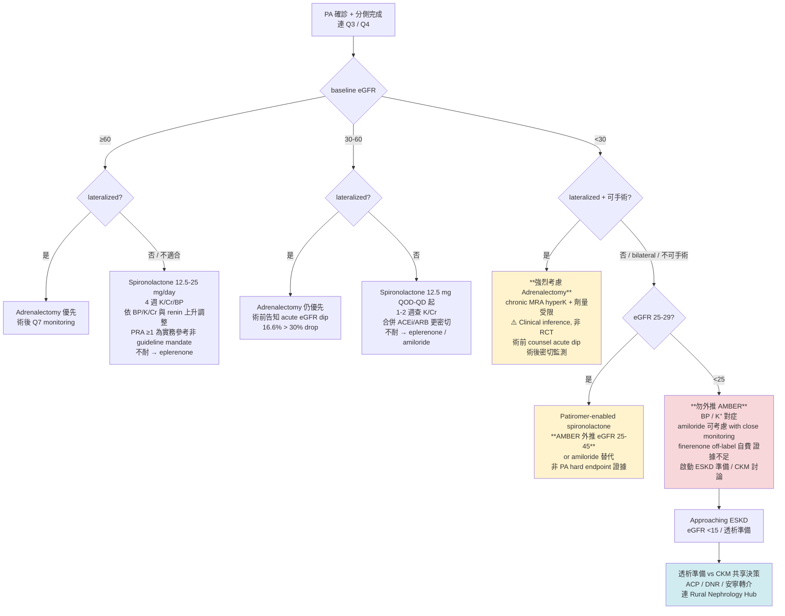

# Q6 — PA + CKD：eGFR 三段式治療與手術後 acute eGFR dip 管理

> **📌 一句話結論**
> PA 合併 CKD 的處置不是把標準 PA 治療「縮小劑量」，而是**用 eGFR 三段式決策**：(1) **≥60** lateralized → adrenalectomy / bilateral → spironolactone 12.5-25 mg/day；(2) **30-60** spironolactone 12.5 mg QOD-QD 起 + 1-2 週查 K⁺/Cr，**lateralized 仍優先手術**；(3) **<30 + lateralized** → **反而更該考慮手術**（chronic MRA hyperK + dose limit；**clinical inference，非 RCT**），術前必告知 **acute eGFR dip 16.6%** [Chen JY 2024]；**<30 + bilateral / 不可手術** → AMBER patiromer-enabled spironolactone（**eGFR 25-45 紅線**，不外推 <25/dialysis）or amiloride 替代。**沒有 spironolactone vs adrenalectomy head-to-head RCT**；Comparator 嚴格區分：Chen 2019 = ADX-treated PA **vs EH controls**（不是 vs MRA direct）；Wu 2021 = adrenalectomy **vs MRA direct**（ACM HR 0.57 / MACE HR 0.67 / CHF HR 0.49）；Cohen 2023 PA-CKD specific cohort 顯示 ADX vs medical 5 年 BP + 用藥較佳但 hard endpoint 無顯著差異。**Finerenone 在 PA 為 off-label**，僅 60 人 8 週 pilot RCT [Hu 2025 Circulation, eGFR ≥60 only, BP 非劣 + K⁺ 較佳]，**hard endpoint 證據不存在**，TW 自費。

> **📝 文件層級分辨**
> **指引建議** ≠ **臨床實務** ≠ **政策現況（NHI coverage）**。本文以 2025 Endocrine Society Clinical Practice Guideline (Adler GK et al., **PMID 40658480**) 為主軸；KDIGO 2024 CKD guideline 為 CKD pathway 對照；TAIPAI Chen YY 2019 + Wu VC 2021 + Chen JY 2024 為核心 cohort 證據；Cohen 2023 為 PA-CKD specific multicenter cohort。截至本次查核可見（2026-05-12），**台灣 NHI 對 finerenone 在 PA 為 off-label 自費**；patiromer 在台灣未能獨立確認成品藥證 / 上市供應 / 健保收載，申報 / 採購前以 TFDA / 健保署 / 院內藥局為準（Q11 cross-reference）。

---

## 1. Bottom Line（300 字）

PA-CKD 的核心決策不複雜：**先決定能否安全承接 MRA、是否已進入 chronic MRA 容易被 hyperK 與 dose ceiling 卡住的區間、以及若 lateralized 手術值不值得提前拉高**。

**Spironolactone 仍是基礎武器**：eGFR ≥60 起 12.5-25 mg/day；30-60 改 **12.5 mg QOD-QD 慢慢滴**，1-2 週查 K⁺/Cr；<30 進入 hyperK 高風險區，需 patiromer 護航或 amiloride 替代。

**Severe CKD + lateralized PA 反而是評估手術的時點**（chronic MRA 在此族群劑量受限 + hyperK 風險高）。觀察性 cohort 一致顯示 ADX 比 medical 在 ESRD / MACE / mortality 有 hard endpoint 訊號（Chen 2019 vs EH; Wu 2021 vs MRA direct），但 **baseline eGFR <30 dedicated cohort 仍缺**，立場必標 **clinical inference**。

**手術後 16.6% 病人在術後 6 個月內 eGFR dip >30%**（Chen JY 2024, PMID 38051943, n=445）。常被解讀為 aldosterone-related hyperfiltration 解除後的 hemodynamic unmasking，**但不能保證「沒有腎傷害」**——dip >30% 組 MAKE 風險上升（HR 2.18 [1.04-4.57]），mortality 與 CV composite 無顯著差異。若實際發生 dip >30%，仍需個案排除 AKI、volume depletion、藥物、RASi/MRA 調整等可逆因素並密切追蹤。**術前必告知**。

**Finerenone 在 PA 為 off-label**：FIDELITY 是 T2D-CKD 不是 PA；唯一 PA RCT（Hu 2025 Circulation, NCT05924620, n=60, 8 週, eGFR ≥60）顯示 BP 非劣 + K⁺ 較佳但無 hard endpoint。**不可外推 PA 優於 spironolactone**。

---

## 2. PA 病人的 CKD epidemiology

### 2.1 盛行率與機轉

- 一般族群 CKD prevalence ~**10-10.6%**（台灣 2017-2020）
- **PA 族群 CKD prevalence 20-50%**（依 cohort 差異大）
  - Iwakura 2014 PMID 24285678: APA baseline CKD 15.7% → 1 年後 37.1%（P<0.0001）；bilateral 8.1% → 28.3%
  - Cohen 2023 PMID 37593884: PA-CKD multicenter cohort baseline eGFR 45±12（接近 stage 3b）
  - **沒有單一權威「30-50%」數字** — 較精確的說法是「**PA 中 CKD 常見，referral / AVS cohorts 尤為常見**」
- **機轉**：
  - Aldosterone → sodium reabsorption + volume expansion → 入球小動脈擴張 + 出球小動脈收縮 → glomerular hyperfiltration
  - Hyperfiltration **掩蓋**真實 eGFR → 治療後 eGFR 急降 = unmasking ≠ 真實腎損傷加劇
  - 同時 aldosterone 直接 pro-fibrotic（TGF-β pathway）→ 長期 glomerulosclerosis + interstitial fibrosis

### 2.2 PA vs EH 的 renal trajectory 差異

- **Hundemer 2018 renal (PMID 29987110)**：
  - MRA-treated PA eGFR slope **−1.6 mL/min/yr** vs EH **−0.9**（P<0.001）
  - MRA-PA incident CKD **aHR 1.63 [1.33-1.99]** vs EH
  - Surgical PA vs EH **無顯著差異**
- → **MRA 治療不夠 aggressive（renin 未解除抑制）**的 PA，腎臟預後仍劣於 EH

### 2.3 CKD 對 PA 確診的影響

- CKD 會讓 ARR/confirmatory test 解讀更難（連 Q3）
- PA 在 CKD 族群篩檢率低：澳洲腎臟科門診 600 例 CKD 中符合 ES 篩檢條件 39%，實際做 ARR 僅 14%（PMC9300536）
- 「沒被診斷的 PA」不是單純 secondary HTN，是持續增加心腎傷害的 driver

---

## 3. Surgery in PA-CKD

### 3.1 Severe CKD + lateralized PA：手術 outcome 是否仍優？

> **⚠️ 嚴格立場 hedge**
> 「**Severe CKD（eGFR <30）+ lateralized PA 反而常更值得認真考慮手術**」此論述**是臨床推論，非隨機試驗結論**。整合自：(a) chronic MRA 在 advanced CKD 之 hyperK + dose limitation；(b) Hundemer 2018 renal: MRA-PA renal slope 劣於 EH；(c) Wu 2021: surgery vs MRA 整體較佳。**並無直接針對 eGFR <30 lateralized PA 的 RCT 或大型 cohort hard endpoint 證據**。
>
> **但在偏鄉現場的張力**：這類 advanced CKD + 單側 PA 病人，雖然「臨床上更該考慮手術」，但**實際接受到手術治療的可近性常較低**——轉介醫學中心、完成 AVS workup、外科評估、家屬意願、交通、經濟、共病等都是門檻。地區醫院腎臟科常見的情境是：把病人轉介出去之後，**是否真的能完成手術鏈**取決於整條照護鏈的銜接，而不只是醫療判斷。

**Comparator 嚴格區分**（Q5 v1.1 教訓延伸）：

| 研究 | PMID | Comparator | Effect size |
|---|---|---|---|
| **Chen YY 2019 TAIPAI** | **31086833** | ADX-treated PA **vs matched EH controls**（**不是** vs MRA direct）| ESRD sHR **0.38, P=0.007**；MRA-treated PA 未顯示同等 ESRD benefit → **間接 observational signal supporting surgery > medical** |
| **Wu VC 2021 TAIPAI** | **34851859** | **ADX vs MRA direct**（IPTW + time-varying）| ACM HR **0.57**, MACE HR **0.67**, CHF HR **0.49** |
| **Cohen 2023 PA-CKD specific** | **37593884** | ADX 66% vs medical 34%（n=239, baseline eGFR 45±12）| 5 年 BP 149/85 → 131/78、用藥 4.0 → 2.4；**hard endpoint 兩組無顯著差異** |

**子群分析（Chen YY 2019）**：Charlson score >0 者，ADX vs EH ESRD HR **0.18 [0.04-0.71]** — 共病多者 ADX benefit 更顯著。**非以 baseline eGFR 分層之子群**。

**baseline eGFR <30 dedicated cohort**：截至本次查核可見尚未發表。

### 3.2 Acute eGFR dip — Chen JY 2024 深化（PMID 38051943, JCEM）

> **⚠️ 必告知 risk**
> **Adrenalectomy 後 16.6% 病人 6 個月內 eGFR dip >30%**（Chen JY 2024, n=445）。**Dip >30% 組 MAKE 風險上升 [HR 2.18, 95% CI 1.04-4.57]**；mortality 與 CV composite 無顯著差異。

**設計**：multicenter prospective cohort, n=445 unilateral PA 行 ADX 者，依術後 6 個月相對 baseline 之 eGFR dip ratio 分組。

**關鍵數字**：
- **eGFR dip <−30% 比例：16.6%（74/445）**
- 平均追蹤 5.0 ± 3.6 年
- **MAKE 17.3%, CV composite 14.6%, 死亡 2.9%**
- Dip <−30% 組 MAKE HR **2.18 [1.04-4.57]**

**Dip <−30% 之獨立 risk factors（多變量分析）**：

| Risk factor | OR | 臨床意義 |
|---|---|---|
| 年齡 | 1.04/year | 腎臟代償儲備下降 |
| 術前 eGFR 較高 | 1.02 | hyperfiltration 越極端，dip 越深 |
| 低血鉀 | 0.45 | K⁺ 越低代表 aldosterone 暴露越強 |
| 術前 SBP | 1.03 | 系統性 HTN 對入球動脈衝擊 |
| PAC | 0.99 | 與 aldosterone burden / hyperfiltration phenotype 相關；OR 需依原文單位解讀，**避免單獨用 PAC 高低預測 dip** |

**MAKE components 主要驅動**：**CKD stage progression + incident CKD**（不是 perioperative AKI 波動）

**臨床操作**（術前 counsel 範本）：
> 「您現在抽血看到的 eGFR 是 X，但這個數字其實是『**假性偏高**』——PA 讓腎臟『超前工作』把分數撐起來。手術把腫瘤拿掉後，腎臟回到**真實狀態**，這在概念上是『**校正回歸**』：從假性偏高校正回到真實水準。這是 hemodynamic unmasking 的常見解釋，**但仍需個案排除 AKI、volume depletion、藥物等可逆因素**。約 1/6 病人 eGFR 會下降超過 30%，多數在 3-6 個月後穩定。下降幅度較大的這群人，未來 CKD 惡化 / 再透析的風險會稍升（MAKE HR 2.18），因此**術後要更密切追蹤**（1 週 / 1 個月 / 3 個月 / 6 個月各驗一次 Cr / K⁺ / eGFR）。觀察性 cohort 整體支持手術可改善 BP / 用藥負擔（Cohen 2023），但**對個別 severe CKD 病人不應保證手術一定降低未來心血管事件或洗腎風險**。」

> **ℹ️ 風險預測工具**
> 截至本次查核可見，**沒有已外部驗證的 PA-ADX eGFR-dip score 或 nomogram**。實務上以年齡 + 術前 eGFR + PAC + K⁺ + SBP 五個變項做臨床 stratification。

### 3.3 Long-term renal outcome post-surgery

**兩層 trajectory**：
1. **Acute reveal of hyperfiltration**：術後第 1 週 - 6 個月最大 eGFR 下降，3-6 個月後趨穩定（非 progressive decline）
2. **真正的 CKD progression slope**：6 個月後 long-term slope 多與 EH 無顯著差異

**Tubular biomarkers post-treatment（Wu VC 系列, JAHA 2023, PMID 36789834）**：
- Cystatin C ↑, eGFR ↓ = **hemodynamic reset**
- L-FABP/Cr ↓, KIM-1/Cr ↓ = **tubular health 改善**
- → **支持** acute dip 主要可能是 hemodynamic reset / hyperfiltration unmasking，而非單純 progressive CKD；但仍需個案排除 AKI、volume 與藥物因素。

**Iwakura 2022 stage 3 CKD-PA（PMID 36367014, n=20, 5-8 yr follow-up）**：
- ADX 12 例 / MRA 8 例
- 兩組長期 eGFR 進一步下降皆不顯著
- **樣本極小**，外推應保守

### 3.4 地區醫院腎臟科視角

**地區醫院腎臟科可做**：
- Pre-op K⁺/BP 優化
- 轉介 lateralization workup（AVS 至醫中）
- 術前 counsel acute eGFR dip（含「校正回歸」概念）
- 術後 eGFR / K⁺ / UACR 接續監測（1w / 1m / 3m / 6m）
- 後續 HTN + CKD 整合追蹤

**地區醫院腎臟科通常無法涵蓋執行**：**AVS、laparoscopic adrenalectomy、cortical-sparing surgery** — 這些**受限於醫療人力與量能**，需要跨專科協作（介入性放射科、泌尿科、病理科）。地區醫院腎臟科通常的情境是：**遇到疑似個案轉介至醫學中心評估、治療；或接收外院下轉的病人做追蹤治療**。能否在地處理這些 procedure，依各醫院實際醫療量能而定。

---

## 4. MRA in CKD-PA

### 4.1 Spironolactone in eGFR 30-60

**起始 + 滴定**：
- eGFR ≥50 + K⁺ ≤5.0: 12.5-25 mg QD
- **eGFR 30-50: 12.5 mg QOD-QD 起**（仿單明列 eGFR 30-50 consider 25 mg every other day；現代腎臟科實務更保守）

**監測頻率**：
- **第 1-2 週**：K⁺ + Cr 各 1 次（合併 ACEi/ARB / DM / 年長 / K⁺ ≥4.5 / eGFR ≤45 更早）
- 第 4 週, 8 週：K⁺ / Cr / BP
- 穩定後：每 3 個月 K⁺ / Cr / UACR
- **PRA 每 3-6 個月**判斷劑量是否足量（renin-guided titration, 2025 ES）

**滴定目標**：
- 2025 ES：「BP 未控且 renin 仍 suppressed → 上調 MRA 讓 renin 上升」
- **不指定 fixed PRA cut-off**；實務常用 **PRA ≥1 ng/mL/h** 為 practical convention（**不是 guideline mandate**）

**合併 ACEi/ARB**：
- CRIB-II 早期 CKD low-dose spironolactone safety trial: 嚴重高血鉀 <1%
- 但 NSAID / trimethoprim / K supplement / 脫水 / 便秘 → K 波動實際更常見

**副作用 dose-dependent**：
- 男性 gynecomastia / 乳房脹痛 / 性功能（~10-13%）
- 女性 menstrual irregularity
- Hyperkalemia
- 不耐受 → eplerenone

### 4.2 Spironolactone in eGFR <30：patiromer-enabled（AMBER 外推）

**AMBER trial（Agarwal 2019, Lancet, PMID 31533906）**：
- **eGFR 25-45** resistant HTN + CKD（**不是 PA trial**）
- n=295；12 週 spironolactone 持續使用率 **86% vs 66%（Δ19.5%, P<0.0001）**

**Subgroup（PMID 35369022, Kidney360 2022）**：
| eGFR 區間 | Patiromer | Placebo | Δ | P |
|---|---|---|---|---|
| 25 to <30 | **84%** | **56%** | **29%** | <0.02 |
| 30-45 | 86% | 69% | 17% | 0.003 |

> **⚠️ AMBER 適用紅線**
> ✅ **可外推**：eGFR **25-45** PA 病人，當需保留 spironolactone 而 hyperK 限制時用 patiromer
> ❌ **不可外推**：eGFR <25 / dialysis
> ❌ **不可宣稱**：「AMBER 證實 patiromer 改善 PA-CKD hard endpoint」（primary endpoint 是 persistence，不是 hard endpoint）
> ❌ **AMBER 不是 PA trial**

**PA-specific patiromer-enabled spironolactone study**：截至 2026-05-12 文獻檢索結果為 **0 篇發表**（PA cohort 外推 AMBER 為唯一證據）

**Patiromer 台灣狀態**：截至本次查核**未能獨立確認** patiromer（Veltassa）在台灣有成品藥證、上市供應或健保收載；申報 / 採購前須以 TFDA 藥物許可證查詢系統、健保署查詢系統與院內藥局為準。

> **⚠️ AMBER 的證據基礎是 patiromer ≠ SZC / Lokelma**
> **AMBER evidence base 是 patiromer**，不是 SZC（sodium zirconium cyclosilicate / Lokelma）。SZC 在台灣可見 5 g/包藥品資料，但 SZC 不能被寫成 AMBER 的等價替代證據——兩種藥的分子結構、PK、subgroup data 都不同。實務上若考慮 SZC 替代 patiromer 啟用 spironolactone，是 evidence-bridging 而非 evidence-equivalent，需個案 K⁺ 密切監測。

### 4.3 Eplerenone in CKD-PA

- 仿單：eGFR >50 起 25 mg QD，可上至 50 mg BID；**CrCl <50 為 PA 適應症仿單禁忌**
- 對 PA BP / K⁺ 控制與 spironolactone 大致相當（Karagiannis 系列）
- 抗雄性素副作用低
- **K⁺ 風險與 spironolactone 大致相當**（同為 K 保留）
- TW NHI 給付：截至本次查核可見，曾有共擬會議議「擴增至 PA 所致高血壓 + spironolactone 不耐」（第 55/79 次議程）；**最新給付以最新版查詢系統為準**（Q11 cross-reference）

### 4.4 Finerenone in CKD-PA — Off-label disclaimer ⚠️

> **⚠️ Off-label 紅線**
> **Finerenone 在 PA 為 off-label**。**機轉外推合理，但 hard endpoint 證據在 PA 不存在；不可外推 PA 優於 spironolactone**。

**FIDELITY pooled analysis（T2D-CKD, NOT PA）**：
- Hyperkalemia 14% vs 6.9%
- Stage 4 CKD subgroup（n=890）: hyperK 26% vs 13%

**PA-specific 證據**：

**1. NCT05924620 Pilot RCT（Hu 2025 Circulation, DOI 10.1161/CIRCULATIONAHA.124.071452）**：
- n=60, **8 週**, finerenone vs spironolactone
- **eGFR ≥60 only, K⁺ ≤5.0**（**不是 CKD trial**）
- 平均日劑量：finerenone 21.8 mg vs spironolactone 23.4 mg
- BP control 兩組差異無顯著（mean diff −2.1 mmHg [−8.2 to 4.0]）
- **K⁺ 上升 finerenone 較小（mean diff −0.3 mmol/L）**
- 不良事件：finerenone 0% vs spironolactone 20.7%

**2. Li 2026 multicenter prospective study（PMID 41568520, Hypertension）**：
- Single-arm, PA cohort
- PAMO complete biochemical response 29.1%, clinical response 20.0%
- Single-arm exploratory；details 以原文 methods 為準

**3. Ongoing trials**：FAIRY NCT06457074 招募中、FAVOR NCT06164379 / NCT05814770 / NCT06381323（status varied）

**TW NHI**：Finerenone 已有 T2D-CKD 相關適應症資料；**健保是否已生效給付、給付條件與健保碼，申報前須以健保署最新版查詢系統與院內藥局為準**。PA **不是核准適應症**，也沒有 PA hard endpoint trial；以 PA 為適應症使用屬 off-label，**不得寫成常規健保給付**。公開自費價約 ~NT$90/20 mg 顆，月約 ~NT$2,520，實際以院內藥局為準。

**真正適合考慮 finerenone 的情境（極罕見）**：
- 明確不能手術
- spironolactone / eplerenone 都無法接受
- 病人**充分理解證據不足**
- → 不該作為 routine PA-CKD 治療

### 4.5 Amiloride / ENaC inhibitors

- 起始 5-10 mg QD，可上至 20-40 mg QD
- PATHWAY-2 mechanism substudy + SPARE trial: 在 resistant HTN 中 SBP 降幅 ~ spironolactone
- 適合 spironolactone 不耐 / contraindicated 之 PA-CKD 替代

**2025 ES Adler 立場**：
- 「**MRA 優於 ENaC inhibitors**」（弱建議、低證據強度）
- ENaC 為 spironolactone 不耐 / contraindicated 之 fallback

> **⚠️ ⚠️ amiloride 同樣 hyperK 風險**
> 不要誤以為「改 amiloride 就比較不會高血鉀」。Advanced CKD 仍須密切監測。

---

## 5. eGFR 三段式治療 framework

**框架要點**：
1. **eGFR 60 / 30 / 25 為三段式節點**
2. **lateralized 在所有 eGFR 段都優先評估手術**（CKD 越重，chronic MRA 越受限，手術相對價值上升 — 但須 hedge，非 RCT）
3. **eGFR 25-45 為 patiromer 適用區間**（含 30-45 區間：若 hyperK 限制 MRA，亦可參考 AMBER eGFR 25-45 evidence，但仍非 PA-specific hard endpoint），<25 / 透析 **嚴禁外推**
4. **Finerenone 在 PA 任一 eGFR 段都標記 off-label**

**各 evidence tier 標籤**（避免讀者把所有分支當同等證據）：
- eGFR ≥60 + lateralized surgery：**guideline + observational cohort**
- eGFR 30-60 MRA low-dose titration：**label / CKD safety extrapolation + expert practice**
- eGFR <30 + lateralized surgery：**clinical inference，非 RCT**
- eGFR 25-45 patiromer-enabled spironolactone：**AMBER RCT extrapolation（非 PA-specific）**
- eGFR <25 / dialysis：**expert opinion / CKM shared decision-making**

---

## 6. PA-CKD CKM / Conservative pathway（連 Rural Nephrology Hub）

**CKM（Conservative Kidney Management）**：年長 / frailty / 多重共病 / 預期壽命受限 / 拒透析之 advanced CKD-PA 病人，CKM 為與 dialysis 並列之合理選擇。重心：症狀控制、生活品質、ACP。

**PA-CKD 切入 CKM 時機**：
- eGFR <20 且合併 (a) 年齡 ≥80、(b) 顯著 frailty、(c) 病人偏好生活品質、(d) PA 治療目標已從「根治 / 心腎保護」轉為「症狀控制」

**啟動 CKM 後仍治療 PA 嗎？**
- CKM 病人常有 frailty、低攝食、便秘、感染、NSAID exposure、ACEi/ARB 併用與抽血監測困難——**MRA / amiloride 在此族群不是 routine**
- 在明確症狀 / 血壓目標下，可以**最低劑量、低強度、可監測**的方式考慮 **低劑量 spironolactone 12.5 mg QOD** 或 amiloride 協助 BP / K⁺ / 容量
- 若抽血監測負擔高、反覆 hyperK、低血壓、脫水或治療目標已轉為舒適照護，**停用或不啟動 MRA / ENaC inhibitor 也是合理選擇**
- 監測 K⁺ + 症狀

**ACP / DNR 討論時機**：eGFR <30 即可預先溝通（提早 6-12 個月）

**安寧轉介**：台灣偏鄉腎臟科可運用健保安寧居家 / 安寧共照 / 安寧住院三條路徑；地區醫院腎臟科主責「啟動討論 + 院內共照」（連 Rural Nephrology Hub）。

---

## 7. NHI 實務 quick reference（連 [Q11](/pa/q11-taiwan-nhi-coverage/)）

> ⚠️ **截至本次查核可見；申報前以最新版健保藥品給付規定查詢系統為準。**

| 藥物 | NHI 給付（截至本次查核可見）| 備註 |
|---|---|---|
| **Spironolactone** | 全給付 | 廣泛使用於 HTN / HF / 肝硬化 / PA |
| **Eplerenone（NHIA 2.9.1）** | 限 post-MI HF / NYHA II 以上 + LVEF ≤30% + **spironolactone 不耐**；**PA 屬 off-label** | 共擬會議曾議擴增至 PA，最新給付以查詢系統為準 |
| **Finerenone（Kerendia）** | 有 T2D-CKD 相關適應症資料；**是否已生效給付 / 給付條件 / 健保碼，申報前以健保署最新版查詢系統與院內藥局為準** | **PA 不是核准適應症 / 不得寫成常規健保給付**；公開自費價約 ~NT$90/20 mg 顆，月 ~NT$2,520 |
| **Patiromer（Veltassa）** | **截至本次查核未能獨立確認台灣有成品藥證 / 上市供應 / 健保收載**；以 TFDA / 健保署 / 院內藥局為準 | AMBER evidence base 是 patiromer；國外公開價 USD 1,000-1,500/月 |
| **SZC / Lokelma** | 可見台灣 5 g/包藥品資料；健保狀態以院內藥局為準 | 公開自費價約 NT$300-400/包；不是 AMBER patiromer 的等價替代證據 |
| **Amiloride 單方** | 健保 NHIA 2.9.2 **限 Liddle's syndrome 事前審查**；PA 屬 off-label | 實務上需依院內藥局 / 健保查詢系統確認是否可取得與是否自費 |
| **Amiloride/HCTZ 複方（Moduretic / Amizide 類）** | 與單方為不同給付與適應症 | **不等同 PA 的 ENaC inhibitor 單方替代**；CKD 使用須注意 HCTZ 對容量 / 血鉀 / 腎功能影響 |

完整健保條文 / 申報核刪 / 自費告知 → [Q11](/pa/q11-taiwan-nhi-coverage/)。

---

## 8. 病人決策對話框架（區域醫院腎臟科門診實境）

### Q：「我洗腎前 PA 還要治療嗎？」
>PA要治療，不管我們是用藥物還是開刀的方式，因為他不只是會影響到腎臟功能的問題，而是同時也會造成中風心臟衰竭心律不整的全身性問題，所以有機會可以解決，當然一定要解決。開刀或是用藥都是選擇之一。

### Q：「醫生說我腎功能太差不能吃 spironolactone，那怎麼辦？」
> 腎功能太差，並不是說完全不能使用 spironolactone。而是說需要依你的實際腎臟功能的狀況去做劑量上的調整以及抽血的追蹤檢查。在台灣如果因為吃這個藥物造成鉀離子太高，則可以使用傳統的降鉀藥物或是新型的降鉀藥物，不過新型的降鉀藥物則是要自費（Lokelma，台灣目前不易取得 patiromer）。另外還有比較老的藥物 Amiloride。

### Q：「我 eGFR 25 還可以開刀嗎？」
> 可以考慮評估看看開刀的效益。因為開完刀之後，大概有六分之一的病人，eGFR 會下降超過 30%，這個常被解釋為腎臟功能的「校正回歸」，也就是說開完刀之後才可以知道真實的腎臟功能是長什麼樣？有沒有被 aldosterone 虛假性地提高 eGFR。通常開刀後 3-6 個月比較能看到實際的腎臟功能；若下降幅度比較大，未來腎功能惡化的風險也會稍高，需要密切追蹤。整體研究顯示手術組長期 BP 與用藥負擔比較好，但對個別嚴重腎功能不全的病人，並不能保證一定降低未來洗腎或心臟問題的風險。因此不是開完刀之後就好了，而是要持續的追蹤。

### Q：「開完刀腎功能會更差嗎？」
> 有些人的確會變得更差，這是帳面上數字的更差，也能讓患者知道他實際上的腎臟功能並不是過去會開刀前的數字那麼好；所以在短期三個月到六個月內的EGFR下降是合理的並不是說手術失敗治療失敗。
> 另外值得一提的是，如果術前的一些臨床狀況就比較差或是條件比較差，例如說年紀大、血壓很高、血鉀很低，這樣子再開完刀之後，預期eGFR掉（eGFR dip）的狀況會更嚴重；就是因為在手術之前aldosterone已經影響很嚴重了，所以才會造成術後狀況看起來不太好。
> 在超過六個月以後，大部分的狀況都是持平或是貼近年齡的eGFR 下降。
> 
> 

### Q：「Lokelma 自費要多少錢？」
> 目前**台灣健保給付情況以最新查詢系統與院內藥局為準**，若需自費，**請治療前先問藥局**。國內公開可見的自費價格大概是一包五公克 NT$300 到 NT$400；若每天吃一包，一個月大概是 NT$9,000 到 NT$12,000，**長期負擔大**，所以我們會評估有沒有其他選擇（amiloride / 低劑量 spironolactone / 改 eplerenone），或是不是「短期過渡」就好。

### Q：「Finerenone 廣告很紅，能不能用？」
> 目前**不能把它當 PA 標準治療**。它在 PA 上**只有 60 人 8 週的小研究**（PA 不是 finerenone 的核准適應症，需自費，月費約 NT$2,500），沒有長期預後資料（沒證明能降洗腎、心衰竭、死亡）。除非 spironolactone 跟 eplerenone 都不能用、又願意自費並理解證據不足，才會考慮。

### Q：「我已經透析了還要治療 PA 嗎？」
> 可以評估看看，但是這個階段治療 PA 的主要目的，重點會變成心血管保護和血壓控制。開刀或藥物都是選擇之一，然而藥物可能會有藥物本身無法容忍的副作用，另外藥物就是要長期使用。而開刀則是要看病人是否適合開刀。腎臟功能太差並不是「無法開刀」的原因——但是否值得開刀，要看心血管風險、體能狀況、麻醉風險、血壓控制目標與你自己的偏好來綜合判斷。

---

## 9. Cross-Topic Linkages

| Q | 連結內容 |
|---|---|
| [Q11 PA 健保給付](/pa/q11-taiwan-nhi-coverage/) | spironolactone / eplerenone / finerenone / patiromer 詳細給付條件 |
| [Q5 PA 治療策略 Surgery vs MRA](/pa/q05-surgery-vs-mra-treatment/) | 本 Q6 為其 CKD subgroup 深化 |
| Q3 Confirmation Test（後續發表）| CKD 影響 ARR / confirmatory test 解讀 |
| Q4 AVS / lateralization（後續發表）| CKD 不影響 AVS 適用；對比劑須 hydration |
| Q7 Post-Treatment Monitoring（後續發表）| Acute eGFR dip 監測（1w/1m/3m/6m）|
| Q10 Persistent HTN Post-Treatment（後續發表）| MRA-PA renin still suppressed → 上調 |
| Rural Nephrology Hub | Conservative kidney management (CKM) in PA-CKD |

---

## 10. Uncertainty / 待補充事項

1. **「PA 病人 CKD prevalence 30-50%」沒有單一權威數字** — 較精確說法為「常見、referral/AVS cohort 尤為常見」

2. **baseline eGFR <30 dedicated cohort 仍稀少** — 「Severe CKD + lateralized PA 更該考慮手術」為臨床推論

3. **Chen JY 2024 核心數字已核對**：n=445、術後 6 個月 dip >30% 74/445（16.6%）、mean follow-up 5.0 ± 3.6 years、MAKE HR 2.18 [1.04-4.57]

4. **Patiromer 台灣狀態**：截至本文查核**未能獨立確認**成品藥證 / 上市 / 健保收載；申報與採購前以 TFDA / 健保署 / 院內藥局為準

5. **Eplerenone PA 健保最新給付** — 共擬會議第 55 / 79 次議程；以最新版查詢系統為準

6. **Finerenone in PA emerging trials** — Hu 2025 Circulation pilot RCT（PMID 39804908）與 Li 2026 Hypertension single-arm（PMID 41568520）已列；均**不可視為 PA hard endpoint evidence**

7. **PA-specific patiromer-enabled spironolactone prospective study** — 截至 2026-05 文獻檢索結果為 **0 篇**，僅 AMBER 外推

8. **截至 2026-05-11 查核**：未見取代 2025 ES Adler guideline 的新 PA-CKD 立場

---

## 11. References（含 PMID）

### 指引

1. **Adler GK, Stowasser M, Correa RR, et al.** Primary Aldosteronism: An Endocrine Society Clinical Practice Guideline. *J Clin Endocrinol Metab* 2025;110(9):2453-2495. **PMID 40658480**
2. **Funder JW, Carey RM, Mantero F, et al.** The Management of Primary Aldosteronism: Case Detection, Diagnosis, and Treatment: An Endocrine Society Clinical Practice Guideline. *J Clin Endocrinol Metab* 2016;101(5):1889-1916. **PMID 26934393**
3. **Tseng CS, Chan CK, Lee HY, et al.** Treatment of primary aldosteronism: Clinical practice guidelines of the Taiwan Society of Aldosteronism. *J Formos Med Assoc* 2024;123 Suppl 2:S125-S134. **PMID 37328332**
4. **KDIGO 2024 Clinical Practice Guideline for the Evaluation and Management of Chronic Kidney Disease.** *Kidney Int* 2024;105(4 Suppl):S117-S314. **PMID 38490803**

### 核心 Cohort / RCT

5. **Chen YY, Lin YH, Huang WC, et al.** Adrenalectomy Improves the Long-Term Risk of End-Stage Renal Disease and Mortality of Primary Aldosteronism. *J Endocr Soc* 2019;3(6):1110-1126. **PMID 31086833** *(TAIPAI; n=2,699 PA; ADX vs matched EH: ESRD sHR 0.38, P=0.007; APA sHR 0.55)*
6. **Wu VC, Wang SM, Huang KH, et al.** Long-term mortality and cardiovascular events in patients with unilateral primary aldosteronism after targeted treatments. *Eur J Endocrinol* 2022;186(2):195-205. **PMID 34851859** *(TAIPAI; ADX vs MRA direct IPTW + time-varying: ACM HR 0.57, MACE HR 0.67, CHF HR 0.49)*
7. **Chen JY, Tsai YC, Chen YL, et al.** Association of Dip in eGFR With Clinical Outcomes in Unilateral Primary Aldosteronism Patients After Adrenalectomy. *J Clin Endocrinol Metab* 2024;109(3):e965-e974. **PMID 38051943** *(n=445; eGFR dip <−30% 16.6%; MAKE 17.3%; HR 2.18 [1.04-4.57])*
8. **Cohen DL, Wachtel H, Vaidya A, et al.** Primary Aldosteronism in Chronic Kidney Disease: Blood Pressure Control and Kidney and Cardiovascular Outcomes After Surgical Versus Medical Management. *Hypertension* 2023;80:2187-2195. **PMID 37593884** *(PA-CKD multicenter; n=239; ADX 66% / medical 34%; 5 年 BP 改善但 hard endpoint 兩組無顯著差異)*
9. **Hundemer GL, Curhan GC, Yozamp N, et al.** Renal Outcomes in Medically and Surgically Treated Primary Aldosteronism. *Hypertension* 2018;72(3):658-666. **PMID 29987110** *(MRA-PA incident CKD aHR 1.63; eGFR slope −1.6 vs EH −0.9)*
10. **Hundemer GL, Curhan GC, Yozamp N, et al.** Cardiometabolic outcomes and mortality in medically treated primary aldosteronism: a retrospective cohort study. *Lancet Diabetes Endocrinol* 2018;6(1):51-59. **PMID 29129576**
11. **Williams TA, Lenders JWM, Mulatero P, et al.** Outcomes after adrenalectomy for unilateral primary aldosteronism: an international consensus on outcome measures and analysis of remission rates in an international cohort. *Lancet Diabetes Endocrinol* 2017;5(9):689-699. **PMID 28576687** *(PASO; n=705; biochemical complete 94%, clinical complete 37%)*
12. **Iwakura Y, Morimoto R, Kudo M, et al.** Predictors of decreasing glomerular filtration rate and prevalence of chronic kidney disease after treatment of primary aldosteronism. *J Clin Endocrinol Metab* 2014;99(5):1593-1598. **PMID 24285678** *(n=213; APA baseline CKD 15.7% → 1 yr 37.1%)*

### MRA / Patiromer

13. **Agarwal R, Rossignol P, Romero A, et al.** Patiromer versus placebo to enable spironolactone use in patients with resistant hypertension and chronic kidney disease (AMBER). *Lancet* 2019;394(10208):1540-1550. **PMID 31533906** *(eGFR 25-45 resistant HTN+CKD; n=295; 12 週 spironolactone 持續 86% vs 66%; 非 PA trial)*
14. **Agarwal R, Rossignol P, Budden J, et al.** Patiromer and Spironolactone in Resistant Hypertension and Advanced CKD: Analysis of the Randomized AMBER Trial. *Kidney360* 2022;3:425-434. **PMID 35369022** *(eGFR 25-30 subgroup 84% vs 56%, Δ29%)*
15. **Edwards NC, Steeds RP, Chue CD, et al.** The safety and tolerability of spironolactone in patients with mild to moderate chronic kidney disease (CRIB-II). *Br J Clin Pharmacol* 2012;73:447-454. **PMID 21950312**
16. **Karagiannis A, Tziomalos K, Papageorgiou A, et al.** Spironolactone versus eplerenone for the treatment of idiopathic hyperaldosteronism. *Expert Opin Pharmacother* 2008;9(4):509-515. **PMID 18312153**

### Finerenone

17. **Hu J, Zhou Q, Sun Y, et al.** Efficacy and Safety of Finerenone in Patients With Primary Aldosteronism: A Pilot Randomized Controlled Trial. *Circulation* 2025;151(2):196-198. **PMID 39804908**. NCT05924620. DOI 10.1161/CIRCULATIONAHA.124.071452 *(n=60, 8 週, eGFR ≥60; BP 非劣; K⁺ 較佳)*
18. **Li P, Yang F, Lou Y, et al.** Efficacy and Safety of Finerenone in Patients With Primary Aldosteronism: A Multicenter Prospective Study. *Hypertension* 2026. **PMID 41568520** *(single-arm; PAMO complete biochemical response 29.1%, clinical 20.0%)*
19. **Agarwal R, Filippatos G, Pitt B, et al.** Cardiovascular and kidney outcomes with finerenone in patients with type 2 diabetes and chronic kidney disease (FIDELITY pooled analysis). *Eur Heart J* 2022;43:474-484. **PMID 35023547** *(T2D-CKD, NOT PA)*

### PA-CKD review / mechanism

20. **Monticone S, Sconfienza E, D'Ascenzo F, et al.** Renal damage in primary aldosteronism: a systematic review and meta-analysis. *J Hypertens* 2020;38:3-12. **PMID 31385870**
21. **Fernández-Argüeso M, et al.** Higher risk of chronic kidney disease and progressive kidney function impairment in primary aldosteronism than in essential hypertension. 2021. **PMID 33797699**
22. **Mirfakhraee S, et al.** Diagnosing Primary Aldosteronism in the Setting of Chronic Kidney Disease. 2021. **PMID 34293951**

### Off-label / 待觀察 / 待 Consensus 驗證

23. **Nakano Y / Iwakura Y, et al.** Long-term effects of PA treatment on patients with PA and CKD. 2023. **PMID 36367014** *(stage 3 CKD-PA, n=20, 5-8 yr ADX vs MRA 無顯著差異；樣本極小)*
24. **Queiroz MS, et al.** Renal function evolution after unilateral adrenalectomy for PA. 2024. **PMID 38040032** *(eGFR 第 1 週下降, 6 月內穩定；本文 n=94 請以原文 methods 為準)*
25. **Wu VC, et al.** Markers of Kidney Tubular Function Deteriorate While Those of Kidney Tubule Health Improve in Primary Aldosteronism After Targeted Treatments. *JAHA* 2023. **PMID 36789834**
26. NCT05814770 / NCT06457074 (FAIRY) / NCT06164379 (FAVOR) / NCT06381323 — finerenone in PA 後續試驗（招募中 or single-arm）

### 健保條文

- NHIA 公開給付規範：**Eplerenone（2.9.1）**：限對 spironolactone 無法耐受 + post-MI HF / NYHA II 以上 + LVEF ≤30%
- NHIA 公開給付規範：**Amiloride 單方（2.9.2）**：限 Liddle's syndrome 事前審查（PA 屬 off-label）
- NHIA 共擬會議文件：**Eplerenone 擴增至 PA**（第 55/79 次議程曾議）
- NHIA 共擬會議文件：**Finerenone（Kerendia）納入健保審議案（T2D-CKD）**——是否已生效給付以最新版查詢系統為準
- **Patiromer 台灣狀態未能獨立確認；SZC / Lokelma 有藥品資料但不是 AMBER patiromer 等價替代證據**
- **以最新版健保署支付標準查詢系統與貴院申報指引為準**

---

> **品質聲明**：本決策備忘錄遵守 (1) 核心 PMID 已逐項核對；仍涉及健保 / 藥品可近性之條目，申報前須以最新版查詢系統與院內藥局為準；(2) Comparator 嚴格區分（Chen 2019 vs EH ≠ Wu 2021 vs MRA direct ≠ Cohen 2023 PA-CKD specific）；(3) Hard endpoint vs surrogate 區分；(4) AMBER 適用紅線（eGFR 25-45）；(5) Finerenone PA off-label flag；(6) Acute eGFR dip 為 hemodynamic unmasking 常見解釋，但 dip >30% 仍需排除可逆因素；(7) Severe CKD 手術立場必標 clinical inference hedge；(8) 作者範圍誠實 — 區域醫院腎臟科可執行 MRA titration / 追蹤 / 轉介手術 / 術後 eGFR 監測，**不執行 adrenalectomy 與 AVS**。
