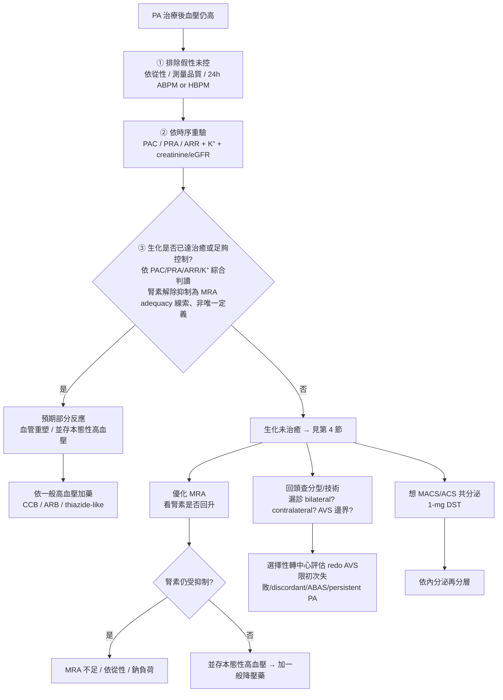

## Bottom line

- **術後仍需吃降壓藥是常態，不是失敗**：PASO 顯示單側 PA 腎上腺切除後，生化完全治癒 94%，但臨床完全治癒僅 37%（部分反應 47%、無反應 16%）。「臨床血壓反應」與「生化治癒」是兩套結局，必須分開判讀（PMID 28576687）。
- **第一步不是判失敗，是分三型**：①生化已治癒仍需藥（血管重塑 / 並存本態性高血壓＝預期部分反應）②生化未治癒（治療不足 / 漏診）③假性未控（服藥依從性 / 白袍高血壓 / masked）。三型的下一步完全不同。
- **MRA 滴定看腎素回升，不是只壓血壓**：腎素持續受抑制代表殘餘礦皮質素受體活化、心腎風險仍高（PMID 29129576）；腎素活性（PRA）>1.0 ng/mL/h 或直接腎素濃度（DRC）>10 為常用的 pragmatic 監測目標，而非強制門檻。

---

## 1. 定義與流行病學

### 1.1 手術臂：PASO
- 生化完全治癒 94% / 臨床完全治癒 37% / 部分反應 47% / 無反應 16%（PMID 28576687；n=705 臨床、699 生化）。
- 獨立預測完全臨床成功：女性 OR 2.25、年齡每增一歲 OR 0.95、術前用藥數每增一種 OR 0.80。
- 臨床治癒率遠低於生化治癒率的原因：長期醛固酮造成血管重塑 / 動脈硬化，加上常並存本態性高血壓。

### 1.2 藥物臂：PAMO（2025 新共識）
- 過去無標準化的藥物治療結局定義，2025 年 PAMO 共識才建立（Yang 2025, PMID 39824204；n=1258）。
- 完全臨床反應 18.3%（228/1248）、完全生化反應 52.9%（559/1057），追蹤 6–12 個月。
- **手術 PASO 與藥物 PAMO 的比較對象與結局定義不同，不可直接橫比治癒率。**

### 1.3 三型殘餘高血壓（本題操作核心）

| 情境 | 典型線索 | 意義 | 下一步 |
|---|---|---|---|
| 生化已治癒但血壓仍高 | 腎素已回升、ARR 不再支持 PA、K⁺ 正常 | 血管重塑 / 並存本態性高血壓＝預期部分反應 | 依一般高血壓加藥（CCB/ARB/thiazide），勿貼「漏診」標籤 |
| 生化未治癒 | 腎素仍受抑制、ARR/PAC 仍異常 | 治療不足 / 分型錯 / AVS 邊界 / 共分泌 | 進第 4 節再評估 |
| 假性未控 | 診間血壓高但 ABPM/HBPM 不高、依從性差 | 測量 / 執行面問題 | 先安排 ABPM/HBPM ＋藥袋核對 |

---

## 2. 預測因子（術前諮詢用）

### 2.1 ARS（最常用、簡單）
- 四變項：使用 ≤2 種降壓藥（2 分）、BMI ≤25（1 分）、高血壓病程 ≤6 年（1 分）、女性（1 分）；總分 0–5（Zarnegar 2008, PMID 18376197）。
- 低 / 中 / 高風險（0–1 / 2–3 / 4–5）對應完全緩解率約 27% / 46% / 75%。
- **外部驗證表現下降**：推導世代 AUC 0.91，外部驗證約 0.68–0.81，不同地區不一致（北美較佳、歐澳較差；亞洲世代亦有外部驗證，PMID 41048441）。因此只作機率式諮詢，不宜當單一門檻。

### 2.2 一致的預測方向
- 女性 OR 2.81、年輕、病程短（OR 0.92）、用藥少（OR 0.44）、BMI 低、無糖尿病 / 血脂異常、eGFR 較好 → 較易術後停藥（Manosroi 2022 meta, PMID 36060937；n=5601）。
- 術前 eGFR 偏低 → 術後殘餘高血壓較多（Wu VC, TAIPAI 世代 2009, PMID 19628318；n=150；OR 2.7 輕度 / 2.8 中重度）。

### 2.3 更新的預測模型（多為單中心 / 內部驗證）
- **Burrello PASO Score**（PMID 30672800；n=380；AUC 0.839、cut-off >16/25；納入標的器官損傷與結節大小）。
- **Marzano 2023 系統性回顧與統合分析**（PMID 37032125；*Clin Endocrinol*；25 篇 / 12 個模型）：三個外部驗證資料較充分的模型 pooled AUC——PASO 0.81 / Utsumi 0.79 / ARS 0.77（判別力相當；PASO、Utsumi 的外部驗證研究數較少，結論仍待累積）。
- 其他模型：SPAIN-ALDO score AUC 0.841（PMID 36018220；n=146）、機器學習模型 AUC 0.884（Kaneko 2022, PMID 35388079；n=107、外部 0.867）、泰國持續性高血壓評分 AUC 0.81（內部）/ 0.72（外部）（Harirugsakul 2025, PMID 40442280；n=363；年齡 ≥50 / 血脂異常 / BMI ≥25 / ≥3 種降壓藥 / 高血壓 ≥5 年）。
- 尿液 Na/K 比值方向：Na/K <3 較易臨床成功（OR 2.5；Lee MJ 2021, PMID 33633824）；>3 的切點受飲食影響，不宜寫死。

---

## 3. 術後血壓仍高的評估流程

在判讀「血壓仍高」時套用下列流程；監測時序排程另見 [Q7 — 術後監測](/pa/q07-post-treatment-monitoring/)。

重點：術後結局多看 **約 6 個月**的穩定值，別用術後幾天到幾週的讀值判「失敗」。

---

## 4. 生化未治癒時的再評估

- **漏診雙側 / 多灶不對稱雙側 PA**：即使 AVS 強烈側化，仍有一部分術後未治癒（Turcu 2024, *Hypertension*, PMID 38174562；n=283 AVS 導引手術後殘餘 PA 16%；獨立預測子——僅基礎狀態側化 OR 8.93、CT 與 AVS 不一致 OR 2.75）。
- **皮質醇共分泌 / MACS-PA overlap**：合併自主性皮質醇分泌（ACS）者術後生化治癒率明顯較低（64.3% vs 98.1%）、影像與 AVS 不一致比例較高（OR 2.37），且為唯一的獨立負向預測子（Hung K 2023, PMID 37800679）。PA 合併 MACS 盛行率約四分之一（各世代數字與文獻整理於後續 MACS-PA 共分泌專篇）。
- **redo AVS 不是看血壓高就做**：主要定位為初次 AVS 失敗、影像與功能不一致、疑似雙側腎上腺醛固酮抑制（ABAS），或 persistent biochemical PA 需再分型的 selected cases（Kline 2021, *JCEM*, PMID 33320942：初次失敗重做約 75% 成功；DePietro 2021 ABAS「double-down」重做 AVS 診斷率 70%，PMID 33781686），且應於高手術量中心評估。長期復發與病理型態（Tetti 2024, *Hypertension*, PMID 38318706：短期生化緩解者長期仍有 23% 復發、nonclassical 病理 60% 對比 classical 14%）可作為「為何 persistent/recurrent PA 需要再分型」的背景風險說明，但不單獨作為 redo AVS 的指征。

---

## 5. 殘餘高血壓的藥物處置

### 5.1 生化已治癒但血壓高
當作一般高血壓處理：CCB / ARB / thiazide-like；不因曾有 PA 就機械式維持高劑量 MRA。

### 5.2 生化未治癒 / 雙側 MRA arm → 優化 MRA
- Spironolactone 起始 12.5–25 mg/日（嚴重低血鉀可 50 mg），滴定至腎素解除抑制；多落在 50–100 mg/日（最高至 200 mg），每 2–3 個月追蹤 K⁺ / eGFR / 腎素（2025 ES 指引；Mansur 2023, PMID 37013957；Hundemer 2018, PMID 29129576）。
- **Eplerenone**：spironolactone 不耐受時的替代；台灣 PA 適應症屬 off-label 自費，詳見 [Q11 — PA 健保給付與自費](/pa/q11-taiwan-nhi-coverage/)。
- **Amiloride**：作用於上皮鈉離子通道（ENaC）；2025 ES 指引建議 MRA 優先於 ENaC 抑制劑。

### 5.3 Finerenone 在 PA — 嚴格保留

> 截至本次查核可見，finerenone 並無 PA 核可適應症（FDA / EMA / TFDA / Endocrine Society / 台灣指引皆無），在 PA 屬 off-label 使用、台灣自費（給付與申報以最新版查詢系統為準）。目前可見的 PA 臨床證據包括：① CONPASS pilot 隨機試驗（Hu J 2025, *Circulation*, PMID 39804908；n=60，血壓與低劑量 spironolactone 相當）；② 實務換藥的反效果訊號（Uslar / Baudrand 2025, *Eur J Endocrinol*, PMID 40378185：被迫由 eplerenone 換為 finerenone 後，血壓正常比例下降、完全生化反應下降、腎素下降）；③ 2026 多中心前瞻單臂 exploratory 研究（Li P 2026, *Hypertension*, PMID 41568520；n=57，12 週日間收縮壓 −6.69 mmHg、完全生化 29.1% / 完全臨床 20.0%）。現有證據不足以取代標準的類固醇型 MRA，也不能與 spironolactone 視為已完成 head-to-head 定論，更不可暗示未來給付。標準 MRA 仍為首選。

---

## 6. MRA arm 專屬：治療中血壓未達標

用腎素拆三型：

- 腎素仍受抑制 → **MRA 劑量不足 / 依從性** → 上調 MRA（而非疊加一般降壓藥）。
- 腎素已解除抑制但血壓仍高 → **並存本態性高血壓 / 鈉負荷 / 肥胖 / 阻塞型睡眠呼吸中止** → 加 CCB / thiazide。
- 數值前後大亂、用藥兜不起來 → 先想依從性 / 藥物交互作用。
- 若為達腎素目標須極高劑量 MRA 而致副作用、且疑單側優勢病變 → 轉回中心重評 AVS / 手術（見 [Q5 — 手術 vs MRA](/pa/q05-surgery-vs-mra-treatment/)）。

---

## 7. 地區醫院腎臟科的角色與跨題連結

**共照腎臟科端可著力的事**：務實地說，以地區醫院的資源，ABPM / HBPM 常常根本做不了，能把 ARR 確實驗完就已經算是很認真的了。真正能穩定做到的，是重驗 PAC/PRA/ARR/K⁺/creatinine、以腎素為目標滴定 MRA、追蹤 K⁺/eGFR，以及判讀「預期部分反應 vs 生化未治癒」。

術後 eGFR 的預期性下降，是門診最難溝通的一點。PA 造成的高過濾（hyperfiltration）一旦解除，eGFR 會從被撐高的數值（masked high）回落到真實基準——這是揭露先前被遮蔽的腎功能，而非治療傷腎。但病人多半難以理解「PA 一直把 eGFR 撐高」這回事；即使把術後的下降解釋成「迴歸校正、回到真實基準」，也常常只能聽個一知半解。這段機轉與監測時序另見 [Q7 — 術後監測](/pa/q07-post-treatment-monitoring/)。

**何時轉回中心**：生化未治癒、疑雙側、AVS 邊界 / 技術失敗、疑 MACS 共分泌、考慮 redo AVS，或需要重新影像 / 手術再評估時。

**相關主題**：AVS 判讀（[Q4 — AVS 定位診斷](/pa/q04-lateralization-avs/)）、術式 vs 藥物重選（[Q5 — 手術 vs MRA](/pa/q05-surgery-vs-mra-treatment/)）、CKD-PA 的 eGFR 軌跡（[Q6 — PA + CKD 治療](/pa/q06-ckd-pa-treatment/)）、監測排程與生化治癒定義（[Q7 — 術後監測](/pa/q07-post-treatment-monitoring/)）、eplerenone / finerenone / redo-AVS 給付（[Q11 — 健保給付與自費](/pa/q11-taiwan-nhi-coverage/)）；MACS 共分泌的機轉與處置見後續 MACS-PA 專篇。

---

## References

### 結局定義與流行病學
1. Williams TA, Lenders JWM, Mulatero P, et al. Outcomes after adrenalectomy for unilateral primary aldosteronism (PASO). *Lancet Diabetes Endocrinol* 2017;5(9):689-699. **PMID 28576687**.
2. Yang J, Burrello J, Goi J, et al. Outcomes after medical treatment for primary aldosteronism: an international consensus and analysis of treatment response (PAMO). *Lancet Diabetes Endocrinol* 2025;13(2):119-133. **PMID 39824204**.
3. Hundemer GL, Curhan GC, Yozamp N, Wang M, Vaidya A. Cardiometabolic outcomes in medically treated primary aldosteronism. *Lancet Diabetes Endocrinol* 2018;6(1):51-59. **PMID 29129576**.

### 預測因子與模型
4. Zarnegar R, Young WF Jr, Lee J, et al. The aldosteronoma resolution score: predicting complete resolution of hypertension after adrenalectomy. *Ann Surg* 2008;247(3):511-518. **PMID 18376197**.
5. Manosroi W, Atthakomol P, Wattanawitawas P, Buranapin S. Predictive factors of clinical success after adrenalectomy in primary aldosteronism: a systematic review and meta-analysis. *Front Endocrinol* 2022;13:925591. **PMID 36060937**.
6. Wu VC, Chueh SC, Chang HW, et al. Association of kidney function with residual hypertension after treatment of aldosterone-producing adenoma (TAIPAI). *Am J Kidney Dis* 2009;54(4):665-673. **PMID 19628318**.
7. Burrello J, Burrello A, Pieroni J, et al. Prediction of hypertension resolution after adrenalectomy for primary aldosteronism: the PASO surgical outcome score. *Ann Surg* 2020. **PMID 30672800**.
8. Marzano L, Kazory A, Husain-Syed F, Ronco C. Prognostic models to predict complete resolution of hypertension after adrenalectomy in primary aldosteronism: a systematic review and meta-analysis. *Clin Endocrinol* 2023;99(1):17-34. **PMID 37032125**.
9. Araujo-Castro M, Paja Fano M, González Boillos M, et al. Predictive model of hypertension resolution after adrenalectomy in primary aldosteronism: the SPAIN-ALDO score. *J Hypertens* 2022;40(12):2486-2493. **PMID 36018220**.
10. Kaneko H, Umakoshi H, Ogata M, et al. Machine learning-based models for predicting clinical outcomes after surgery in unilateral primary aldosteronism. *Sci Rep* 2022;12:5781. **PMID 35388079**.
11. Harirugsakul K, Suharitdumrong S, Panumatrassamee K, et al. Novel predictive factors scoring model for persistent hypertension after adrenalectomy in patients with primary aldosteronism. *Sci Rep* 2025;15:18935. **PMID 40442280**.
12. Ishihara Y, Umakoshi H, Kaneko H, et al. Aldosteronoma resolution score in Asian patients under two surgical procedures (external validation). *Front Endocrinol* 2025. **PMID 41048441**.
13. Lee MJ, Kim JH, et al. Urinary sodium-to-potassium ratio and clinical success after treatment of primary aldosteronism. *Ther Adv Chronic Dis* 2021. **PMID 33633824**.

### 生化未治癒與 redo AVS
14. Turcu AF, Tezuka Y, Lim JS, et al. Multifocal, asymmetric bilateral primary aldosteronism cannot be excluded by strong adrenal vein sampling lateralization. *Hypertension* 2024;81(3):604-613. **PMID 38174562**.
15. Hung K, Lee BC, Chen PT, et al. Influence of autonomous cortisol secretion in patients with primary aldosteronism: subtype analysis and postoperative outcome. *Endocr Connect* 2023;12(12):e230121. **PMID 37800679**.
16. Kline GA, Leung AA, Sam D, Chin A, So B. Repeat adrenal vein sampling in aldosteronism: reproducibility and interpretation of persistently discordant results. *J Clin Endocrinol Metab* 2021;106(3):e1170-e1178. **PMID 33320942**.
17. DePietro DM, Fraker DL, Wachtel H, Cohen DL, Trerotola SO. "Double-down" adrenal vein sampling results in patients with apparent bilateral aldosterone suppression: utility of repeat and super-selective sampling. *J Vasc Interv Radiol* 2021;32(5):656-665. **PMID 33781686**.
18. Tetti M, Brüdgam D, Burrello J, et al. Unilateral primary aldosteronism: long-term disease recurrence after adrenalectomy. *Hypertension* 2024;81(4):936-945. **PMID 38318706**.

### 藥物治療與 finerenone
19. Adler GK, Stowasser M, Correa RR, et al. Primary aldosteronism: an Endocrine Society clinical practice guideline. *J Clin Endocrinol Metab* 2025;110(9):2453-2495. **PMID 40658480**.
20. Mansur A, et al. Renin-guided titration of mineralocorticoid receptor antagonists in primary aldosteronism. *Am J Hypertens* 2023. **PMID 37013957**.
21. Hu J, Zhou Q, Sun Y, et al. Efficacy and safety of finerenone in patients with primary aldosteronism: a pilot randomized controlled trial (CONPASS). *Circulation* 2025;151(2):196-198. **PMID 39804908**.
22. Uslar T, Sanfuentes B, Muñoz I, Vaidya A, Baudrand R. Real-world outcomes of finerenone in primary aldosteronism. *Eur J Endocrinol* 2025;192(5):K50-K53. **PMID 40378185**.
23. Li P, Yang F, Lou Y, et al. Efficacy and safety of finerenone in patients with primary aldosteronism: a multicenter prospective study. *Hypertension* 2026;83(5):e26048. **PMID 41568520**.

---

## 相關問答

依臨床情境分流：

- 想看**治療策略整體** → [Q5 — PA 治療策略：手術 vs MRA](/pa/q05-surgery-vs-mra-treatment/)
- 想看 **AVS 定位判讀** → [Q4 — AVS 定位診斷](/pa/q04-lateralization-avs/)
- 想看 **PA + CKD 共病** → [Q6 — PA + CKD 三段式治療](/pa/q06-ckd-pa-treatment/)
- 想看**術後監測排程** → [Q7 — 術後監測](/pa/q07-post-treatment-monitoring/)
- 想看**腎上腺意外瘤共照** → [Q8 — Adrenal Incidentaloma + HTN](/pa/q08-adrenal-incidentaloma-htn/)
- 想看**健保給付與自費** → [Q11 — PA 健保給付與自費價格](/pa/q11-taiwan-nhi-coverage/)

---

## 跨 cluster 深化

- [Finerenone Q08 — 監測頻率](/finerenone/q08-monitoring-frequency/) — MR antagonist 家族的監測原則
- [SGLT2i Q01 — CKD 啟用時機](/sglt2i/q01-ckd-start-timing/) — 心腎代謝交界用藥
- [偏鄉腎臟科醫師到底在做什麼？](/rural-nephrology/01-rural-nephrology-role/) — 在地腎臟科的跨院共照角色

---

> **重點重申**：PA 治療後血壓仍高多為常態而非失敗；判讀前先分「生化已治癒 / 生化未治癒 / 假性未控」三型，再據此處置。MRA 治療以腎素是否解除抑制判斷劑量是否足夠，而非只看血壓。生化未治癒時要想到漏診雙側、MACS 共分泌與 redo AVS 的 selected cases。Finerenone 在 PA 無適應症、所有用法皆自費，不作為一線。本文為臨床決策參考，個別病人處置仍須回到主治醫師面對面評估。
