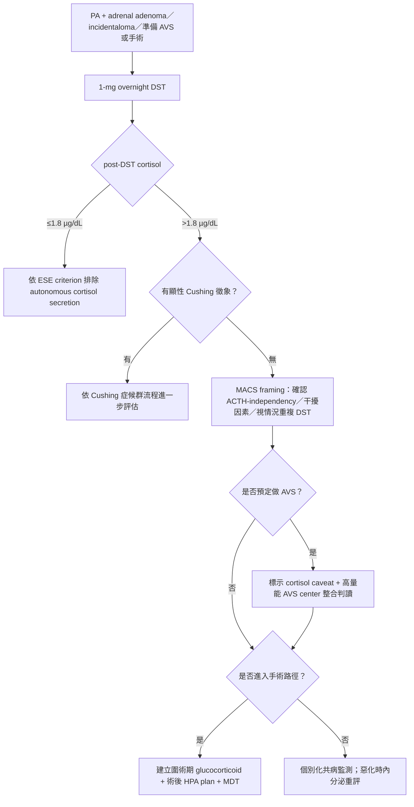

## Bottom line

- **PA 合併 MACS 並不少見，但不是固定「四分之一」**：2025 cohort 加統合分析的 pooled prevalence 為 **21.9%（95% CI 18.1–26.2）**（PMID 40069399）；台灣 TAIPAI 的 26.4% 是 **65/246**，限於 image–AVS analysis subgroup，不是 65/327，也不代表所有 PA（PMID 37800679）。
- **誰最該做 DST：PA 合併 adrenal adenoma**：2025 Endocrine Society 建議做 1-mg overnight DST，但屬**弱建議、very-low certainty（2｜⊕○○○）**（PMID 40658480）。adrenal incidentaloma 依 2023 ESE 原則上應做 DST；準備 AVS／adrenalectomy 者也有台灣共識支持。無腺瘤、純藥物治療者則個別化，不寫成所有 PA 絕對必做。
- **MACS 不等於 AVS 必然失真**：真正要警覺的是 AVS 當下**左右 cortisol 分泌不對稱**。cortisol 與真正 aldosterone-dominant side 同側偏高可壓低 A/C-based 側化指數；偏在對側可放大；若 aldosterone 原本不明顯單側，還可能製造表觀側化。
- **metanephrine 是補充工具，不是標準替代品**：替代 analyte 最一致的優勢是改善 selectivity；PA–MACS lateralization rescue 以 metanephrine 較直接，但 outcome validation 很少，沒有跨 assay／ACTH protocol 的通用 cutoff。
- **手術後同時追兩條軸**：aldosterone 的生化／臨床結局，與 cortisol／HPA 恢復分開看。TAIPAI 較低的完全生化治癒率是小型單一 cohort signal（9/14 vs 51/52），不能翻成「開刀只有六成會好」；術前 DST >1.8 µg/dL 且接受手術者，依 ESE 應有圍術期 glucocorticoid 與 HPA 恢復計畫。
- **門診的真實入口**：會讓我在門診開始 PA work-up 的，通常是已使用 **3 種以上降壓藥、血壓仍然偏高**、低血鉀、代謝性鹼中毒，或年輕即出現高血壓。這些是常見的高風險入口，不是排他性的 PA 篩檢條件，也不是 MACS 的診斷條件；當 work-up 進一步發現 adrenal adenoma／incidentaloma，或病人準備進入 AVS／手術路徑時，再依指引評估並補做 1-mg DST。

---

## 1. 盛行率與定義

### 1.1 MACS ≠ 顯性 Cushing 症候群

依 2023 ESE-ENSAT adrenal incidentaloma guideline（PMID 37318239）與 2025 Endocrine Society PA guideline（PMID 40658480）：

- **1-mg overnight DST**：23:00–24:00 口服 dexamethasone 1 mg，隔日 08:00–09:00 測血清 cortisol。
- post-DST cortisol **≤1.8 µg/dL（≤50 nmol/L）**：用於排除 autonomous cortisol secretion。
- 無顯性 Cushing 徵象且 post-DST cortisol **>1.8 µg/dL**：依現行 ESE terminology 稱 MACS（mild autonomous cortisol secretion）。
- 2023 版已不再把 1.9–5.0 與 >5.0 µg/dL 分成「possible ACS」與「ACS」兩個名稱；結果應視為連續變項。研究中 >5 µg/dL 可作較明顯 cortisol excess 的風險訊號，**不是另一個疾病名稱**。
- 應確認 ACTH-independency、檢查可能干擾 DST 的因素，並依情境重複 DST；ACTH、DHEA-S 或其他 cortisol 測試是輔助，不自行創造未驗證 cutoff。

> **名詞界線**：「單次 DST >1.8」不是脫離臨床情境的最終診斷；若有顯性 Cushing 特徵，應進一步依 Cushing 症候群流程評估，而不是套上 MACS 名稱。

### 1.2 PA–MACS 有多常見

| 研究 | 族群 / selection | 比例 |
|---|---|---:|
| Huang 2025（PMID 40069399） | TAIPAI cohort n=874；另報告 SR 11 studies、n=2882 | pooled **21.9%（18.1–26.2）** |
| Hung 2023（PMID 37800679） | TAIPAI image–AVS subgroup n=246 | **65/246 = 26.4%** |
| O'Toole 2020（PMID 32785656） | ACTH-stimulated AVS cohort n=144 | 14.6% |
| Heinrich 2022（PMID 36070424） | non-ACTH AVS cohort n=278 | 18.9% |
| Araujo-Castro 2023（PMID 37410097） | 21 tertiary centers；DST subset n=176 | 29.0% |
| Lamas 2024（PMID 39594996） | DST + AVS available n=225 | 43.6% |
| Wada 2026（PMID 41638657） | CT adrenal nodule ≥10 mm + DST n=872 | 32.4% |

**可對外的寫法**：PA 合併 MACS 約占五分之一；selected tertiary／adrenal-nodule／AVS cohorts 常見 20–30%，但已驗研究約 15% 到 40% 以上。TAIPAI 各出版 cohort 可能部分重疊，不能當成多次完全獨立的 replication；Hung 2023 的 26.4% 分母是 image–AVS subgroup（246），不是總收案（327）。

---

## 2. 三大臨床衝擊

### 2.1 AVS：風險來自 asymmetric cortisol，不是 MACS 標籤本身

傳統側化指數：`LI = (A_D/C_D) / (A_N/C_N)`，D 代表真正 aldosterone-dominant side。

- **cortisol 與 aldosterone 同側偏高**：`C_D` 上升 → LI 被壓低 → 可能偏向 false bilateral。
- **cortisol 偏在對側**：`C_N` 上升 → 既有 LI 被放大。
- **aldosterone 原本不明顯單側**：單側 cortisol asymmetry 可能製造表觀 lateralization，才有反向／錯側判讀風險。
- 周邊 DST 陽性只表示 cortisol 抑制不完全，**不能證明 AVS 當下左右 cortisol 一定不對稱**。

Hung 2023 顯示 image–AVS discordance 75.4%（49/65）vs 56.4%（102/181），OR 2.37（1.26–4.48）；但這是 **CT／影像與 AVS 不一致**，不是「AVS 錯誤率」，也不能單靠此數字證明 A/C 分母造成誤判。

跨 cohort 結果需並列：

- **O'Toole 2020**（n=144）：low-grade cosecretion 對 ACTH-stimulated AVS 參數／management 影響有限。
- **Heinrich 2022**（n=278）：整體 AVS/PASO 無差，但 post-DST >5 µg/dL 的 lateralized cases 側化指數較低（2.58 vs ~11，P=0.008），提示較明顯 cortisol excess 需提高警覺。
- **Lamas 2024**（n=225）：AVS 指數、單／雙側比例及術後 response 無顯著差異。
- **Wada 2026**（n=872）：ACS 組 ACTH-stimulated AVS success 84.8% vs 91.0%，但 unilateral 結果比例無差；unstimulated AVS–CT concordance 44.1% vs 61.7%，且 post-DST ≥5 µg/dL 者 reverse laterality 較多。

**結論**：平均效果有限／不一致，但遇到較高 post-DST cortisol、左右 cortisol 不對稱、borderline LI、AVS–CT discordance 或臨床結果不合預期時，應升級判讀層級，而不是宣布「MACS 使 AVS 失效」。

### 2.2 術後生化治癒：重要 signal，尚非一般定論

- **Hung 2023**：完全生化治癒 **64.3%（9/14）vs 98.1%（51/52）**；該 cohort 數字已交叉查核，但樣本小、CI 極寬，對一般 PA–MACS 的外推有限。
- **Araujo-Castro 2023**：ACS-PA 與 PA-only 的手術生化與臨床治癒率相似，未見顯著差異。
- **Heinrich 2022、Lamas 2024**：未見 cortisol 共分泌對 PASO／biochemical/clinical response 的一致不利影響。

因此「MACS 普遍大幅降低術後 cure」目前僅屬 hypothesis-generating。**完全生化治癒不等於血壓完全治癒或停藥**；患者預後仍須分開看 aldosterone 生化反應、血壓／藥物臨床反應與 HPA 恢復。

### 2.3 術後腎上腺功能不足：管理原則強，MACS-PA 發生率未知

- 2023 ESE：adrenal surgery 且術前 post-DST cortisol >1.8 µg/dL 者，建議圍術期 stress-dose glucocorticoid，並由內分泌科追蹤至 HPA axis 恢復。
- 2025 ES PA guideline：術後應測 early-morning cortisol，並預備可能的 glucocorticoid 不足期。
- Heinrich 2019（PMID 31225874）：單中心 unilateral PA adrenalectomy n=100、依該研究 ACTH stimulation protocol，**27% 有術後腎上腺功能不足**（severe 13、moderate 14；1 例 adrenal crisis）；**這不是 MACS-PA 專屬發生率，也不是 27% 都是 severe**。

公開版不寫死 POD1 cortisol、ACTH-test cutoff、固定 hydrocortisone 劑量或 taper 時程；assay、院所 protocol 與個人恢復速度不同，留給內分泌團隊決定。

---

## 3. 何時懷疑、如何測

### 3.1 哪些 PA 情境優先做 1-mg DST

| 情境 | 建議 | 依據 / 強度 |
|---|---|---|
| **PA + adrenal adenoma** | 建議做 DST；陽性後進一步內分泌評估 | 2025 ES Recommendation 8，**弱建議 2｜⊕○○○** |
| **adrenal incidentaloma** | 依 functional work-up 原則做 DST，不因沒有典型 Cushing 外觀而省略；frail、餘命有限可例外 | 2023 ESE；詳 [Q8 — 腎上腺意外瘤](/pa/q08-adrenal-incidentaloma-htn/) |
| **準備 AVS 或 adrenalectomy** | 低門檻篩 ACS；結果會影響 AVS caveat 與術後 HPA plan | 台灣共識（PMID 37173227） |
| **HTN、糖尿病、血脂異常、骨質疏鬆等與 cortisol 相關共病新發、惡化、難治或與年齡不相稱** | 若合併 adrenal mass 或過去未完成 cortisol work-up，提高 DST／內分泌重評優先度；共病本身不診斷 MACS | 2023 ESE comorbidity framework；PA-specific 直接證據有限 |
| **純藥物治療、無腺瘤／不走 AVS 或手術** | 是否檢查取決於結果能否改變共病監測或轉介；不寫成 universal mandate | PA-specific guideline 未明確涵蓋 |

### 3.2 實務流程

> **地區醫院可執行範圍**：可辨識高風險情境、安排／確認 DST 採檢條件、初步檢視顯性 Cushing 徵象與共病、解釋「MACS 不是顯性 Cushing」。ACTH-independency 的整合、特殊 AVS analyte、手術適應症與 glucocorticoid taper 以內分泌／高量能中心 MDT 為主。

---

## 4. AVS 判讀與替代 analyte

### 4.1 標準 AVS 仍是預設流程

本題不重寫 AVS 的 selectivity index、LI cutoff、ACTH protocol 與採樣技術；基礎流程見 [Q4 — AVS 定位診斷](/pa/q04-lateralization-avs/)。MACS 不是跳過 AVS、由 CT 直接選側或自行更換分母的理由。

### 4.2 三層證據不可混寫

| 問題層 | 代表證據 | 能支持 | 不能支持 |
|---|---|---|---|
| **Selectivity**：導管是否在腎上腺靜脈 | Dekkers 2013（unstimulated metanephrine success 91% vs cortisol 56%）；Ceolotto 2017／2021；Alessi 2025 | metanephrine／androstenedione gradient 較高，可救回部分 cortisol-SI nonselective cases | 已改善手術 outcome |
| **Lateralization**：哪側 aldosterone dominant | Buffolo 2023（asymmetric cortisol 18%、A/M vs A/C 分型不一致 14%）；2025 ES 稱 metanephrine「may help」 | asymmetric cortisol 或疑難 case 可加做 A/M 互補分析 | A/M 一定比 A/C 正確；固定通用 cutoff |
| **Outcome validation**：依分型開刀是否正確 | Nadeem 2025 SR（手術 validation n=28）；Zhang 2025（outcome adjudication n=25） | 現有資料屬 promising rescue evidence | 常規取代 cortisol、宣稱 outcome superiority |

Ceolotto 2021 雖顯示 androstenedione／metanephrine 提升雙側 selectivity success，但研究中沒有 MACS 個案；因此 **androstenedione 目前最強角色是 selectivity，不是已驗證的 MACS lateralization correction**。

### 4.3 何時升級判讀

下列情境可與有經驗的 AVS center 討論 re-review 或 metanephrine-based 互補分析：post-DST cortisol 較高（尤其較明顯 cortisol excess）、左右腎上腺 cortisol 明顯不對稱、standard A/C-based LI borderline、AVS 與 CT discordant、或 AVS 結果與整體生化／臨床 picture 不一致。

沒有替代 analyte 或已驗證的院內 assay 時，不把文獻中的 SI／LI cutoff 直接套到院內結果；應保留不確定性並轉介 MDT。

> **AVS 實務邊界**：我目前沒有自行以特殊 SI／LI 或替代 analyte 重新判讀 AVS report 並據此決策、也沒有為此主動與轉介中心討論的實務經驗；因此本文不設定地區醫院自訂的特殊 SI／LI 或轉介門檻，疑難 case 依上列原則交由有經驗的 AVS center 整合判讀。

---

## 5. 術後與長期管理差異

### 5.1 手術前：把兩個問題分開回答

1. **aldosterone 是否 lateralized、病人是否適合 adrenalectomy？**——依 PA 標準流程與 AVS；MACS 本身不決定 PA 手術側。
2. **cortisol／HPA axis 是否需要圍術期保護？**——依 DST、ACTH-independency、臨床表現與內分泌評估建立 plan。

MACS 合併相關共病與單側 adrenal mass 時，可依 ESE 在 expert MDT 討論手術；但這是 adrenal incidentaloma／MACS framework，不能替代 PA 的 lateralization 決策。

### 5.2 圍術期與術後

- 術前 post-DST >1.8 µg/dL 且接受手術：依 ESE 安排圍術期 stress-dose glucocorticoid。
- 術後 early-morning cortisol／適當動態測試，與症狀、用藥一起判讀；由內分泌團隊決定 replacement 與 taper。
- 未證明 HPA 恢復前，不自行停 glucocorticoid；需有 illness／stress 情境的處理說明。
- aldosterone 生化反應、血壓／藥物臨床反應、cortisol／HPA 恢復分三軸記錄；殘餘高血壓接 [Q10 — 治療後血壓仍高](/pa/q10-persistent-post-treatment-htn/)。

### 5.3 不手術／MRA 治療

- MRA 治療 aldosterone excess，**不等於治療 autonomous cortisol secretion**。
- 目前缺乏 medical-only PA–MACS 的 cortisol-specific outcome 與 universal DST strategy。
- 持續處理血壓、K⁺、腎功能、糖尿病、心血管與骨骼風險；骨骼照護接 [Q12 — PA 與骨質疏鬆](/pa/q12-pa-osteoporosis/)。
- 可借用 ESE MACS 的共病監測邏輯，但須註明這是 adrenal incidentaloma guideline 的間接套用；共病新發或惡化時轉內分泌重新評估。

> **轉介後的地區醫院共照**：轉介後回到地區醫院，我實際持續負責的是**血壓控制與 ARR 追蹤**。ARR 仍需連同治療 arm、PAC／PRA、K⁺、用藥與採血條件一起解讀：手術 arm 先按 [Q7 — 術後監測](/pa/q07-post-treatment-monitoring/) 時序追血壓／K⁺，再用 PAC／PRA／ARR 評估生化 outcome；MRA arm 則以血壓、K⁺、eGFR 與 renin 作主要調藥監測，PAC／ARR 只作背景判讀，不是單獨的 treatment target。

---

## 6. 患者常見問題

- **「醫師說我同時有 aldosterone 和 cortisol 的問題，是同一顆瘤分泌兩種荷爾蒙嗎？」**：目前能確定的是同一位病人同時有 aldosterone 過多、且 DST 顯示 cortisol 抑制不完全；除非側別已被完整證實，不能直接說一定是同一顆腺瘤。這叫 MACS，和有典型症狀的顯性 Cushing 不一樣。
- **「這樣開刀還會好嗎？」**：若 aldosterone 的側別確認且適合手術，多數病人仍可能得到生化與血壓改善。台灣一個小型研究看到生化治癒率較低，但其他研究沒有一致重現，不能把單一百分比當成個人預後，也不能把生化治癒直接等同完全停藥。
- **「為什麼術後可能要暫時補類固醇？」**：自主的 cortisol 分泌可能暫時抑制 HPA axis，使術後一段時間出現 cortisol 不足。補充是為了安全度過恢復期，多久能減量或停藥要看檢驗與症狀，不能預先保證固定時程，也不可自行停藥。

---

## References

### 指引／共識
1. Fassnacht M, et al. European Society of Endocrinology clinical practice guidelines on the management of adrenal incidentalomas. *Eur J Endocrinol* 2023;189(1):G1–G42. **PMID 37318239**.
2. Adler GK, et al. Primary Aldosteronism: An Endocrine Society Clinical Practice Guideline. *J Clin Endocrinol Metab* 2025;110(9):2453–2495. **PMID 40658480**.
3. Huang CW, et al. The role of confirmatory tests in the diagnosis of primary aldosteronism. *J Formos Med Assoc* 2023;123(Suppl 2):S104–S113. **PMID 37173227**.
4. Williams TA, et al. International Histopathology Consensus for Unilateral Primary Aldosteronism (HISTALDO). *J Clin Endocrinol Metab* 2021;106(1):42–54. **PMID 32717746**.

### 盛行率／AVS／術後結果
5. Hung K, et al. Influence of autonomous cortisol secretion in patients with primary aldosteronism: subtype analysis and postoperative outcome. *Endocr Connect* 2023;12(12):e230121. **PMID 37800679**.
6. Huang C, et al. Exploring the high prevalence, comorbidities, and indicators of mild autonomous cortisol secretion in primary aldosteronism: a cohort study and systematic review. *Hypertens Res* 2025;48(5):1716–1729. **PMID 40069399**.
7. O'Toole SM, et al. Low-grade cortisol cosecretion has limited impact on ACTH-stimulated AVS parameters in primary aldosteronism. *J Clin Endocrinol Metab* 2020;105(10):dgaa519. **PMID 32785656**.
8. Heinrich DA, et al. Influence of cortisol cosecretion on non-ACTH-stimulated AVS in primary aldosteronism. *Eur J Endocrinol* 2022;187(5):637–650. **PMID 36070424**.
9. Araujo-Castro M, et al. Autonomous cortisol secretion in patients with primary aldosteronism: prevalence and implications on cardiometabolic profile and surgical outcomes. *Endocr Connect* 2023;12(9):e230043. **PMID 37410097**.
10. Lamas C, et al. Impact of cortisol-cosecretion on adrenal venous sampling results in primary aldosteronism: study of 225 cases. *Biomedicines* 2024;12(11):2430. **PMID 39594996**.
11. Wada N, et al. Impact of autonomous cortisol secretion on adrenal venous sampling with and without ACTH stimulation in patients with primary aldosteronism. *Endocr J* 2026;73(5):637–647. **PMID 41638657**.
12. Heinrich DA, et al. Adrenal insufficiency after unilateral adrenalectomy in primary aldosteronism: long-term outcome and clinical impact. *J Clin Endocrinol Metab* 2019;104(11):5658–5664. **PMID 31225874**.

### 替代 analyte
13. Dekkers T, et al. Plasma metanephrine for assessing the selectivity of adrenal venous sampling. *Hypertension* 2013;62(6):1152–1157. **PMID 24082051**.
14. Ceolotto G, et al. Androstenedione and 17-α-hydroxyprogesterone are better indicators of AVS selectivity than cortisol. *Hypertension* 2017;70(2):342–346. **PMID 28584010**.
15. Ceolotto G, et al. Comparison of cortisol, androstenedione and metanephrines to assess selectivity and lateralization of AVS in PA. *J Clin Med* 2021;10(20):4755. **PMID 34682878**.
16. Buffolo F, et al. Prevalence of cortisol cosecretion in patients with primary aldosteronism: role of metanephrine in AVS. *J Clin Endocrinol Metab* 2023;108(9):e720–e725. **PMID 36974473**.
17. Nadeem IM, et al. The effectiveness of metanephrine-based compared with cortisol-based measurements to assess selectivity and lateralization of AVS in PA: a systematic review. *J Vasc Interv Radiol* 2025;36(8):1268–1277.e3. **PMID 40320047**.
18. Zhang X, et al. Metanephrines-corrected adrenal vein sampling in primary aldosteronism concurrent with autonomous cortisol secretion. *J Endocrinol Invest* 2025;48(11):2695–2702. **PMID 40802233**.
19. Alessi F, et al. Mass spectrometric measurements of 11-deoxycortisol, androstenedione and DHEA are superior to cortisol to assess selectivity of non-stimulated AVS. *Clin Endocrinol (Oxf)* 2025;104(1):10–18. **PMID 40958155**.

---

## 相關問答

依臨床情境分流：

- 想看 **AVS 定位判讀** → [Q4 — AVS 定位診斷](/pa/q04-lateralization-avs/)
- 想看**腎上腺意外瘤共照** → [Q8 — Adrenal Incidentaloma + HTN](/pa/q08-adrenal-incidentaloma-htn/)
- 想看**術後血壓仍高** → [Q10 — 治療後血壓仍高](/pa/q10-persistent-post-treatment-htn/)
- 想看 **PA 與骨質疏鬆** → [Q12 — PA 與骨質疏鬆／骨折](/pa/q12-pa-osteoporosis/)
- 想看**健保給付與自費** → [Q11 — PA 健保給付與自費價格](/pa/q11-taiwan-nhi-coverage/)

---

## 跨 cluster 深化

- [Finerenone Q08 — 監測頻率](/finerenone/q08-monitoring-frequency/) — MR antagonist 家族的監測原則
- [SGLT2i Q01 — CKD 啟用時機](/sglt2i/q01-ckd-start-timing/) — 心腎代謝交界用藥
- [偏鄉腎臟科醫師到底在做什麼？](/rural-nephrology/01-rural-nephrology-role/) — 在地腎臟科的跨院共照角色

---

> **重點重申**：PA 合併 MACS 約占五分之一，但不是固定「四分之一」。最明確該做 1-mg DST 的是 PA 合併 adrenal adenoma／incidentaloma 或準備 AVS／手術者（2025 ES 弱建議）。MACS 不等於 AVS 必然失真——要警覺的是 AVS 當下左右 cortisol 不對稱；metanephrine／androstenedione 主要改善 selectivity，lateralization 替代仍是 promising、非已驗證取代。術前 DST >1.8 µg/dL 且要開刀者，需圍術期 glucocorticoid 與術後 HPA 恢復計畫。生化治癒率的單一小型數字不可當個人預後。本文為臨床決策參考，個別病人處置仍須回到主治醫師與內分泌／介入放射／外科團隊面對面評估。
